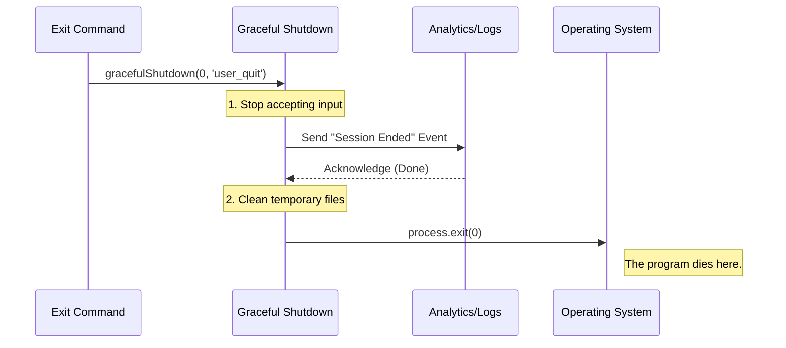

# Chapter 5: Graceful Shutdown

Welcome to the final chapter of our tutorial series!

In [Chapter 4: Worktree Session State](04_worktree_session_state.md), we learned how to pause the exit process if the user had unsaved work. We acted like a responsible word processor asking, *"Are you sure?"*

But what happens when the user clicks "Yes"? Or what if there was no work to save in the first place?

We need to close the application. However, we cannot just "pull the plug." We need to perform a **Graceful Shutdown**.

## The Motivation

Imagine you own a coffee shop. It is 9:00 PM, and it is time to close.

1.  **The "Hard Crash" Approach:** You instantly cut the electricity to the building. The lights go out, customers trip in the dark, the coffee machine stops mid-brew, and the cash register doesn't save the day's total. This is chaotic.
2.  **The "Graceful Shutdown" Approach:** You lock the front door so no new people enter. You let current customers finish their drinks. You wipe down the counters. Finally, you turn off the lights and lock up.

In software, simply killing a process (the "Hard Crash") can corrupt files, leave network connections hanging, or fail to save logs.

**The Solution:** We create a dedicated function called `gracefulShutdown`. It acts as the "closing manager," ensuring everything is tidy before the program actually stops.

## Key Concepts

To understand how we implement this, we need to know three small concepts:

1.  **Exit Code:** When a program finishes, it leaves a number behind for the operating system.
    *   `0`: Success. Everything went according to plan.
    *   `1` (or higher): Error. Something went wrong.
2.  **Cleanup Hooks:** These are tasks that *must* happen before death (e.g., "Send final analytics," "Delete temporary files").
3.  **Process Termination:** The actual command that tells the computer to stop running our code (`process.exit`).

## Usage: Calling the Shutdown

Let's look at our `exit.tsx` file one last time. We use a utility function to handle this complexity for us.

### 1. The Import

We import the utility from our shared folder.

```typescript
// exit.tsx
import { gracefulShutdown } from '../../utils/gracefulShutdown.js';
```

### 2. The Execution

At the end of our `call` function, when we are sure the user wants to leave, we call this function.

```typescript
// Inside exit.tsx -> call()
// ... checks passed, we are ready to leave

// 1. Tell the UI to finish (print "Goodbye")
onDone(getRandomGoodbyeMessage());

// 2. Await the cleanup process
await gracefulShutdown(0, 'prompt_input_exit');

// 3. Return null (though the program usually ends at step 2)
return null;
```

**What do these arguments mean?**
*   `0`: This is the **Exit Code**. We are exiting voluntarily, so it is a success (0).
*   `'prompt_input_exit'`: This is a **Reason Tag**. We are telling our analytics system *why* we are quitting (the user typed the exit command).

## Under the Hood: Internal Implementation

What happens inside that `gracefulShutdown` black box?

It is crucial that this function is `async` (asynchronous). Cleanup tasks—like sending a final "Goodbye" signal to a server or writing a log to a hard drive—take time. We must wait for them to finish.

### Sequence Diagram

Here is the "Closing Time" checklist the system goes through:



### The Utility Code (Simplified)

While we don't need to write this utility today, here is a simplified version of what `utils/gracefulShutdown.js` looks like to help you understand the magic.

```typescript
// utils/gracefulShutdown.js (Conceptual)

export async function gracefulShutdown(code, reason) {
  // 1. Log why we are quitting
  console.log(`Shutting down: ${reason}`);

  // 2. Wait for any pending network requests (Analytics)
  await flushAnalyticsEvents();

  // 3. Finally, kill the process with the code (0 or 1)
  process.exit(code);
}
```

### Why use `await`?

In `exit.tsx`, you noticed we wrote:
```typescript
await gracefulShutdown(0, 'prompt_input_exit');
```

If we forgot `await`, the code would race to the next line. Since `gracefulShutdown` takes a few milliseconds to save data, the program might accidentally close *before* the data is saved! By using `await`, we force the program to pause until the cleanup is 100% complete.

## Conclusion

Congratulations! You have completed the **`exit` Project Tutorial**.

Let's review the journey we took to build a robust "Exit" command:

1.  **[Chapter 1](01_command_configuration.md):** We configured the command metadata so the CLI knows `exit` exists.
2.  **[Chapter 2](02_local_jsx_command_handler.md):** We built a Handler that can render interactive UI (React) instead of just text.
3.  **[Chapter 3](03_background_session_persistence.md):** We learned to detect background sessions (tmux) and "detach" instead of quit.
4.  **[Chapter 4](04_worktree_session_state.md):** We protected the user from losing active work by checking the Worktree State.
5.  **Chapter 5 (You are here):** We ensured that when the program finally closes, it does so cleanly and responsibly using Graceful Shutdown.

You now understand how a professional-grade CLI handles the lifecycle of a command, from the moment a user types it to the moment the process disappears from the operating system.

Happy Coding!

---

Generated by [Code IQ](https://github.com/adityasoni99/Code-IQ)