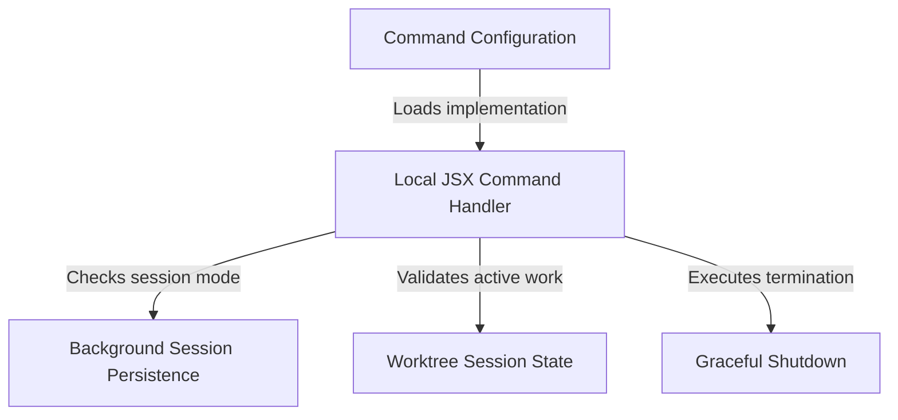

# Tutorial: exit

This project module implements a smart **exit** command for a CLI application. It utilizes a **Command Configuration** to define keywords like `exit` or `quit` and lazily loads the execution logic. When invoked, the handler intelligently decides whether to simply **detach** from a *persistent background session*, prompt the user about *unsaved work*, or proceed with a safe and **Graceful Shutdown**.

## Chapters

1. [Command Configuration](01_command_configuration.md)
2. [Local JSX Command Handler](02_local_jsx_command_handler.md)
3. [Background Session Persistence](03_background_session_persistence.md)
4. [Worktree Session State](04_worktree_session_state.md)
5. [Graceful Shutdown](05_graceful_shutdown.md)

---

Generated by [Code IQ](https://github.com/adityasoni99/Code-IQ)