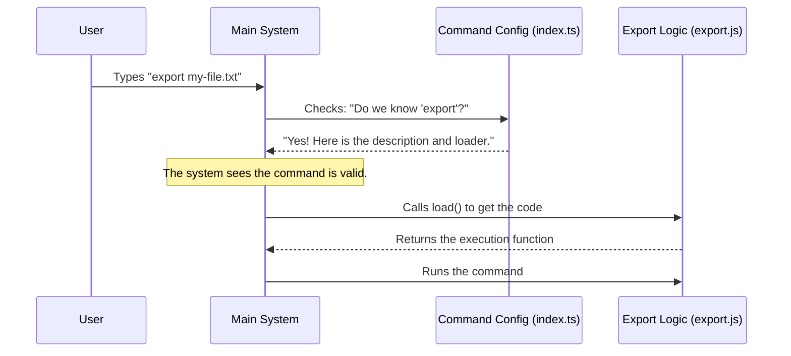

# Chapter 1: Command Configuration

Welcome to the first chapter of the `export` tool tutorial! Before we can write any code to actually save files or copy text to the clipboard, we need to introduce our tool to the main system.

## The Motivation: The Restaurant Menu

Imagine you sit down at a restaurant. Before you can eat, you need a **menu**. The menu tells you:
1.  **What is available?** (The name of the dish)
2.  **What is it?** (A short description)
3.  **Do you have options?** (Like "rare" or "medium-well")

The **Command Configuration** is exactly like that menu entry. It doesn't "cook the food" (execute the logic) yet; it simply tells the system that the `export` command exists, what it does, and how to use it.

**The Central Use Case:**
We want a user to be able to type `export` in their terminal. To do this, the system needs a configuration object that registers this keyword.

## Key Concepts

To build this configuration, we need to understand three simple concepts:

1.  **Identity:** Defining the command's name (`export`) and a helpful description so users know what it does.
2.  **Arguments:** Defining what the user *can* type after the command. For example, `export my-notes.txt`.
3.  **Lazy Loading:** This is a performance trick. We don't want to load all the heavy code for the export logic until the user actually asks for it. It's like the kitchen not cooking the burger until you place the order.

## Building the Configuration

Let's look at how we define this configuration in the file `index.ts`. We will break the code down into small pieces.

### 1. Defining Identity
First, we define the basic look and feel of the command.

```typescript
// File: index.ts
const exportCommand = {
  // 'local-jsx' tells the system we might use UI components
  type: 'local-jsx', 
  
  // This is what the user types in the terminal
  name: 'export',
  
  // This appears in the help menu
  description: 'Export the current conversation to a file or clipboard',
}
```
**Explanation:**
*   `name`: When the user types `export`, the system matches it to this entry.
*   `description`: If the user asks for help, they see this text.

### 2. Handling Arguments
Next, we tell the system what to expect after the command name.

```typescript
// File: index.ts (continued inside the object)
  // [filename] means an optional argument
  argumentHint: '[filename]',
```
**Explanation:**
*   `argumentHint`: This is a visual cue. Brackets `[]` usually mean "optional". This tells the user they can type `export` (alone) or `export results.md` (with a filename).

### 3. The "Lazy Load" Mechanism
Finally, we connect the menu entry to the actual kitchen (the code that does the work).

```typescript
// File: index.ts (continued inside the object)
  // Only import the logic file when the command is actually run
  load: () => import('./export.js'),
} satisfies Command
```
**Explanation:**
*   `load`: This is a function. It uses `import('./export.js')` to fetch the code from another file.
*   **Why?** If the user never types `export`, we never waste memory loading the `export.js` file.

## Under the Hood: How it Works

What happens when you start the application? The system reads this configuration file immediately, but it *doesn't* touch the heavy logic yet.

Here is a simplified view of the process:



## Deep Dive: The Code Implementation

Now, let's look at the complete file `index.ts`. This single file binds everything together.

```typescript
// File: index.ts
import type { Command } from '../../commands.js'

const exportCommand = {
  type: 'local-jsx',
  name: 'export',
  description: 'Export the current conversation to a file or clipboard',
  argumentHint: '[filename]',
  load: () => import('./export.js'),
} satisfies Command

export default exportCommand
```

**Walkthrough:**
1.  **`import type { Command }`**: We import a blueprint (interface) that ensures our object follows the rules (must have a name, must have a description, etc.).
2.  **`const exportCommand`**: We create the object holding our configuration.
3.  **`load: () => import('./export.js')`**: This points to the file where the real magic happens. The logic in `export.js` is what actually handles saving files or copying text. We will cover how that logic starts in [Chapter 2: Export Execution Flow](02_export_execution_flow.md).
4.  **`export default`**: We make this configuration available to the rest of the application.

## Summary

In this chapter, we learned how to create a **Command Configuration**. This is the "face" of our tool.
*   We defined the **name** so the system recognizes it.
*   We set a **description** and **argument hint** for the user.
*   We used **lazy loading** to keep the application fast, loading the heavy logic only when needed.

Now that the system knows *who* we are, it's time to see what happens when the command is actually triggered.

[Next Chapter: Export Execution Flow](02_export_execution_flow.md)

---

Generated by [Code IQ](https://github.com/adityasoni99/Code-IQ)