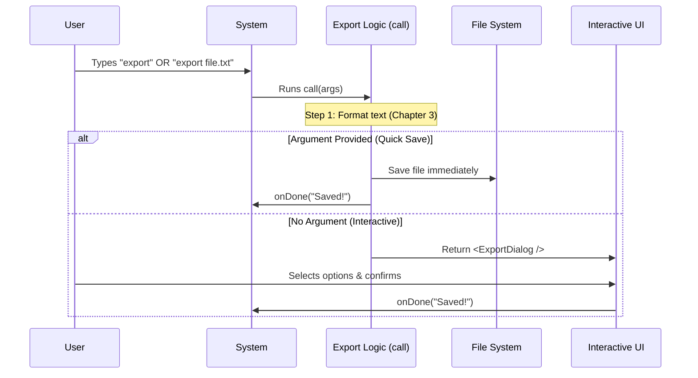

# Chapter 2: Export Execution Flow

In [Chapter 1: Command Configuration](01_command_configuration.md), we introduced our tool to the system. We placed "Export" on the menu. Now, the user has actually ordered it! They have typed `export` in their terminal.

This chapter explains what happens immediately after that command is entered.

## The Motivation: The Project Manager

Think of the **Export Execution Flow** as the **Project Manager** of this operation.

When you tell a Project Manager to "Save this project," they don't do everything themselves. Instead, they coordinate the team:
1.  **The Researcher:** Gathers the data (fetching the conversation).
2.  **The Decision Maker:** Asks, "Did the client give us a specific filename, or do we need to ask them?"
3.  **The Delivery Guy:** Delivers the file (saves it) or sets up a meeting (opens a dialog).

This file (`export.tsx`) is that Project Manager. It doesn't care *how* the text is formatted or *how* the dialog looks; it just ensures the right steps happen in the right order.

**The Central Use Case:**
We need to handle two scenarios efficiently:
1.  **Quick Save:** User types `export my-log.txt`. The tool should just save it. No questions asked.
2.  **Interactive Save:** User types `export`. The tool should verify the content and ask for a name.

## Key Concepts

To understand this flow, we look at the `call` function in `export.tsx`. It handles three distinct phases:

1.  **Preparation:** Getting the raw conversation data from the system.
2.  **Branching Logic:** Checking if the user provided a shortcut (arguments).
3.  **Execution:** Either writing to the disk immediately or handing off to the user interface.

## Solving the Use Case

Let's walk through the code in `export.tsx` to see how our "Project Manager" handles these tasks. We will break the big function into tiny, digestible blocks.

### 1. The Entry Point
When the command runs, the system calls this function.

```typescript
// File: export.tsx
export async function call(
  onDone: LocalJSXCommandOnDone, // Function to call when finished
  context: ToolUseContext,       // Contains the conversation history
  args: string,                  // What the user typed (e.g., "my-file.txt")
): Promise<React.ReactNode> {
```
**Explanation:**
*   `args`: This is crucial. If the user typed `export log.txt`, `args` will be `"log.txt"`. If they just typed `export`, `args` is empty.
*   `context`: This holds all the messages we want to save.

### 2. Preparation (Fetching Content)
Before deciding *where* to save, we need to know *what* to save.

```typescript
  // Render the conversation content
  // We delegate this hard work to a helper function
  const content = await exportWithReactRenderer(context);
```
**Explanation:**
*   Our Project Manager asks the "Researcher" to get the text.
*   We will learn exactly how this text is formatted in [Chapter 3: Content Serialization](03_content_serialization.md). For now, just know that `content` holds the text of your conversation.

### 3. The "Quick Save" Branch
Now, the Project Manager checks: *Did the user give us a specific filename?*

```typescript
  const filename = args.trim();
  
  // IF the user provided a filename, we enter "Quick Save" mode
  if (filename) {
    // Ensure the file ends in .txt
    const finalFilename = filename.endsWith('.txt') 
      ? filename 
      : filename.replace(/\.[^.]+$/, '') + '.txt';
```
**Explanation:**
*   We look at `args`.
*   If it exists, we assume the user wants to save immediately.
*   We do a little cleanup to ensure the file extension is `.txt`.

### 4. Executing the Quick Save
If we have a filename, we try to write the file to the disk.

```typescript
    const filepath = join(getCwd(), finalFilename);
    try {
      // Write the content to the disk
      writeFileSync_DEPRECATED(filepath, content, {
        encoding: 'utf-8',
        flush: true
      });
      // Tell the system we are finished successfully!
      onDone(`Conversation exported to: ${filepath}`);
      return null;
```
**Explanation:**
*   `writeFileSync`: This saves the data to your hard drive.
*   `onDone`: This is the Project Manager reporting back to the user, "Job done!"
*   `return null`: We return `null` because we don't need to show any UI (User Interface).

### 5. The "Interactive" Branch
But what if `args` was empty? This means the user wants to choose options.

```typescript
  // If we are here, NO filename was provided.
  
  // We calculate a suggestion for the filename
  // (We will cover this logic in Chapter 4)
  const defaultFilename = ... 

  // We return a visual Dialog component
  return <ExportDialog 
    content={content} 
    defaultFilename={defaultFilename} 
    onDone={(result) => onDone(result.message)} 
  />;
}
```
**Explanation:**
*   Instead of saving immediately, we launch a visual tool (`<ExportDialog />`).
*   This hands control over to the interactive UI, covered in [Chapter 5: Interactive Export Fallback](05_interactive_export_fallback.md).

## Under the Hood: The Flow

Here is the decision-making process visualized. Notice how the flow splits based on user input.



## Summary

In this chapter, we built the **Execution Flow**. We learned how to:
1.  **Receive inputs** from the command line (`args`).
2.  **Generate the content** string (via a helper).
3.  **Decide** whether to perform a "Quick Save" (write immediately) or an "Interactive Save" (show a dialog).

However, in Step 2, we glossed over *how* the conversation messages are actually turned into a clean text string. That is a complex task that deserves its own chapter.

[Next Chapter: Content Serialization](03_content_serialization.md)

---

Generated by [Code IQ](https://github.com/adityasoni99/Code-IQ)