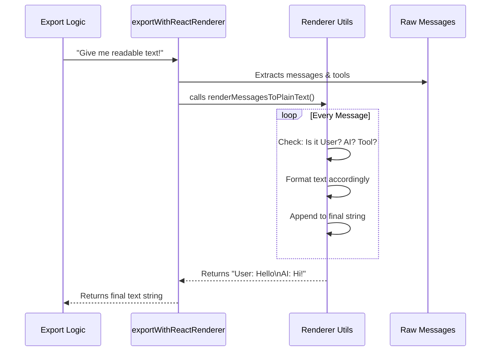

# Chapter 3: Content Serialization

In [Chapter 2: Export Execution Flow](02_export_execution_flow.md), our "Project Manager" (the execution flow) coordinated the export process. We saw a step where the code asked for `content`, like this:

```typescript
const content = await exportWithReactRenderer(context);
```

But what exactly happens inside that function? How do we turn a complex computer conversation object into a readable text file?

Welcome to **Content Serialization**.

## The Motivation: The Court Reporter

Imagine a courtroom. People are talking, showing evidence, and whispering side comments.

The computer stores this conversation like a chaotic box of evidence:
*   **User Message:** `{ type: 'user', text: 'Analyze this file', timestamp: 12345 }`
*   **System Action:** `{ type: 'tool', name: 'readFile', output: '...file content...' }`
*   **AI Response:** `{ type: 'assistant', text: 'Here is the summary...' }`

If we just saved this "box of evidence" directly to a file, it would look like messy computer code (JSON). It would be hard for a human to read.

We need a **Court Reporter** (the Serializer). The Court Reporter's job is to take that chaotic box and type out a clean, linear script:

> **User:** Analyze this file.
>
> **Tool (readFile):** [File Content Hidden]
>
> **AI:** Here is the summary...

**The Central Use Case:**
We want to take the application's internal memory (which contains messages, tool results, and errors) and convert it into a single, pretty string of text that we can write to a `.txt` file.

## Key Concepts

To achieve this, we use a concept called **Serialization**.

1.  **The Context (The Raw Material):**
    This is the object passed to our command. It contains the entire history of the chat (`messages`) and the tools available (`tools`).

2.  **The Renderer (The Translator):**
    This is a helper function that loops through every message. It decides how to format it based on who sent it.
    *   Did the **User** say it? Add a "User:" label.
    *   Is it a **Tool Result**? Format it differently so it stands out.

## Solving the Use Case

Let's look at how the code in `export.tsx` handles this. It acts as a bridge between the raw data and the formatting logic.

### 1. The Wrapper Function
We define a specific function to handle this translation task.

```typescript
// File: export.tsx
async function exportWithReactRenderer(
  context: ToolUseContext,
): Promise<string> {
```
**Explanation:**
*   **Input (`context`):** The "box of evidence" containing all messages.
*   **Output (`Promise<string>`):** The final, readable script.

### 2. Extracting Tools
First, we look to see if any specific tools were used or available in this context.

```typescript
  // Get the list of tools, or use an empty list if none exist
  const tools = context.options.tools || [];
```
**Explanation:**
*   Sometimes tools (like "calculator" or "file-reader") are part of the conversation. We need to know about them to format their outputs correctly.

### 3. Delegating the Hard Work
Finally, we call a specialized utility to do the heavy lifting.

```typescript
  // Call the utility that loops through messages and formats them
  return renderMessagesToPlainText(context.messages, tools);
}
```
**Explanation:**
*   `renderMessagesToPlainText`: This is our "Court Reporter." We don't see the inside of this function here (it lives in `utils/exportRenderer.js`), but we know its job: iterate through the list and return a string.

## Under the Hood: The Flow

What happens when this "Court Reporter" gets to work? Here is the sequence of events:



### Example Input vs. Output

To visually understand what this abstraction does, look at this transformation:

**Input (Internal Data):**
```javascript
[
  { role: 'user', content: 'What is 2+2?' },
  { role: 'assistant', content: 'It is 4.' }
]
```

**Output (Serialized String):**
```text
User: What is 2+2?

Assistant: It is 4.
```

## Deep Dive: The Code Implementation

Let's look at the function in `export.tsx` one last time in its entirety. It is short but acts as a critical funnel.

```typescript
// File: export.tsx

import { renderMessagesToPlainText } from '../../utils/exportRenderer.js'

async function exportWithReactRenderer(
  context: ToolUseContext,
): Promise<string> {
  // 1. Prepare the tools
  const tools = context.options.tools || [];
  
  // 2. Convert the complex objects into a simple string
  return renderMessagesToPlainText(context.messages, tools);
}
```

**Why separate this?**
You might ask, "Why not write the formatting logic directly inside the `call` function we saw in Chapter 2?"

By separating it:
1.  **Readability:** The main export logic doesn't get cluttered with text formatting rules.
2.  **Reusability:** If we want to copy text to the clipboard instead of saving a file, we can use this same function to get the text!

## Summary

In this chapter, we learned about **Content Serialization**.
*   We learned that internal data is messy and needs a **"Translator"** (or Court Reporter).
*   We saw how `exportWithReactRenderer` prepares the tools and messages.
*   We delegated the actual string construction to a helper utility, ensuring our code remains clean.

Now we have a variable named `content` holding our perfect, human-readable text. But... what should we name the file? `output.txt`? `file1.txt`? That's boring and unhelpful.

Let's learn how to automatically generate smart filenames based on what the user actually talked about.

[Next Chapter: Contextual Filename Generation](04_contextual_filename_generation.md)

---

Generated by [Code IQ](https://github.com/adityasoni99/Code-IQ)