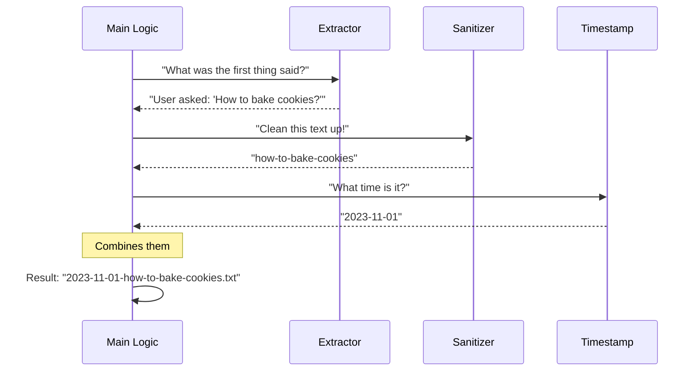

# Chapter 4: Contextual Filename Generation

In [Chapter 3: Content Serialization](03_content_serialization.md), we successfully turned our complex conversation data into a readable text string (our "content").

However, if the user didn't specify a filename (e.g., they just typed `export` instead of `export my-file.txt`), we have a problem. We can't just save it as `file.txt` every time, or we would overwrite previous work. We also don't want to use boring names like `export_001.txt` because nobody remembers what those contain.

This chapter is about building a **Smart Filing Assistant** that names files automatically based on what you were talking about.

## The Motivation: The Smart Secretary

Imagine you are dictating notes to a secretary.

*   **The Lazy Secretary:** You finish talking. They shove the paper into a folder named "Document 1." Three weeks later, you have no idea which document contains your cookie recipe.
*   **The Smart Secretary:** You finish talking about cookies. They scan the first sentence ("Here is the best chocolate chip recipe..."), look at the clock, and file it as `2023-10-27-chocolate-chip-recipe.txt`.

**The Central Use Case:**
We want our tool to scan the conversation, find the first thing the user said (the "Topic"), clean it up so computers can read it, and use that as the filename.

## Key Concepts

To build this Smart Secretary, we need three specific skills:

1.  **Extraction:** Finding the "Subject Line" amidst the technical data.
2.  **Sanitization:** Computers are picky. They hate characters like `?`, `:`, or `/` in filenames. We need to clean the text.
3.  **Fallback (Timestamping):** If the conversation is empty or the extraction fails, we need a reliable backup plan (like the current time).

## Solving the Use Case

We will implement this logic using three small helper functions inside `export.tsx`.

### 1. The Fallback: Formatting the Timestamp
First, let's make sure we can always generate a unique name based on the current time.

```typescript
// File: export.tsx
function formatTimestamp(date: Date): string {
  const year = date.getFullYear();
  // Add +1 because months are 0-indexed (0 = January)
  const month = String(date.getMonth() + 1).padStart(2, '0');
  const day = String(date.getDate()).padStart(2, '0');
  
  // Return format: 2023-10-27-143005
  // (Year-Month-Day-HourMinuteSecond)
  return `${year}-${month}-${day}-${date.getHours()}...`; 
}
```
**Explanation:**
*   This creates a string like `2023-11-04`.
*   `padStart(2, '0')` ensures that "January" becomes `01` instead of just `1`, keeping our filenames neatly sorted alphabetically.

### 2. Extraction: Finding the Topic
Next, we need to find out what the conversation is about. We assume the **first message** from the user sets the topic.

```typescript
// File: export.tsx
export function extractFirstPrompt(messages: Message[]): string {
  // Find the very first message sent by the 'user'
  const firstUserMessage = messages.find(msg => msg.type === 'user');

  if (!firstUserMessage) return ''; // No user message found? Return empty.

  // Get the text content (simplifying complex objects if needed)
  let result = extractTextFromMessage(firstUserMessage); 

  // Take only the first line and limit it to 50 characters
  return result.split('\n')[0].substring(0, 49);
}
```
**Explanation:**
*   We look through the message history.
*   We grab the text.
*   We cut it short. If the user pasted a whole book, we only want the first 50 characters of the first line to serve as the title.

### 3. Sanitization: Making it "File System Safe"
Users type things like "How do I fix my CPU?" or "Project: Alpha/Beta".
Operating systems forbid `?` and `/` in filenames. We need to clean this up.

```typescript
// File: export.tsx
export function sanitizeFilename(text: string): string {
  return text.toLowerCase()
    // 1. Remove anything that isn't a letter, number, or space
    .replace(/[^a-z0-9\s-]/g, '') 
    // 2. Turn spaces into hyphens (project alpha -> project-alpha)
    .replace(/\s+/g, '-') 
    // 3. Remove accidental double hyphens
    .replace(/-+/g, '-'); 
}
```
**Explanation:**
*   **Input:** "Project: Alpha/Beta?"
*   **Step 1:** "project alpha beta" (Removed symbols)
*   **Step 2:** "project-alpha-beta" (Spaces to dashes)
*   **Output:** `project-alpha-beta`

## Under the Hood: The Assembly Line

Now, let's see how these three functions work together in a sequence when the command is run.



## Deep Dive: The Implementation

Finally, let's look at the `call` function in `export.tsx` where these pieces are glued together. This happens immediately after we generate the content (from the previous chapter) but *before* we show the dialog.

```typescript
// File: export.tsx (Inside the call function)

  // 1. Get the raw text of the first user message
  const firstPrompt = extractFirstPrompt(context.messages);
  
  // 2. Get the current time
  const timestamp = formatTimestamp(new Date());

  let defaultFilename: string;

  // 3. Decide the name
  if (firstPrompt) {
    const sanitized = sanitizeFilename(firstPrompt);
    // Combine: Timestamp + Context.txt
    defaultFilename = `${timestamp}-${sanitized}.txt`;
  } else {
    // Fallback: Context was empty or invalid? Just use timestamp.
    defaultFilename = `conversation-${timestamp}.txt`;
  }
```

**Walkthrough:**
1.  **Extract:** We try to get a topic string.
2.  **Check:** If we found a topic (`if (firstPrompt)`), we sanitize it and append the timestamp.
    *   *Result:* `2023-10-27-how-to-code.txt`
3.  **Fallback:** If we didn't find a topic (maybe the conversation was empty), we use a generic name.
    *   *Result:* `conversation-2023-10-27.txt`

## Summary

In this chapter, we built the **Contextual Filename Generation** logic.
*   We learned how to **extract** the user's intent from the message history.
*   We **sanitized** that text to ensure it is safe for file systems (no illegal characters).
*   We combined it with a **timestamp** to ensure every file is unique and easy to sort.

We now have the *Content* (from Chapter 3) and the *Default Filename* (from Chapter 4). But we still haven't actually saved the file if the user didn't provide an argument!

It is time to present these options to the user nicely.

[Next Chapter: Interactive Export Fallback](05_interactive_export_fallback.md)

---

Generated by [Code IQ](https://github.com/adityasoni99/Code-IQ)