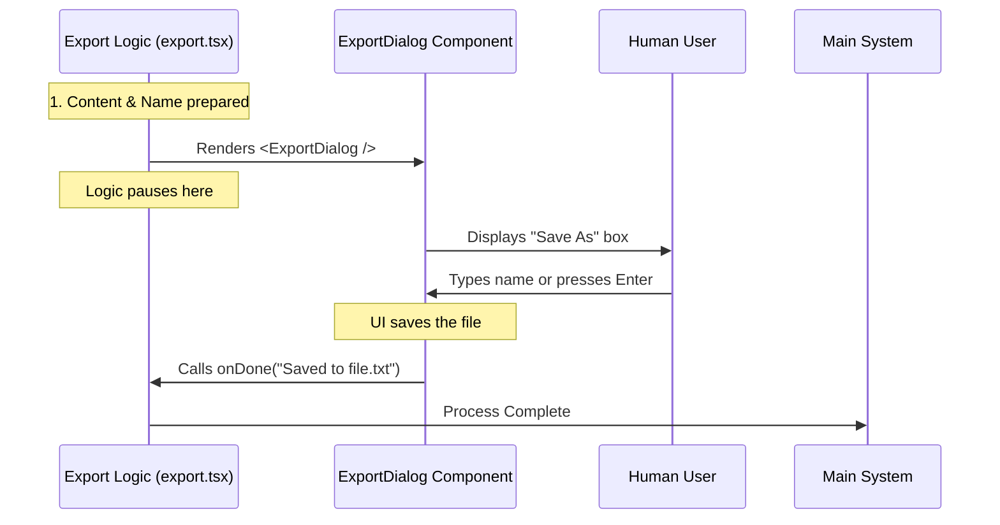

# Chapter 5: Interactive Export Fallback

Welcome to the final chapter of the `export` tutorial!

In [Chapter 4: Contextual Filename Generation](04_contextual_filename_generation.md), we taught our tool to be smart. It can now read the conversation and guess a perfect filename (e.g., `2023-10-27-cookie-recipe.txt`).

However, we left one loose end. If the user didn't type a filename manually, we calculated a name... **but we haven't saved the file yet.**

This chapter covers the **Interactive Export Fallback**. This is the mechanism that says, "Okay, you didn't tell me where to save it, so I'm going to show you a nice interface so you can review my guess before we finish."

## The Motivation: The "Save As" Dialog

Think about Microsoft Word or Google Docs.
1.  **Direct Save:** If you hit `Ctrl+S` on an existing file, it just saves. It doesn't ask questions. (This is what we did in Chapter 2).
2.  **Save As:** If you create a *new* document and hit Save, it pops up a window. It shows you the content, suggests a name (like "Document1"), and lets you change it or confirm it.

**The Central Use Case:**
The user types `export` (with no arguments). instead of silently saving to a file they might not find, or crashing, the tool should open a visual "Save As" dialog right inside the terminal.

## Key Concepts

To achieve this, we rely on three concepts:

1.  **Terminal UI (TUI):**
    Usually, terminal commands just output text and quit. But here, we keep the program running and render an interactive interface (buttons, text inputs) using a library called React.

2.  **The Component:**
    We treat the entire "Save As" window as a single reusable block of code called `<ExportDialog />`. We pass it data, and it handles the visuals.

3.  **The Handoff:**
    The logic engine (our "Project Manager" from Chapter 2) hands control over to the Interface. The logic stops running and waits for the Interface to tell it when the user is done.

## Solving the Use Case

We are working inside the `export.tsx` file. We have reached the bottom of the `call` function. We have the content and the default filename, but no user-provided argument.

Instead of writing to a file, we **return a UI component**.

### 1. The Decision Point
Recall this logic from the end of the `call` function:

```typescript
// File: export.tsx

// If arguments were provided, we already saved and returned null.
// If we are still running here, it means we need the interactive mode.

// We simply return the React Component to be rendered on screen.
return (
  <ExportDialog 
    // ... props go here ...
  />
);
```

**Explanation:**
*   By returning a component (starting with `<... />`), we tell the system: "Don't quit yet. Draw this on the screen and let the user interact with it."

### 2. Passing the Data (Props)
We need to give the Dialog the information we prepared in the previous chapters.

```typescript
// File: export.tsx inside the return statement

  <ExportDialog
    // Pass the text we generated in Chapter 3
    content={content}
    
    // Pass the smart filename we guessed in Chapter 4
    defaultFilename={defaultFilename}
    
    // ...
  />
```

**Explanation:**
*   **`content`**: The dialog needs this so it can show a preview of what is being saved.
*   **`defaultFilename`**: The dialog will pre-fill the input box with this name (e.g., `2023-10-27-recipe.txt`) so the user can just hit "Enter" if they like it.

### 3. Handling Completion
When the user finally hits "Save" in the visual dialog, the dialog needs to tell the main system it's finished.

```typescript
// File: export.tsx inside the return statement

    // What happens when the user finishes using the Dialog?
    onDone={(result) => {
      // The Dialog gives us a result object
      // We pass the success message back to the main system
      onDone(result.message);
    }}
  />
```

**Explanation:**
*   `onDone`: This is a "callback." It's like leaving a phone number. We tell the Dialog, "Call this function when the user is finished saving the file."

## Under the Hood: The Handoff

Here is how the control flows from our logic code to the visual interface and back to the system.



## Deep Dive: The Code Implementation

Let's look at the final block of code in `export.tsx`. This ties together everything we have learned in this tutorial.

```typescript
// File: export.tsx

  // ... (Previous chapters: Content generated, Filename guessed) ...

  // Return the dialog component when no args provided
  return (
    <ExportDialog
      content={content}
      defaultFilename={defaultFilename}
      onDone={(result) => {
        onDone(result.message);
      }}
    />
  );
}
```

**Why is this approach better?**
1.  **Safety:** We never overwrite files accidentally. The user always sees the name first.
2.  **Flexibility:** The user gets the smart suggestion (Chapter 4), but if they hate it, they can just type a new name in the Dialog box.
3.  **User Experience:** It feels like a modern application, not a robotic script.

## Tutorial Summary

Congratulations! You have explored the entire architecture of the `export` command.

Let's recap the journey:

1.  **[Command Configuration](01_command_configuration.md):** We registered `export` on the menu so the system knows it exists.
2.  **[Export Execution Flow](02_export_execution_flow.md):** We built the "Project Manager" that decides whether to quick-save or ask the user.
3.  **[Content Serialization](03_content_serialization.md):** We turned complex data objects into a readable text script.
4.  **[Contextual Filename Generation](04_contextual_filename_generation.md):** We used logic to guess a filename based on the conversation topic.
5.  **Interactive Export Fallback:** (This chapter) We provided a visual "Save As" interface when no filename was given.

By combining these five separate concepts, we created a tool that is robust, user-friendly, and smart. You now understand how to build complex CLI commands that feel like complete applications!

---

Generated by [Code IQ](https://github.com/adityasoni99/Code-IQ)