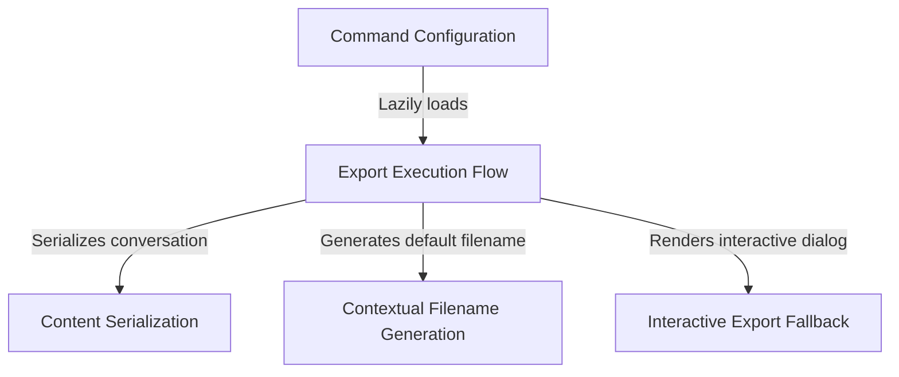

# Tutorial: export

This project implements an **export command** that allows users to save their current conversation history to a local text file. It features a versatile workflow that can either write directly to a specified path or automatically generate a *context-aware default filename* and present an **interactive dialog** for user confirmation if no filename is provided.

## Chapters

1. [Command Configuration](01_command_configuration.md)
2. [Export Execution Flow](02_export_execution_flow.md)
3. [Content Serialization](03_content_serialization.md)
4. [Contextual Filename Generation](04_contextual_filename_generation.md)
5. [Interactive Export Fallback](05_interactive_export_fallback.md)

---

Generated by [Code IQ](https://github.com/adityasoni99/Code-IQ)