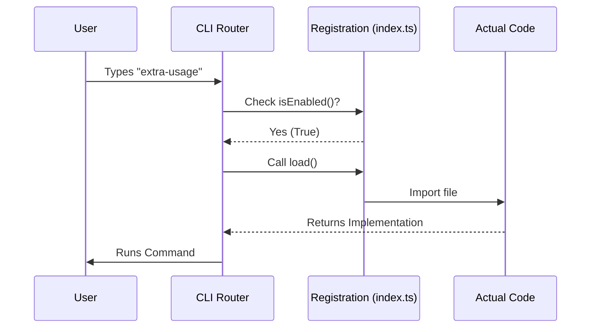

# Chapter 1: Command Registration

Welcome to the `extra-usage` project tutorial! This is the starting point of our journey. Before we dive into complex logic or user interfaces, we need to answer a fundamental question: **How does the CLI know this command exists?**

## The Motivation

Imagine walking into a large office building. You don't just wander around looking for the person you want to meet. You go to the **Reception Desk**.

The receptionist has a list of employees (a directory). When you ask for someone, the receptionist checks two things:
1.  **Availability:** Is that person actually in the office today?
2.  **Security:** Are you allowed to see them?

If everything checks out, the receptionist calls the employee to come down to the lobby.

In our CLI project, **Command Registration** is that Reception Desk.

### The Use Case
We want to create a command called `extra-usage`. When a user types this command in their terminal, the CLI needs to:
1.  Check if the command is enabled (Environment variables, permissions).
2.  Decide which "version" of the command to run (Interactive UI vs. Headless script).
3.  Load the heavy code only when needed.

## Key Concepts

To solve this, we don't write all our code in one giant file. Instead, we create a small **Registration Object** that acts like a manifest.

### 1. Identity
Every command needs a `name` (what the user types) and a `description` (what shows up in the help menu).

### 2. The Gatekeeper (`isEnabled`)
This is a rule that tells the CLI: "Only show this command if these conditions are met." If this returns `false`, the command is invisible to the user.

### 3. Lazy Loading (`load`)
To make the CLI start fast, we don't load the actual code for the command immediately. We use a dynamic import. This is like the receptionist only calling the employee *after* you arrive, rather than having the employee stand in the lobby all day waiting.

## Implementation: Defining the Command

Let's look at how we register the `extra-usage` command in `index.ts`. We break this down into small, manageable pieces.

### Step 1: The Gatekeeper Logic
First, we define a helper function to check if the user is even allowed to use this feature.

```typescript
// From index.ts
function isExtraUsageAllowed(): boolean {
  // 1. Check if an environment variable explicitly disables it
  if (isEnvTruthy(process.env.DISABLE_EXTRA_USAGE_COMMAND)) {
    return false
  }
  // 2. Check strict authentication rules
  return isOverageProvisioningAllowed()
}
```
**Explanation:** This function acts as our security guard. It returns `true` or `false`. We check environment variables first, then check specific provisioning permissions.

### Step 2: Registering the Interactive Command
Now we define the command object for human users (Interactive mode).

```typescript
export const extraUsage = {
  type: 'local-jsx', // Uses a rich UI
  name: 'extra-usage',
  description: 'Configure extra usage...',
  // Only enable if allowed AND we are in an interactive session
  isEnabled: () => isExtraUsageAllowed() && !getIsNonInteractiveSession(),
  load: () => import('./extra-usage.js'),
} satisfies Command
```
**Explanation:**
*   **`type: 'local-jsx'`**: Tells the CLI this command uses a visual interface (like a menu).
*   **`isEnabled`**: We ensure `isExtraUsageAllowed()` is true **AND** we are NOT in a script (`!getIsNonInteractiveSession()`).
*   **`load`**: This imports the heavy code from `./extra-usage.js` only when the user actually runs the command.

### Step 3: Registering the Non-Interactive Command
What if a script runs this command automatically (Headless mode)? We register a *second* definition for the **same command name**.

```typescript
export const extraUsageNonInteractive = {
  type: 'local', // Standard logic, no UI
  name: 'extra-usage',
  supportsNonInteractive: true,
  // Only enable if allowed AND we ARE in a non-interactive session
  isEnabled: () => isExtraUsageAllowed() && getIsNonInteractiveSession(),
  load: () => import('./extra-usage-noninteractive.js'),
} satisfies Command
```
**Explanation:**
*   **`name: 'extra-usage'`**: Notice the name is the *same* as above.
*   **`isEnabled`**: The logic is flipped. It requires `getIsNonInteractiveSession()` to be true.
*   **`load`**: It loads a completely different file (`./extra-usage-noninteractive.js`) optimized for scripts.

## Under the Hood: How it Works

When the CLI starts, it doesn't read your code files immediately. It only reads these registration objects.

Here is what happens when the CLI boots up:



### The "Router" Effect
By having two exports (`extraUsage` and `extraUsageNonInteractive`) with the same `name` but opposing `isEnabled` logic, we create a smart router.

1.  **User A (Human):** `isEnabled` for `extraUsage` becomes **True**. `extraUsageNonInteractive` becomes **False**. The CLI loads the Interactive UI.
2.  **User B (Robot/Script):** `isEnabled` for `extraUsage` becomes **False**. `extraUsageNonInteractive` becomes **True**. The CLI loads the Headless script.

This concept is crucial for creating a smooth experience. We will explore the differences between these two modes in depth in [Interactive vs. Headless Modes](02_interactive_vs__headless_modes.md).

## Summary

In this chapter, we learned:
*   **Command Registration** acts as the manifest for our CLI.
*   We use **`isEnabled`** to act as a gatekeeper, checking environment variables and permissions.
*   We use **`load`** to lazy-load code, keeping the CLI fast.
*   We can register the same command name twice to handle different environments (Interactive vs. Non-Interactive).

Now that our command is registered and knows *when* to run, let's look at *what* runs.

[Next Chapter: Interactive vs. Headless Modes](02_interactive_vs__headless_modes.md)

---

Generated by [Code IQ](https://github.com/adityasoni99/Code-IQ)