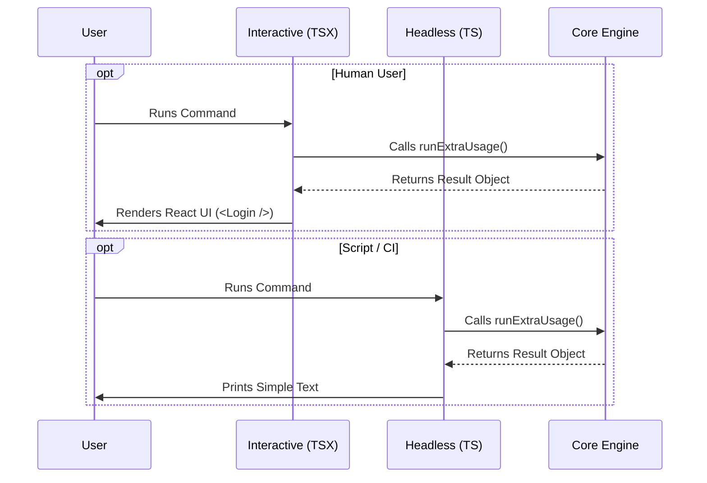

# Chapter 2: Interactive vs. Headless Modes

Welcome back! In [Command Registration](01_command_registration.md), we learned how to register our command with the CLI "Reception Desk." We set up a smart router that directs users to one of two files: `extra-usage.tsx` (for humans) or `extra-usage-noninteractive.ts` (for scripts).

Now, we will explore **what happens inside those files**.

## The Motivation: Humans vs. Robots

Imagine you are ordering a pizza.

1.  **The Human Experience:** You walk into the restaurant. A waiter hands you a menu with pictures. You point at the pizza you want. The waiter asks, "Do you want extra cheese?" You say, "Yes."
2.  **The Robot Experience:** You are a delivery app server. You send a specific data code: `{ item: "pizza", cheese: true }`. You expect a confirmation code back instantly. You do **not** want a waiter to walk up to your server rack and ask questions.

In our CLI:
*   **Interactive Mode** is the Restaurant. It renders buttons, text inputs, and can ask the user to log in again if their session expired.
*   **Headless Mode** is the Delivery API. It runs in the background (like in a CI/CD pipeline). It outputs simple text and exits. It cannot ask for input.

## The Strategy: One Brain, Two Faces

To solve this, we separate the **Logic** (The Brain) from the **Presentation** (The Face).

1.  **The Core Logic:** Calculates usage, checks limits, generates URLs. (We cover this in [Core Workflow Engine](03_core_workflow_engine.md)).
2.  **The Interactive Wrapper:** Calls the core logic. If something is needed, it draws a UI.
3.  **The Headless Wrapper:** Calls the core logic. It simply prints the result as text.

## Implementation: The Interactive Mode

Let's look at `extra-usage.tsx`. This file is loaded when a human types the command.

### Use Case: The Re-Login Flow
A major advantage of interactive mode is handling errors gracefully. If the user's session is expired, we don't just crash. We show them a Login form right inside the command!

```typescript
// extra-usage.tsx
import { Login } from '../login/login.js';
import { runExtraUsage } from './extra-usage-core.js';

// The function signature expects a React Node return
export async function call(onDone, context) {
  // 1. Run the shared logic (The Brain)
  const result = await runExtraUsage();

  // 2. If it's just a message, print it and exit
  if (result.type === 'message') {
    onDone(result.value);
    return null; // No UI needed
  }

  // 3. Otherwise, return a React Component (The UI)
  return <Login startingMessage="Starting new login..." />;
}
```

**Explanation:**
*   **`runExtraUsage()`**: This is our "Brain." We wait for it to do the heavy lifting.
*   **`return <Login ... />`**: This is the magic. Because we are in `local-jsx` mode, we can return a React component. The CLI renders this login form in the terminal, allowing the user to fix their authentication issues immediately.

## Implementation: The Headless Mode

Now let's look at `extra-usage-noninteractive.ts`. This file is loaded when a script runs the command.

### Use Case: CI/CD Output
Scripts (like GitHub Actions) cannot see React components. They need standard text output (stdout).

```typescript
// extra-usage-noninteractive.ts
import { runExtraUsage } from './extra-usage-core.js'

// The function signature expects a simple Text Object return
export async function call() {
  // 1. Run the EXACT SAME shared logic
  const result = await runExtraUsage()

  // 2. Format the output as simple text
  const message = result.opened
      ? `Browser opened. Or visit: ${result.url}`
      : `Please visit ${result.url}`

  // 3. Return a text object
  return { type: 'text', value: message }
}
```

**Explanation:**
*   **`runExtraUsage()`**: Notice we call the *exact same function* as the interactive mode. We reuse the logic!
*   **`return { type: 'text' ... }`**: Instead of a UI component, we return a plain Javascript object containing a string. The CLI will print this string to the console and exit cleanly.

## Under the Hood

How does the data flow? Here is a diagram showing how both modes wrap around the same core engine.



### The "Result" Object
Both modes receive a `result` from the Core Engine. This object usually looks something like this:

```javascript
// Example Result from Core
{
  type: 'action_required',
  url: 'https://dashboard.example.com/usage',
  opened: false
}
```

*   **Interactive Mode** sees this and might say: "I'll render a button allowing the user to click this URL."
*   **Headless Mode** sees this and says: "I'll just print 'Please visit https://dashboard.example.com/usage'."

## Summary

In this chapter, we learned:
1.  **Separation of Concerns:** We keep our "Brain" (logic) separate from our "Face" (UI).
2.  **Interactive Mode (`.tsx`):** Used for humans. Can return React components like `<Login />` to fix issues dynamically.
3.  **Headless Mode (`.ts`):** Used for scripts. Returns simple text objects to ensure automation pipelines don't crash.

But what exactly is happening inside that `runExtraUsage()` function that both modes are calling? That is where the real business logic lives.

[Next Chapter: Core Workflow Engine](03_core_workflow_engine.md)

---

Generated by [Code IQ](https://github.com/adityasoni99/Code-IQ)