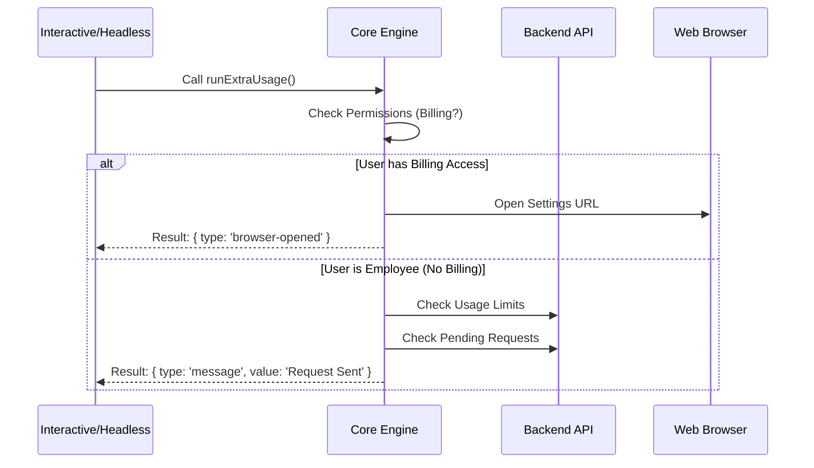

# Chapter 3: Core Workflow Engine

Welcome to the heart of our application!

In the previous chapter, [Interactive vs. Headless Modes](02_interactive_vs__headless_modes.md), we learned that our CLI has two "faces": one for humans (Interactive) and one for robots (Headless).

However, a face is useless without a brain. This chapter introduces **The Core Workflow Engine**. This is the shared brain that makes decisions, performs checks, and tells the interface what to do next.

## The Motivation

Imagine you are a Navigator in a rally car.
*   The **Driver** (Interactive Mode) handles the steering wheel and pedals.
*   The **Autopilot** (Headless Mode) controls the car via computer.

You are the **Navigator**. You hold the map. It doesn't matter who is driving; your job is to look at the road, check the map, and give a clear instruction: *"Turn Left"* or *"Stop."*

In our project, the `runExtraUsage()` function is the Navigator. It doesn't draw buttons or print text to the console. It simply calculates the situation and returns a **Result Object** containing instructions.

### The Use Case

When a user runs `extra-usage`, we need to handle two very different scenarios based on who the user is:

1.  **The Billing Manager:** They have the credit card. We should open the billing settings page for them.
2.  **The Employee:** They *don't* have the credit card. Opening the settings page is useless because they can't see it. Instead, we should check if they can request an increase from their admin.

The Core Engine figures out which scenario applies.

## Key Concepts

### 1. The Result Object
The Engine never speaks directly to the user. It returns a standardized object. This decouples the "What" (Logic) from the "How" (Display).

```typescript
type ExtraUsageResult =
  | { type: 'message'; value: string }
  | { type: 'browser-opened'; url: string; opened: boolean }
```

*   **`browser-opened`**: The Engine decided the best action was to send the user to the web dashboard.
*   **`message`**: The Engine performed an action internally (like sending an email to an admin) and just needs to tell the user what happened.

### 2. The Decision Tree
The logic inside the engine follows a strict hierarchy:
1.  **Refresh Data:** Ensure we aren't looking at old permissions.
2.  **Check Identity:** Are you a Team/Enterprise user?
3.  **Check Power:** Do you have billing access?
4.  **Action:** Either open the browser OR start the "Ask Admin" flow.

## Implementation: Step-by-Step

Let's walk through `extra-usage-core.ts`.

### Step 1: Cleaning the Slate
Before making decisions, we ensure we have the freshest data.

```typescript
export async function runExtraUsage(): Promise<ExtraUsageResult> {
  // 1. Mark that the user has tried this feature
  if (!getGlobalConfig().hasVisitedExtraUsage) {
    saveGlobalConfig(prev => ({ ...prev, hasVisitedExtraUsage: true }))
  }

  // 2. Clear old permission data to force a fresh check
  invalidateOverageCreditGrantCache()
```
**Explanation:** We flag that the user has used this command (useful for onboarding tips later). Then, we invalidate the cache. This is like refreshing your browser page to make sure you aren't looking at yesterday's stock prices.

### Step 2: Who is this user?
We gather the user's details.

```typescript
  // 3. Get subscription level and billing power
  const subscriptionType = getSubscriptionType()
  const isTeamOrEnterprise =
    subscriptionType === 'team' || subscriptionType === 'enterprise'
  
  const hasBillingAccess = hasClaudeAiBillingAccess()
```
**Explanation:**
*   `isTeamOrEnterprise`: Are they part of an organization?
*   `hasBillingAccess`: Do they have the authority to spend money?

### Step 3: Scenario A - The "Employee" (No Billing Access)
If the user is on a Team but *cannot* pay, we enter the complex logic. We need to help them ask for permission.

```typescript
  if (!hasBillingAccess && isTeamOrEnterprise) {
    // Check if they already have unlimited usage
    const utilization = await fetchUtilization()
    if (utilization?.extra_usage?.is_enabled && utilization.extra_usage.monthly_limit === null) {
       return { type: 'message', value: 'You already have unlimited usage.' }
    }
    
    // ... (More checks on creating requests) ...
```
**Explanation:** Before letting them bug their boss, we check: "Do you actually need this?" If they already have unlimited usage, we return a `message` type result immediately.

*(Note: We will cover the logic for actually sending the admin request in the [Admin Request State Machine](04_admin_request_state_machine.md) chapter).*

### Step 4: Scenario B - The "Billing Manager"
If the user *does* have billing access (or isn't on a team), the solution is simple: Send them to the website.

```typescript
  // Determine the correct URL based on plan
  const url = isTeamOrEnterprise
    ? 'https://claude.ai/admin-settings/usage'
    : 'https://claude.ai/settings/usage'

  try {
    // Attempt to open their default browser
    const opened = await openBrowser(url)
    return { type: 'browser-opened', url, opened }
  } catch (error) {
    // If browser fails, fallback to a message
    return { type: 'message', value: `Please visit ${url}` }
  }
}
```
**Explanation:**
1.  We pick the URL.
2.  We try to open it automatically.
3.  We return `type: 'browser-opened'`.
4.  If opening fails (common on servers), we catch the error and return a text message instead.

## Under the Hood: The Flow

Here is how the data flows through the engine. Notice how the Engine takes inputs and outputs a *Result*, but never draws UI itself.



### Why this matters
By separating this logic, if we ever want to change the URL or change the rules for who is an "Employee," we change it in **one place**. Both the Interactive CLI and the Headless script automatically get the update.

## Summary

In this chapter, we explored the **Core Workflow Engine**. We learned:

1.  The Engine acts as a **Navigator**, making decisions but letting the wrappers handle the display.
2.  We use a **Result Object** (`message` vs `browser-opened`) to keep our logic UI-agnostic.
3.  We handle two main paths: Direct Browser access for managers, and a complex check sequence for employees.

You might have noticed that in "Scenario A (The Employee)," we glossed over exactly *how* we ask the admin for permission. That involves checking for pending requests, eligibility, and sending the invite. This logic is complex enough to deserve its own chapter.

[Next Chapter: Admin Request State Machine](04_admin_request_state_machine.md)

---

Generated by [Code IQ](https://github.com/adityasoni99/Code-IQ)