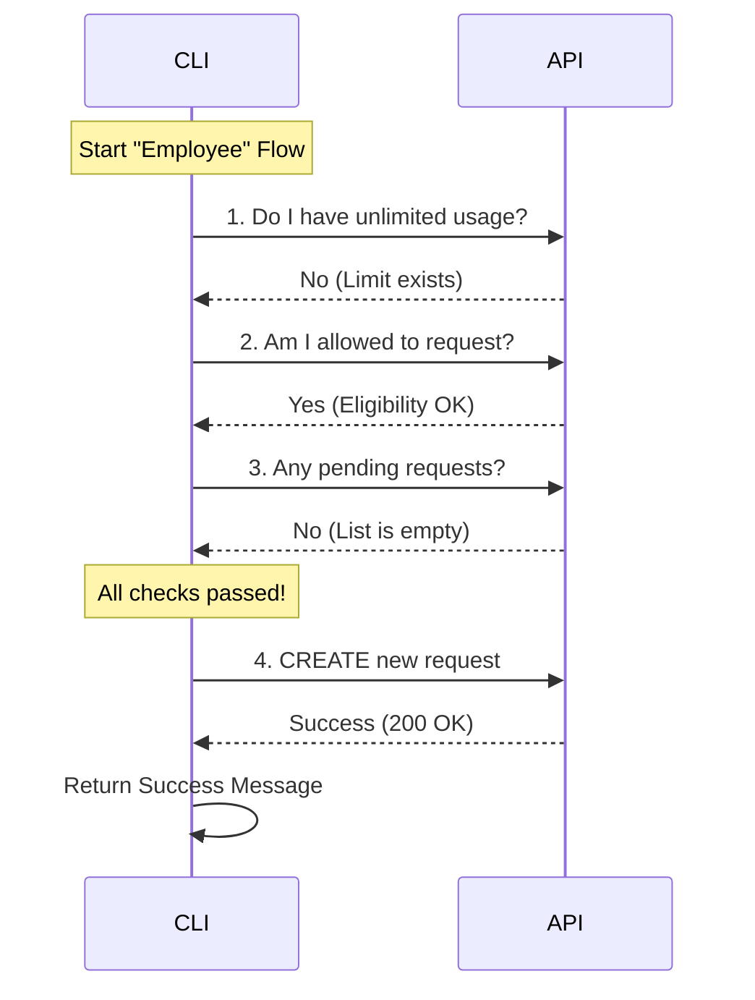

# Chapter 4: Admin Request State Machine

Welcome back! In the previous chapter, [Core Workflow Engine](03_core_workflow_engine.md), we learned how our CLI acts as a "Navigator," deciding whether to send a user to a website or perform an internal action.

We identified two types of users:
1.  **The Billing Manager:** Can pay directly.
2.  **The Employee:** Cannot pay; must ask for permission.

This chapter focuses exclusively on **The Employee**. We will explore the logic used to respectfully and efficiently ask an admin for more usage limits.

## The Motivation: The "Ice Cream" Problem

Imagine a child wants ice cream. A poorly programmed "child robot" might simply scream, "I want ice cream!" repeatedly.

A smart "child robot" (our CLI) follows a logical flow before asking:
1.  **Check Hand:** Do I already *have* ice cream? (If yes, stop).
2.  **Check Rules:** Am I grounded? (If yes, don't bother asking).
3.  **Check Memory:** Did I *already ask* five minutes ago and Mom hasn't answered yet? (If yes, wait).
4.  **Action:** Okay, *now* I can politely ask for ice cream.

This logic is a **State Machine**. We move through a series of checks (states) to determine if we should perform the final action. This prevents us from spamming the admin or crashing if the feature isn't allowed.

## Key Concepts

To implement this "polite asking" system, we need to check three things against the API before we send a request.

### 1. Saturation (Do you need it?)
If the user already has "Unlimited" usage enabled, asking for *more* makes no sense.

### 2. Eligibility (Are you allowed?)
Some organizations disable the ability for employees to request changes. If the `checkAdminRequestEligibility` API says "No," we must respect that.

### 3. Duplication (Did you already ask?)
We check `getMyAdminRequests`. If there is a request sitting in "Pending" status, we shouldn't create a second one. It creates clutter for the admin.

## Implementation: The Logic Flow

Let's break down the code inside `runExtraUsage` (in `extra-usage-core.ts`) that handles this specific flow.

### Step 1: The Saturation Check
First, we look at the current utilization data.

```typescript
// extra-usage-core.ts
const utilization = await fetchUtilization()
const extraUsage = utilization?.extra_usage

// If enabled and limit is null (unlimited), we are done.
if (extraUsage?.is_enabled && extraUsage.monthly_limit === null) {
  return {
    type: 'message',
    value: 'Your organization already has unlimited extra usage.',
  }
}
```
**Explanation:** This is the "Do I already have ice cream?" check. If `monthly_limit` is null, it means there is no cap. We return a success message immediately and exit.

### Step 2: The Eligibility Check
Next, we ask the server if we are even allowed to make a request.

```typescript
// extra-usage-core.ts
try {
  const eligibility = await checkAdminRequestEligibility('limit_increase')
  
  if (eligibility?.is_allowed === false) {
    return {
      type: 'message',
      value: 'Please contact your admin to manage settings.',
    }
  }
} catch (error) { /* Log and continue */ }
```
**Explanation:** This is the "Am I grounded?" check. We query the `limit_increase` type. If `is_allowed` is false, we stop and tell the user they need to talk to their admin manually.

### Step 3: The Duplication Check
Now we check if there is paperwork already on the desk.

```typescript
// extra-usage-core.ts
try {
  // Look for requests that are Pending or Dismissed
  const existing = await getMyAdminRequests(
    'limit_increase',
    ['pending', 'dismissed'],
  )
  
  if (existing && existing.length > 0) {
    return {
      type: 'message',
      value: 'You have already submitted a request.',
    }
  }
} catch (error) { /* Log and continue */ }
```
**Explanation:** This is the "Did I already ask?" check. We look for any request matching our type (`limit_increase`). If we find one, we tell the user to be patient.

### Step 4: The Action (Creating the Request)
If we passed all previous checks, we are finally clear to submit the new request.

```typescript
// extra-usage-core.ts
try {
  await createAdminRequest({
    request_type: 'limit_increase',
    details: null,
  })

  return {
    type: 'message',
    value: 'Request sent to your admin successfully.',
  }
} catch (error) { /* Handle error */ }
```
**Explanation:** We call `createAdminRequest`. If it succeeds, we return a success message to the user.

## Under the Hood: The Sequence

Here is how the CLI moves through these states. Notice that a "Yes" at any early stage causes an exit. We only reach the bottom if all checks pass.



### Why this structure matters?
1.  **Performance:** We don't perform the expensive "Create" action unless necessary.
2.  **User Experience:** We give specific feedback ("You already asked") rather than a generic error.
3.  **Safety:** We respect organization rules (Eligibility).

## Summary

In this chapter, we learned how to build a **State Machine** for handling admin requests. Instead of blindly sending data, we:
1.  Check for **Saturation** (Do you need it?).
2.  Check for **Eligibility** (Can you ask?).
3.  Check for **Duplication** (Did you already ask?).
4.  Only then do we **Create** the request.

However, all of these checks rely on one critical thing: **The API must work.**

What happens if the API rejects us because our authentication token is old? In a standard script, the program would crash. But in our CLI, we have a self-healing mechanism.

[Next Chapter: Session Refresh Strategy](05_session_refresh_strategy.md)

---

Generated by [Code IQ](https://github.com/adityasoni99/Code-IQ)