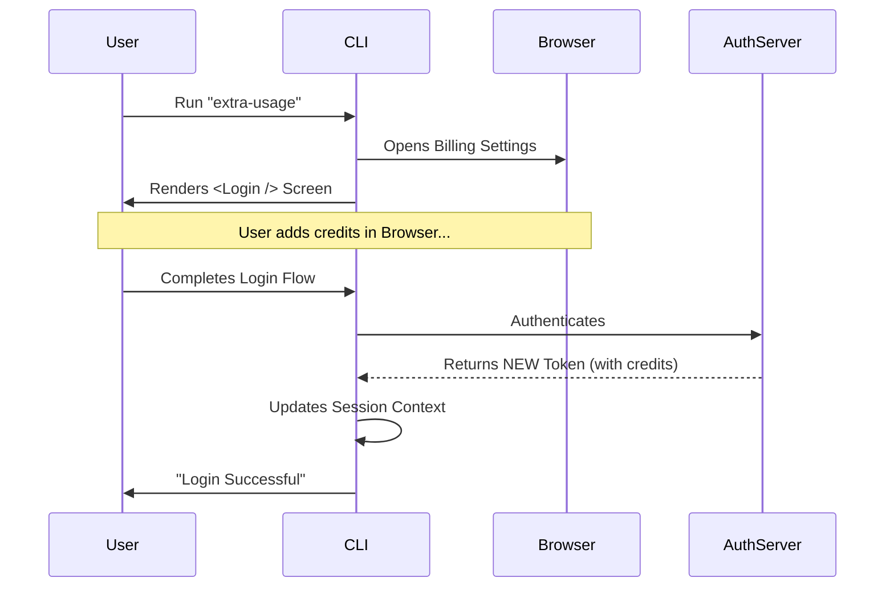

# Chapter 5: Session Refresh Strategy

Welcome to the final chapter of our tutorial series!

In the previous chapter, [Admin Request State Machine](04_admin_request_state_machine.md), we learned how to help employees politely ask for more usage limits.

But what about the **Managers**? Remember in [Core Workflow Engine](03_core_workflow_engine.md) that if a user has billing access, we send them to the web browser to pay for more credits.

Here is the problem: **The user pays in the browser, but the CLI doesn't know about it.**

The CLI is holding an old "ID Card" (Authentication Token) that says "This user has $0 credits." Even if the user adds $50 in the browser, the CLI's local ID card is outdated.

This chapter introduces the **Session Refresh Strategy**: How to force the CLI to tear up the old ID card and get a fresh one immediately.

## The Motivation: The Stale ID Card

Imagine you are at a theme park.
1.  You try to enter a roller coaster.
2.  The scanner beeps red: **"Not enough credits."**
3.  You go to a kiosk and buy a "Fast Pass."
4.  You run back to the scanner.

If the scanner (the CLI) remembers your status from 5 minutes ago, it will **still** beep red. You would have to leave the park and re-enter for the scanner to recognize your new pass. That is a terrible user experience.

In our CLI, we want the user to pay in the browser and immediately continue working in the terminal, without having to quit and restart.

## The Strategy: Seamless Re-Login

To solve this, we use a simple but powerful trick.

When the logic determines the user needs to visit the browser (`extra-usage-core`), the Interactive Command (`extra-usage.tsx`) doesn't just exit. Instead, it transitions directly into a **Login Screen**.

By forcing the user to log in again, we guarantee that:
1.  We authenticate with the server.
2.  The server issues a **brand new token**.
3.  This new token contains the updated billing permissions.

## Implementation: The Interactive Wrapper

Let's look at `extra-usage.tsx` again. This is where the strategy is implemented.

### Step 1: Execute Core Logic
First, we run the brain of our operation.

```typescript
// extra-usage.tsx
export async function call(onDone, context) {
  // 1. Run the core engine
  const result = await runExtraUsage()
  
  // ... check result ...
}
```
**Explanation:** We wait for the Core Engine to decide what to do. (See [Core Workflow Engine](03_core_workflow_engine.md)).

### Step 2: Handle Simple Messages
If the engine returns a simple message (like "Request Sent"), we print it and exit. We don't need to refresh the session for this.

```typescript
  // 2. If it's just a text message, we are done.
  if (result.type === 'message') {
    onDone(result.value)
    return null
  }
```
**Explanation:** `onDone` tells the CLI "We are finished here." Returning `null` means "Don't render any more UI."

### Step 3: Trigger the Session Refresh
If the result was **not** a message (meaning it was `browser-opened`), we assume the user might change something in the browser. We immediately render the Login component.

```typescript
  // 3. Render the Login component to refresh the session
  return (
    <Login
      startingMessage={'Starting new login...'}
      onDone={(success) => {
        context.onChangeAPIKey() // Update global state
        onDone(success ? 'Login successful' : 'Login interrupted')
      }}
    />
  )
}
```
**Explanation:**
*   **`<Login />`**: We import the existing Login screen component.
*   **`startingMessage`**: We explain to the user *why* they are logging in again.
*   **`context.onChangeAPIKey()`**: This is the crucial step. It updates the CLI's internal memory with the new key.

## Under the Hood: The Sequence

Here is what happens when a Manager runs this command. Notice how the CLI keeps running while the user is in the browser.



### Why this works
By embedding `<Login />` directly in the return statement, the CLI doesn't exit. It stays alive, waiting for the user to complete the authentication loop. This makes the experience feel like one continuous flow rather than two separate commands.

## Deep Dive: `context.onChangeAPIKey()`

You might notice this specific line in the code:

```typescript
context.onChangeAPIKey();
```

This is a method provided by the CLI framework's context.

*   **Without this:** The user would log in, get a new token on disk, but the *currently running* CLI process might still hold the old token in memory variable.
*   **With this:** We explicitly tell the running application: "I have replaced the API key on the disk. Please reload your in-memory configuration."

This ensures that any subsequent command the user runs (immediately after this one finishes) uses the fresh permissions.

## Summary

In this final chapter, we learned:
1.  **The "Stale Token" Problem:** Local state becomes outdated when users modify settings on the server (browser).
2.  **The Refresh Strategy:** We reuse the `<Login />` component to force a fresh authentication handshake.
3.  **State Synchronization:** We use `onChangeAPIKey()` to ensure the running application adopts the new credentials immediately.

### Project Conclusion

Congratulations! You have navigated the entire architecture of the `extra-usage` command.

*   **Chapter 1:** We registered the command and handled permissions.
*   **Chapter 2:** We split the command into Interactive (UI) and Headless (Script) modes.
*   **Chapter 3:** We built a shared Core Engine to handle logic centrally.
*   **Chapter 4:** We built a State Machine to handle complex admin requests.
*   **Chapter 5:** We implemented a Session Refresh to ensure billing changes apply instantly.

You now possess the knowledge to build robust, user-friendly, and secure CLI commands that bridge the gap between terminal inputs and web-based settings!

---

Generated by [Code IQ](https://github.com/adityasoni99/Code-IQ)