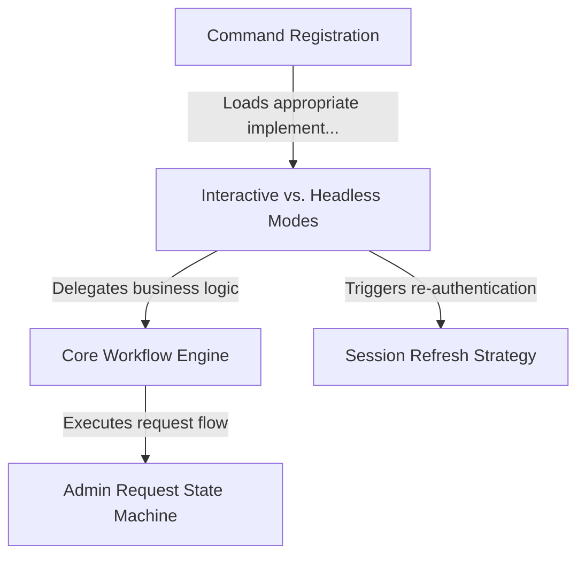

# Tutorial: extra-usage

This project implements a **CLI command** designed to help users manage billing limits or request **extra usage credits** directly from their terminal. It intelligently detects the environment to switch between a rich *interactive UI* (which handles re-authentication) and a simple *headless text mode* suitable for automated scripts.

## Chapters

1. [Command Registration](01_command_registration.md)
2. [Interactive vs. Headless Modes](02_interactive_vs__headless_modes.md)
3. [Core Workflow Engine](03_core_workflow_engine.md)
4. [Admin Request State Machine](04_admin_request_state_machine.md)
5. [Session Refresh Strategy](05_session_refresh_strategy.md)

---

Generated by [Code IQ](https://github.com/adityasoni99/Code-IQ)