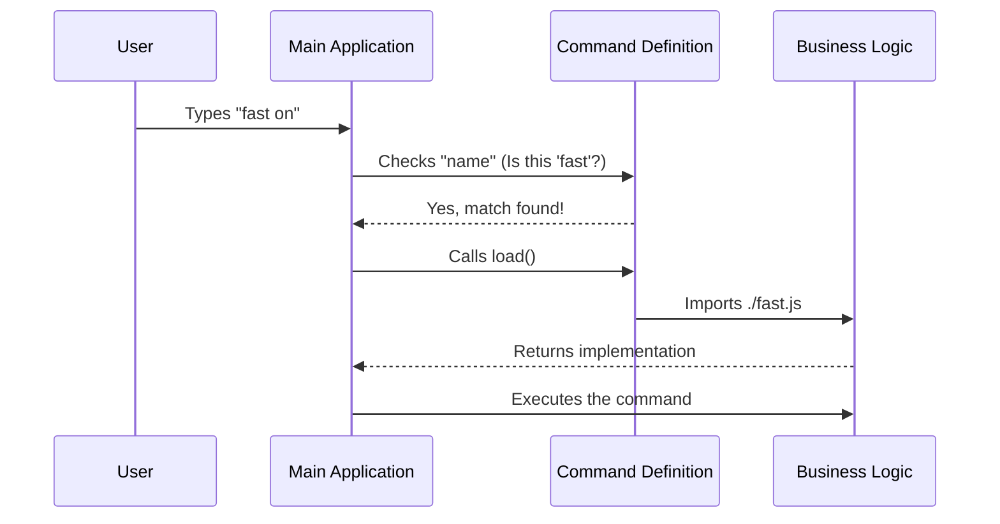

# Chapter 1: Command Plugin Definition

Welcome to the `fast` project! In this first chapter, we are going to look at the foundational building block of our CLI (Command Line Interface) tool: the **Command Plugin Definition**.

## Why do we need this?

Imagine you are building a smartphone app with hundreds of features. If you tried to load every single feature into memory the moment the user opened the app, it would take forever to start!

Instead, you want a system that lists the **names** of the features (like icons on a home screen) but only loads the heavy computer code when the user actually taps one.

That is exactly what a **Command Plugin Definition** does. It acts like a "manifest" or a "business card" for a feature. It tells the main application:
1.  "My name is `fast`."
2.  "Here is what I do."
3.  "Only load my heavy logic file if someone actually calls my name."

### The Use Case

We want to create a command that users can run by typing:

```bash
> fast on
```

We need a lightweight way to register this command so the application knows it exists.

## Key Concepts

Before we look at the code, let's understand the three main parts of this definition:

1.  **Identity:** The name and type of the command.
2.  **Metadata:** Helpful info like descriptions and hints for the user (e.g., valid arguments).
3.  **The "Lazy" Loader:** A function that imports the actual business logic only when needed.

## Building the Definition

Let's look at how we define the `fast` command in our `index.ts` file. We will break the code into small pieces.

### 1. Identity and Description

First, we define the basic identity. This allows the application to list the command in a help menu without loading any heavy code.

```typescript
const fast = {
  type: 'local-jsx', // Specifies the rendering style
  name: 'fast',      // The command keyword the user types
  get description() {
    // A dynamic description shown in the help menu
    return `Toggle fast mode (${FAST_MODE_MODEL_DISPLAY} only)`
  },
  // ... continued below
```

**Explanation:**
*   `name`: This is the specific word the user types to trigger the command.
*   `description`: A short sentence explaining what the command does. Notice we use a getter (`get description()`) so we can include dynamic variables like `FAST_MODE_MODEL_DISPLAY`.

### 2. Availability and Hints

Next, we tell the application *when* this command is allowed to run and what arguments it accepts.

```typescript
  // ... continued
  availability: ['claude-ai', 'console'], // Where can this run?
  isEnabled: () => isFastModeEnabled(),   // Check global settings
  get isHidden() {
    return !isFastModeEnabled()           // Hide if disabled
  },
  argumentHint: '[on|off]',               // Visual hint for user
  // ... continued below
```

**Explanation:**
*   `availability`: Defines which environments (like specific AI models or consoles) support this command.
*   `isEnabled`: Checks [Global Application State](03_global_application_state.md) to see if the command can currently be used.
*   `argumentHint`: Shows the user that they can type `on` or `off` after the command.

### 3. The Lazy Loader

This is the most critical part. We link the definition to the actual code execution.

```typescript
  // ... continued
  load: () => import('./fast.js'),
} satisfies Command

export default fast
```

**Explanation:**
*   `load`: This is a function that returns an `import`. This is **Lazy Loading**. The file `./fast.js` (which contains the [Fast Mode Business Logic](02_fast_mode_business_logic.md)) is **not** read or loaded until the moment this function is called.
*   `satisfies Command`: This ensures our object follows the strict rules required by the application.

## Under the Hood: How it works

When the application starts, it doesn't run the command. It just reads this definition file. Here is the flow of events:



### Internal Implementation Details

The definitions are usually aggregated in a central registry. Because our `fast` object exports a generic interface, the main application treats it like a plugin.

The application relies on the `immediate` property to decide execution timing.

```typescript
import { shouldInferenceConfigCommandBeImmediate } from '../../utils/immediateCommand.js'

// Inside the fast object:
get immediate() {
    // Determines if we run now or wait for queue
    return shouldInferenceConfigCommandBeImmediate()
},
```

**Explanation:**
*   Sometimes, commands need to interrupt the current flow (like cancelling a process), and sometimes they wait their turn.
*   The `immediate` property tells the command runner how to schedule this task.

## Summary

In this chapter, we learned how to define a **Command Plugin**. This abstraction allows us to:
1.  Register the command `fast`.
2.  Provide metadata like descriptions and hints.
3.  Keep the application fast by "lazy loading" the heavy logic only when requested.

Now that we have defined *what* the command is, we need to write the code for *what it actually does*.

[Next: Fast Mode Business Logic](02_fast_mode_business_logic.md)

---

Generated by [Code IQ](https://github.com/adityasoni99/Code-IQ)