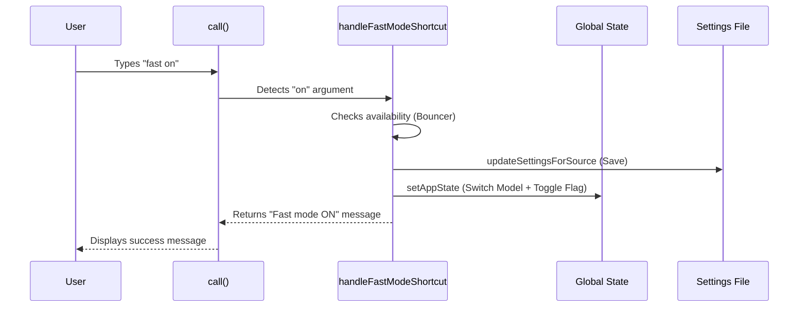

# Chapter 2: Fast Mode Business Logic

Welcome back! In the previous chapter, [Command Plugin Definition](01_command_plugin_definition.md), we created the "manifest" for our `fast` command. We told the application *that* the command exists, but we haven't told it *how* to work yet.

Now, we are going to build the "Brain" of this feature.

## The Motivation

Imagine you flip a light switch in your house.
1.  **Input:** You flip the switch.
2.  **Logic:** The electrical circuit checks if there is power, if the bulb is screwed in, and if the fuse is intact.
3.  **Action:** The light turns on.

In software, "Business Logic" is that middle step. When a user types `fast on`, we can't just blindly change a variable. We need to answer several questions first:
*   Is the user actually allowed to use Fast Mode?
*   Are they currently on a "cooldown" (waiting period)?
*   Do we need to swap out their AI model for a cheaper/faster one automatically?
*   Did we remember to save this preference so it stays "on" next time they open the app?

## The Use Case

We are building the logic to handle two scenarios:
1.  **Direct Toggle:** User types `fast on` or `fast off`.
2.  **Interactive Picker:** User types `fast` (no arguments), which opens a menu to let them choose.

In this chapter, we focus on the **Logic** that powers both scenarios.

## Key Concepts

### 1. The Entry Point (`call`)
Every command needs a main function usually named `call`. This is what the application executes after the "Lazy Loader" (from Chapter 1) imports the file.

### 2. Validation (The Bouncer)
Before doing anything, we must check if the feature is available. If the server is overloaded or the user's organization has disabled the feature, we stop immediately.

### 3. State Mutation (The Switch)
This is the core action. We need to update the [Global Application State](03_global_application_state.md). This is the app's short-term memory.

### 4. Persistence (The Save File)
We also need to update `userSettings`. This is the app's long-term memory (saved to a file on the computer), so the user doesn't have to enable Fast Mode every time they restart.

## Building the Logic

Let's look at the implementation in `fast.tsx`.

### Step 1: The Entry Point

When the command runs, the `call` function is executed. It checks if the user provided an argument like "on" or "off".

```typescript
// inside fast.tsx
export async function call(
  onDone: LocalJSXCommandOnDone,
  context: LocalJSXCommandContext,
  args?: string
) {
  // 1. Check if the feature is globally enabled
  if (!isFastModeEnabled()) {
    return null;
  }
  
  // ... continued below
```

**Explanation:**
We immediately check `isFastModeEnabled()`. If the feature is turned off at a system level, we do nothing.

### Step 2: Handling Arguments

If the user typed `fast on`, we want to bypass the menu and just do it.

```typescript
  // ... inside call function
  const arg = args?.trim().toLowerCase();

  if (arg === 'on' || arg === 'off') {
    // Perform the logic directly
    const result = await handleFastModeShortcut(
      arg === 'on', 
      context.getAppState, 
      context.setAppState
    );
    onDone(result); // Tell the app we are finished
    return null;
  }
```

**Explanation:**
*   `args`: The text typed after the command.
*   `handleFastModeShortcut`: A helper function that runs our logic without showing a UI.
*   `onDone`: A callback that tells the CLI "I'm finished, here is the result message."

### Step 3: The Core Logic (`applyFastMode`)

This is the most important function in the file. It orchestrates the actual change. It handles **Persistence** and **State Mutation**.

First, let's handle **Persistence** (saving to disk).

```typescript
function applyFastMode(
  enable: boolean, 
  setAppState: (f: (prev: AppState) => AppState) => void
): void {
  // 1. Reset any temporary cooldown timers
  clearFastModeCooldown();

  // 2. Save to "Long Term Memory" (User Settings file)
  updateSettingsForSource('userSettings', {
    fastMode: enable ? true : undefined
  });
  
  // ... continued below
```

**Explanation:**
*   `updateSettingsForSource`: This utility saves the preference to a JSON file on the user's computer. Even if they crash, we remember they wanted Fast Mode.

Next, we handle **State Mutation** (updating memory). This part is tricky because enabling Fast Mode might require changing the active AI Model.

```typescript
  // ... inside applyFastMode
  if (enable) {
    setAppState(prev => {
      // Check if the current model SUPPORTS fast mode
      const needsModelSwitch = !isFastModeSupportedByModel(prev.mainLoopModel);

      return {
        ...prev,
        // If needed, swap to a fast-supported model (e.g., Haiku)
        ...(needsModelSwitch ? {
          mainLoopModel: getFastModeModel(),
          mainLoopModelForSession: null // Clear session overrides
        } : {}),
        fastMode: true // The core change
      };
    });
  }
  // ... else block handles disabling it
}
```

**Explanation:**
*   `setAppState`: Updates the [Global Application State](03_global_application_state.md).
*   **The Logic:** You can't be in Fast Mode if you are using a heavy, slow model. If the user turns Fast Mode ON, but they are using a slow model, we automatically switch `mainLoopModel` to the designated `FastModeModel`.

## Under the Hood: Internal Implementation

When `fast on` is called, a chain reaction occurs.

### Sequence Diagram



### Telemetry and User Feedback

Business logic isn't just about changing variables; it's about tracking what happened.

```typescript
// inside handleFastModeShortcut
logEvent('tengu_fast_mode_toggled', {
  enabled: enable,
  source: 'shortcut'
});

if (enable) {
  return `${getFastIconString(true)} Fast mode ON`;
} else {
  return `Fast mode OFF`;
}
```

**Explanation:**
*   `logEvent`: Sends anonymous usage data (see [Event Telemetry](06_event_telemetry.md)). This helps us know how many people use this feature.
*   The function returns a string. This string is what the user sees in their terminal after hitting Enter.

## Summary

In this chapter, we built the **Fast Mode Business Logic**. We learned:

1.  **The `call` entry point** receives the user's input.
2.  **The Bouncer** validates if the command can run.
3.  **The Logic Core** (`applyFastMode`) updates persistent settings on the disk AND updates the application state in memory.
4.  It intelligently **swaps AI models** if required.

However, we kept mentioning `setAppState` and `AppState`. What exactly is that? How does the rest of the application know that we changed this variable?

[Next: Global Application State](03_global_application_state.md)

---

Generated by [Code IQ](https://github.com/adityasoni99/Code-IQ)