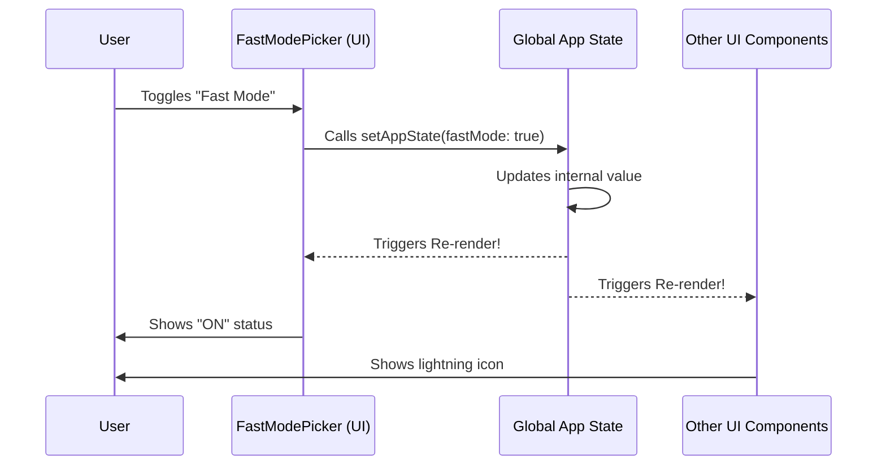

# Chapter 3: Global Application State

Welcome to Chapter 3! In the previous chapter, [Fast Mode Business Logic](02_fast_mode_business_logic.md), we wrote the code to toggle "Fast Mode" on and off. We calculated whether the user was allowed to use it and we saved their preference to a file.

However, we have a missing link.

When you run `fast on`, how does the rest of the application—like the UI that shows the current model name, or the AI loop that sends messages—know that the setting has changed?

This brings us to the **Global Application State**.

## The Motivation

Imagine you are in a classroom.
*   **Without Global State:** If the teacher wants to tell every student that "Math Class is cancelled," she has to whisper it to the first student, who whispers it to the second, and so on. This is slow and prone to errors (in React, we call this "Prop Drilling").
*   **With Global State:** The teacher writes "NO MATH CLASS" on the big whiteboard at the front of the room. Every student simply looks up and knows the status immediately.

In the `fast` project, the **Global Application State** is that whiteboard. It is the "Single Source of Truth."

### The Use Case

We need to build the `FastModePicker` (a menu that lets users toggle the mode).
1.  It needs to **Read** the current state (Is Fast Mode already on?).
2.  It needs to **Write** the new state when the user presses Enter.
3.  It needs to **React** (update the screen) immediately when the state changes.

## Key Concepts

We interact with this "Whiteboard" using two special tools (Hooks):

### 1. The Reader (`useAppState`)
This hook allows a component to "put on glasses" and look at a specific part of the whiteboard. If that part of the whiteboard changes, the component automatically re-runs to show the new data.

### 2. The Writer (`useSetAppState`)
This hook gives you a "marker." It allows you to change what is written on the whiteboard.

### 3. The State Object (`AppState`)
This is the data structure itself. It looks something like this:

```typescript
type AppState = {
  mainLoopModel: string; // e.g., 'claude-3-opus'
  fastMode: boolean;     // e.g., true or false
  // ... other global settings
}
```

## How to Use It

Let's see how we use these tools inside our `FastModePicker` component (found in `fast.tsx`).

### Reading the State

We want to know the current model and whether fast mode is active.

```typescript
import { useAppState } from '../../state/AppState.js';

// Inside a React Component:
const model = useAppState(state => state.mainLoopModel);
const isFastMode = useAppState(state => state.fastMode);
```

**Explanation:**
*   `useAppState` takes a "selector function."
*   `state => state.fastMode` means: "I only care about the `fastMode` variable. Please give me its current value."
*   If `fastMode` changes from `false` to `true`, this component will re-render automatically.

### Writing the State

Now, let's look at how we update the state when the user toggles the feature.

```typescript
import { useSetAppState } from '../../state/AppState.js';

// 1. Get the "marker" (the setter function)
const setAppState = useSetAppState();

// 2. Use it to update state
setAppState(currentState => ({
  ...currentState,   // Keep all other settings the same!
  fastMode: true     // Overwrite this specific setting
}));
```

**Explanation:**
*   `setAppState` is a function that accepts an update function.
*   `...currentState`: This is the "Spread Operator." It copies everything currently on the whiteboard so we don't accidentally erase the user's other settings.
*   `fastMode: true`: We explicitly change only the value we want.

## Internal Implementation: How it Works

When you call `setAppState`, a chain reaction occurs. The state updates, and every component "listening" to that state via `useAppState` is notified.



### Real World Code Example

Let's look at a simplified version of the logic inside `fast.tsx` that combines what we learned.

In the previous chapter, we created the function `applyFastMode`. Here is how it uses the state setter to not only toggle the flag but also switch the AI model if necessary.

```typescript
// Inside applyFastMode function in fast.tsx

if (enable) {
  // We use the setter we got from the hook
  setAppState(prev => {
    
    // Check if current model is too slow for fast mode
    const mustSwitch = !isFastModeSupportedByModel(prev.mainLoopModel);

    return {
      ...prev,                 // Copy existing state
      fastMode: true,          // Turn on the flag
      // If we must switch, change the model too. Otherwise, do nothing.
      ...(mustSwitch ? { mainLoopModel: 'claude-3-haiku' } : {}) 
    };
  });
}
```

**Explanation:**
This is a powerful pattern. We are conditionally updating multiple parts of the global state at once.
1.  We look at the *previous* state (`prev`).
2.  We decide if `mainLoopModel` needs to change.
3.  We return a new object that represents the *entire* future state of the application.

## Why this matters for the User Interface

Because we are using this reactive global state, we don't need to manually tell the screen to update.

In `fast.tsx`, the `FastModePicker` component is defined like this:

```typescript
export function FastModePicker({ onDone }) {
  // 1. Hook into the state
  const enableFastMode = useAppState(s => s.fastMode);

  // 2. Render based on that state
  return (
    <Box>
       <Text bold>Fast mode</Text>
       {/* The text below changes automatically! */}
       <Text color={enableFastMode ? "green" : "gray"}>
         {enableFastMode ? "ON" : "OFF"}
       </Text>
    </Box>
  );
}
```

Because `enableFastMode` comes from `useAppState`, the moment our logic function updates the state, this `<Text>` tag flips from "OFF" to "ON" and turns green.

## Summary

In this chapter, we learned about **Global Application State**:
1.  It is the "Whiteboard" accessible by the whole app.
2.  We read from it using `useAppState`.
3.  We write to it using `useSetAppState`.
4.  It powers the reactive nature of our tool—change data in one place, and the UI updates everywhere.

Now that we have our Logic (Chapter 2) and our Data (Chapter 3), we need to actually draw that beautiful interface we just saw in the code snippets.

[Next: Terminal UI (TUI) Rendering](04_terminal_ui__tui__rendering.md)

---

Generated by [Code IQ](https://github.com/adityasoni99/Code-IQ)