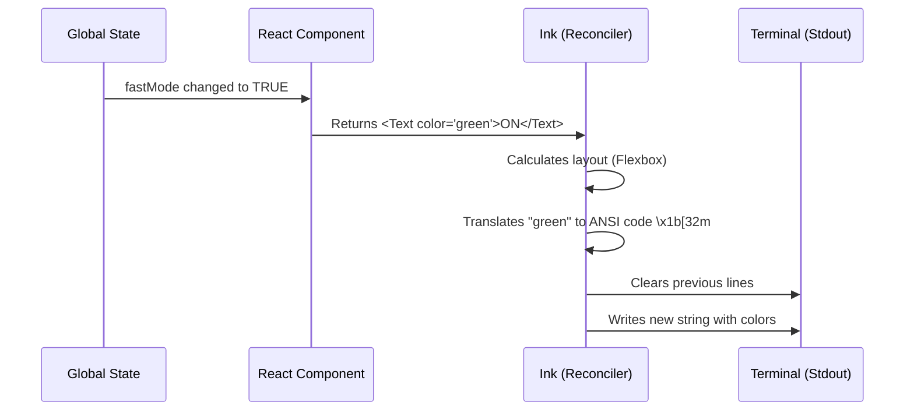

# Chapter 4: Terminal UI (TUI) Rendering

Welcome back! In the previous chapter, [Global Application State](03_global_application_state.md), we built the "brain" and "memory" of our `fast` command. We know how to toggle the setting in memory and save it to a file.

But right now, if you ran the command, nothing would happen on the screen. The user would be staring at a blank terminal.

In this chapter, we will build the **Terminal UI (TUI)**. This is the "face" of our feature.

## The Motivation

In the old days of command-line tools, programs just printed text line-by-line using `console.log`.

```bash
> Task started.
> Task finished.
```

This is fine for simple scripts, but modern CLI tools need to be **interactive**. We want to:
1.  Update text in place (without scrolling down).
2.  Show colors (Green for "ON", Gray for "OFF").
3.  Display a nice border box around our tool.

To do this, we use a technology called **Ink**. It allows us to write **React** components (just like a website), but instead of rendering HTML to a browser, it renders text to your terminal window.

### The Use Case

We are building the visual part of the **Fast Mode Picker**.


*(Conceptual visualization: A box with text inside)*

It needs to display:
*   A Title ("Fast mode").
*   The Status ("ON" or "OFF").
*   Pricing information.
*   A surrounding box/dialog.

## Key Concepts

### 1. React in the Terminal
If you have used React for the web, you know `<div>` and `<span>`. In the terminal, we don't have a browser engine, so we use equivalents provided by the **Ink** library:

*   **`<Box>`**: The replacement for `<div>`. It handles layout (Flexbox), margins, and padding.
*   **`<Text>`**: The replacement for `<span>` or `<p>`. All text **must** be wrapped in this tag.

### 2. The `Dialog` Component
This is a custom component built for our project. It draws a nice border around our content and handles the title and helper text (like "Press Enter to confirm").

### 3. Dynamic Rendering
Just like a website, when our [Global Application State](03_global_application_state.md) changes, our component "re-renders" to update the terminal text instantly.

## Building the UI

Let's look at `fast.tsx` and see how we construct the visual interface.

### Step 1: The Setup

We start by importing our building blocks.

```typescript
import * as React from 'react';
import { Box, Text } from '../../ink.js'; // Our TUI primitives
import { Dialog } from '../../components/design-system/Dialog.js';
import { FastIcon } from '../../components/FastIcon.js';

// The Component
export function FastModePicker({ onDone, unavailableReason }) {
  // ... hooks from Chapter 3 go here ...
```

**Explanation:**
*   We define a standard React functional component called `FastModePicker`.
*   It receives props like `unavailableReason` so it knows if it should display an error message.

### Step 2: Designing the Content (`Box` and `Text`)

We want to show the status. We use a Flexbox row layout.

```typescript
// Inside the component return statement
<Box flexDirection="column" marginLeft={2}>
  <Box flexDirection="row" gap={2}>
    <Text bold>Fast mode</Text>
    
    {/* Dynamic Color changing based on state */}
    <Text color={enableFastMode ? "green" : "gray"}>
      {enableFastMode ? "ON " : "OFF"}
    </Text>
    
    <Text dimColor>{pricing}</Text>
  </Box>
</Box>
```

**Explanation:**
*   `<Box flexDirection="row">`: Places items side-by-side.
*   `<Text color={...}>`: This is where the magic happens. If `enableFastMode` is true (from our State), the text turns green. If false, it turns gray.
*   `dimColor`: A helper prop to make the pricing text less distracting.

### Step 3: Wrapping in a `Dialog`

Finally, we wrap that content in our `Dialog` component to give it a professional look.

```typescript
return (
  <Dialog
    title={<Text><FastIcon /> Fast mode</Text>}
    subtitle="High-speed mode. Billed as extra usage."
    color="fastMode" // Theme color
    inputGuide={<Text>Tab to toggle · Enter to confirm</Text>}
  >
    {/* The content from Step 2 goes here */}
    {content} 
  </Dialog>
);
```

**Explanation:**
*   `Dialog`: Draws the border and standardizes the look.
*   `title`: We can pass other components (like icons) into the title.
*   `inputGuide`: Tells the user which keys to press.

## Under the Hood: How Rendering Works

It might seem strange that we are writing HTML-like code for a black-and-white terminal. Here is how it works:



1.  **Reconciliation:** When state changes, React figures out *what* needs to change (e.g., just the word "OFF" to "ON").
2.  **Layout Engine:** Ink uses a purely mathematical version of Flexbox (Yoga layout engine) to calculate where the text should sit on the grid of character cells.
3.  **Painting:** Ink converts these instructions into **ANSI Escape Codes** (special hidden characters that tell the terminal to change color or move the cursor) and prints them to `stdout`.

### Internal Implementation Details

The file `fast.tsx` handles a complex logic: what if Fast Mode is unavailable (e.g., server down)?

We use **Conditional Rendering** to swap the entire UI if there is an error.

```typescript
// Inside FastModePicker
if (unavailableReason) {
  return (
    <Dialog title="...">
      <Box marginLeft={2}>
        {/* Render Error Message in Red */}
        <Text color="error">{unavailableReason}</Text>
      </Box>
    </Dialog>
  );
}
// Otherwise render the normal UI...
```

**Explanation:**
*   React allows us to branch our logic.
*   If `unavailableReason` exists, we ignore the "ON/OFF" switch and just show the error in red.
*   This ensures the user never tries to toggle a broken feature.

## Summary

In this chapter, we learned about **Terminal UI (TUI) Rendering**:

1.  We use **React** and **Ink** to build interfaces for the terminal.
2.  We replace HTML tags with `<Box>` (for layout) and `<Text>` (for content).
3.  We treat the terminal output as a dynamic, changing surface, not just a log file.
4.  We wrap our UI in a `Dialog` to make it look consistent with the rest of the app.

We have a beautiful interface that shows the state. But currently, if you press "Tab" or "Enter", nothing happens! The UI looks ready, but it isn't listening to your keyboard yet.

[Next: Keyboard Input Abstraction](05_keyboard_input_abstraction.md)

---

Generated by [Code IQ](https://github.com/adityasoni99/Code-IQ)