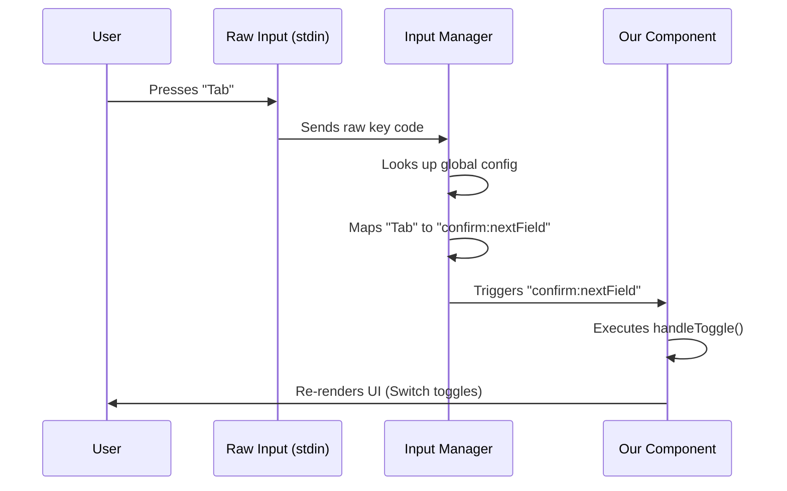

# Chapter 5: Keyboard Input Abstraction

Welcome back! In the previous chapter, [Terminal UI (TUI) Rendering](04_terminal_ui__tui__rendering.md), we built a beautiful interface for our Fast Mode Picker. It displays text, colors, and borders using React components.

However, if you ran the command right now, you would hit a wall. You could see the menu, but pressing "Enter" or "Tab" would do absolutely nothing. The interface is currently just a painting—nice to look at, but you can't drive it.

In this chapter, we will implement the **Keyboard Input Abstraction**. We will wire up the dashboard to the engine.

## The Motivation

Handling keyboard input in a terminal is surprisingly difficult.
*   **The Hard Way:** You have to listen to a stream of raw data. A letter like 'a' is easy, but special keys like `Up Arrow` or `Home` send complex binary codes that differ between operating systems.
*   **The `fast` Way:** We don't want to think about binary codes. We want to think about **Actions**.

We want to say: *"When the user wants to **Confirm**, run this function."* We don't care if they pressed `Enter`, `Space`, or clicked a button. We just care about the intent.

### The Use Case

We need to make our `FastModePicker` interactive.
1.  **Toggle:** When the user presses `Tab` (or arrows), switch between ON and OFF.
2.  **Confirm:** When the user presses `Enter`, save the choice and exit.
3.  **Cancel:** When the user presses `Esc`, close the menu without saving.

## Key Concepts

To achieve this, we use a special tool called `useKeybindings`. It relies on two main ideas:

### 1. Semantic Actions
Instead of listening for "Key Code 13" (Enter), we listen for `confirm:yes`.
Instead of listening for "Key Code 9" (Tab), we listen for `confirm:toggle`.

This is called **Abstraction**. It separates the *physical button* from the *logical action*.

### 2. The Action Map
This is a simple dictionary (object) where we link the Logical Action to a JavaScript Function.

```text
"confirm:yes"    ------------>  Run handleConfirm() function
"confirm:toggle" ------------>  Run handleToggle() function
```

## Implementing the Logic

Let's wire up the `FastModePicker` inside `fast.tsx`.

### Step 1: define the Action Map

We already have our logic functions `handleConfirm` and `handleToggle` (created in Chapter 2 and 3). Now we group them into an object.

```typescript
// Inside FastModePicker component
const keybindingMap = {
  'confirm:yes': handleConfirm,       // Usually mapped to Enter
  'confirm:toggle': handleToggle,     // Usually mapped to Space
  'confirm:nextField': handleToggle,  // Usually mapped to Tab
  'confirm:cycleMode': handleToggle,  // Usually mapped to Arrows
};
```

**Explanation:**
*   We map multiple semantic actions to the same function (`handleToggle`).
*   This ensures that whether the user presses Tab, Right Arrow, or Space, the toggle still happens. This makes the UI feel responsive and intuitive.

### Step 2: Activate the Hook

Now we pass this map to the `useKeybindings` hook. This tells the application: "Start listening immediately."

```typescript
import { useKeybindings } from '../../keybindings/useKeybinding.js';

// Inside the component
useKeybindings(
  keybindingMap, 
  { context: 'Confirmation' } // Metadata for help menus
);
```

**Explanation:**
*   `keybindingMap`: The object we created in Step 1.
*   `context`: This is a label. If the user asks for "Help", the app can show them: *"In the **Confirmation** context, press Enter to Confirm."*

## Under the Hood: How it Works

When you use this abstraction, you aren't just adding an event listener. You are plugging into a global input management system.

### Sequence Diagram



### Internal Implementation Details

In `fast.tsx`, we combine these steps into a concise block of code. Notice how we handle the `onCancel` logic slightly differently.

The `Esc` key (Cancel) is often handled globally by the `Dialog` component (which we used in [Chapter 4: Terminal UI (TUI) Rendering](04_terminal_ui__tui__rendering.md)), but we define the specific confirm/toggle behaviors here.

```typescript
// Real code from fast.tsx

// 1. Define the map
const bindings = {
  'confirm:yes': handleConfirm,
  'confirm:nextField': handleToggle,
  'confirm:next': handleToggle,
  'confirm:previous': handleToggle,
  'confirm:cycleMode': handleToggle,
  'confirm:toggle': handleToggle,
};

// 2. Register the bindings
useKeybindings(bindings, { context: 'Confirmation' });
```

**Why so many bindings?**
Different users have different habits.
*   Some expect `Tab` to move to the next item (`confirm:nextField`).
*   Some expect `Right Arrow` to move (`confirm:next`).
*   Some expect `Space` to toggle a checkbox (`confirm:toggle`).

By mapping all of these to `handleToggle`, we ensure the tool works exactly how the user intuitively expects it to, regardless of their navigation style.

## Summary

In this chapter, we learned about **Keyboard Input Abstraction**:

1.  We don't listen for raw keys (like "Enter"); we listen for **Semantic Actions** (like `confirm:yes`).
2.  We use the `useKeybindings` hook to map these actions to our functions.
3.  We map multiple actions to a single function to support different user habits (Tab, Arrows, Space).

Now our command is fully functional!
1.  We defined it (Chapter 1).
2.  We gave it logic (Chapter 2).
3.  We gave it memory (Chapter 3).
4.  We gave it a face (Chapter 4).
5.  We gave it controls (Chapter 5).

But... are people actually using it? Is it working correctly in the wild? We need a way to spy on our own application (anonymously, of course).

[Next: Event Telemetry](06_event_telemetry.md)

---

Generated by [Code IQ](https://github.com/adityasoni99/Code-IQ)