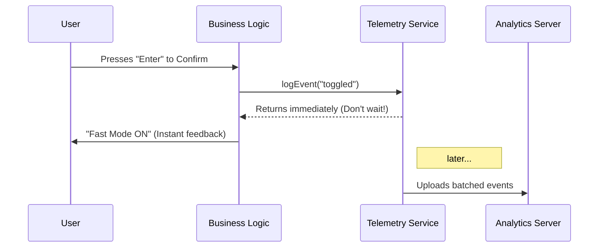

# Chapter 6: Event Telemetry

Welcome to the final chapter of our specific feature walkthrough! 

In the previous chapter, [Keyboard Input Abstraction](05_keyboard_input_abstraction.md), we made our Fast Mode tool interactive. Users can now open the menu, toggle options, and confirm their choices using the keyboard.

But here is a scary thought: **Once we release this to users, we are flying blind.**

*   Are people actually using it?
*   Are they trying to use it, but getting an error because the server is down?
*   Do they prefer typing `fast on` (shortcut) or opening the menu?

To answer these questions without standing behind every user's shoulder, we use **Event Telemetry**.

## The Motivation

Imagine you run a bakery.
*   **Without Telemetry:** You bake 100 croissants. At the end of the day, 50 are left. You don't know if people didn't like them, or if they just didn't see them.
*   **With Telemetry:** You have a clicker counter. You click it every time someone *looks* at a croissant, and click it again when they *buy* one.

In software, **Event Telemetry** is that clicker. It allows our code to send small, anonymous postcards to our servers saying, "Hey, this thing just happened!"

### The Use Case

For our `fast` command, we want to track two specific moments:
1.  **Exposure:** The user opened the menu (`tengu_fast_mode_picker_shown`).
2.  **Action:** The user successfully changed the setting (`tengu_fast_mode_toggled`).

## Key Concepts

### 1. The Event Name
This is a unique ID for the action. It should be descriptive.
*   Good: `tengu_fast_mode_toggled`
*   Bad: `button_clicked` (Too vague! Which button?)

### 2. The Metadata (Payload)
Just knowing "it happened" isn't always enough. We need context.
If the user toggled the mode, did they turn it **ON** or **OFF**? Did they use the **Menu** or the **Shortcut**? We pass this extra info as a simple object.

### 3. Fire-and-Forget
Telemetry should never slow down the application. When we log an event, we don't wait for a receipt. We "fire" the event and immediately let the code continue running.

## Implementing Telemetry

Let's look at how we added this to `fast.tsx`. We use a helper function called `logEvent`.

### Step 1: Tracking the "View"

When the command is called (but before the user selects anything), we want to record that the menu was opened. We also want to know if the menu showed an error (like "System Overloaded").

```typescript
// inside the call() function in fast.tsx

// 1. Get the status (is the system down?)
const unavailableReason = getFastModeUnavailableReason();

// 2. Log the event
logEvent('tengu_fast_mode_picker_shown', {
  unavailable_reason: (unavailableReason ?? '')
});

// 3. Show the UI (The log happens in the background)
return <FastModePicker ... />;
```

**Explanation:**
*   `tengu_fast_mode_picker_shown`: The name of our event.
*   `unavailable_reason`: If the user sees an error, we want to know about it. If 1,000 users see this error, we know we have a server problem!

### Step 2: Tracking the "Action"

Now, let's look at what happens when the user actually changes the setting. This happens in our logic handler.

```typescript
// inside handleFastModeShortcut
// ... logic to save settings ...

logEvent('tengu_fast_mode_toggled', {
  enabled: enable,   // Did they turn it ON (true) or OFF (false)?
  source: 'shortcut' // Did they use the CLI arg?
});

// ... return success message ...
```

**Explanation:**
*   `enabled`: This boolean is crucial. It helps us calculate the "Adoption Rate" (how many people keep it on).
*   `source`: This helps our Product Designers. If 99% of users use `source: 'shortcut'`, maybe we don't need to maintain the visual menu anymore!

## Under the Hood: How it Works

You might be wondering: *"Does sending this data over the internet make my CLI slow?"*

The answer is **No**. The `logEvent` service uses a "buffer" system.



### Internal Implementation Details

In our code, you might notice a strange type cast: `as AnalyticsMetadata_I_VERIFIED...`.

```typescript
logEvent('tengu_fast_mode_toggled', {
  enabled: enable,
  source: 'picker' as AnalyticsMetadata_I_VERIFIED_THIS_IS_NOT_CODE_OR_FILEPATHS
});
```

**Why is this here?**
This is a safety mechanism.
*   **Privacy First:** We never want to accidentally send the user's code, file paths, or private prompt text to our analytics server.
*   **The Type Check:** This long, scary type name forces the developer to promise: *"I have checked this variable. It is just a static string like 'picker', NOT a user's private file content."*

## Summary

In this final chapter, we learned about **Event Telemetry**:
1.  It acts as the "eyes and ears" of the developer.
2.  We use `logEvent` to record specific actions (Views and Toggles).
3.  We attach **Metadata** to understand *how* the feature is being used.
4.  It runs asynchronously so it never slows down the user experience.

### Conclusion of the Tutorial

Congratulations! You have walked through the entire lifecycle of a command in the `fast` project.

1.  We **Defined** the command so the app knows it exists ([Chapter 1](01_command_plugin_definition.md)).
2.  We wrote the **Business Logic** to handle the heavy lifting ([Chapter 2](02_fast_mode_business_logic.md)).
3.  We managed **Global State** to keep the app in sync ([Chapter 3](03_global_application_state.md)).
4.  We rendered a **TUI** using React and Ink ([Chapter 4](04_terminal_ui__tui__rendering.md)).
5.  We wired up **Keyboard Inputs** for interaction ([Chapter 5](05_keyboard_input_abstraction.md)).
6.  We added **Telemetry** to track success (Chapter 6).

You now possess the knowledge to build your own powerful, interactive, and data-driven CLI tools. Happy coding!

---

Generated by [Code IQ](https://github.com/adityasoni99/Code-IQ)