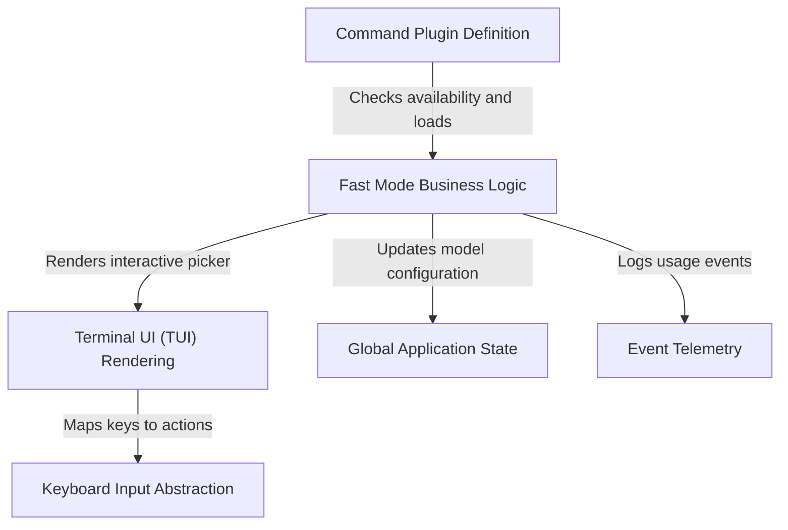

# Tutorial: fast

The project implements a **Fast Mode** feature for a CLI application, enabling users to toggle a high-speed, premium AI model with specific pricing and cooldown rules. It utilizes a *command plugin* architecture to lazy-load the feature, a centralized **Global Application State** to manage model transitions, and a React-based *Terminal UI* to present interactive confirmation dialogs and status updates.

## Chapters

1. [Command Plugin Definition](01_command_plugin_definition.md)
2. [Fast Mode Business Logic](02_fast_mode_business_logic.md)
3. [Global Application State](03_global_application_state.md)
4. [Terminal UI (TUI) Rendering](04_terminal_ui__tui__rendering.md)
5. [Keyboard Input Abstraction](05_keyboard_input_abstraction.md)
6. [Event Telemetry](06_event_telemetry.md)

---

Generated by [Code IQ](https://github.com/adityasoni99/Code-IQ)