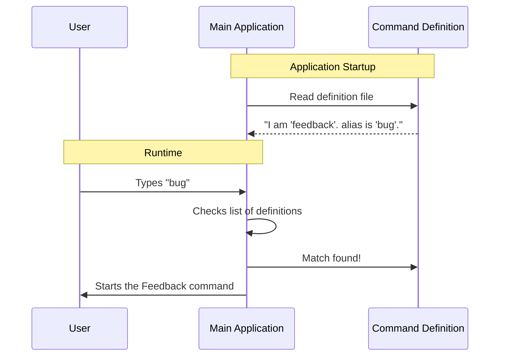

# Chapter 1: Command Definition

Welcome to the **Feedback** project tutorial! In this series, we are going to explore how a Command Line Interface (CLI) tool manages a specific feature: the `feedback` command.

We start at the very beginning: **Identity**.

## Motivation: The "Menu" Analogy

Imagine you go to a restaurant. Before you can order a burger, the kitchen needs to define what a "burger" is on the menu. They need to list:
1.  **The Name:** "Classic Burger"
2.  **The Nickname:** "Number 1" (so you can order it quickly)
3.  **The Description:** "A juicy beef patty with lettuce..."
4.  **Availability:** Is it breakfast only? (When can you order it?)

In our code, the **Command Definition** is exactly like this menu entry.

**The Use Case:**
We want a user to be able to type `feedback` (or the shortcut `bug`) in their terminal to report an issue. The main application acts like the waiter—it doesn't know what `feedback` does automatically. It needs a definition file to tell it: *"Hey, if the user types this, here is who I am."*

## Key Concepts

To define a command, we create a simple JavaScript object. This object acts as a contract between our specific feature and the rest of the application.

Here are the parts we need:

1.  **Identity:** The unique `name` and any `aliases` (shortcuts).
2.  **Metadata:** Helpful text like `description` so the user knows what it does.
3.  **Type:** What kind of command is this? (e.g., does it open a UI or just print text?).
4.  **Behavior:** Pointers to functions that determine *if* it can run and *how* it runs.

## The Implementation: Under the Hood

Before we look at the code, let's visualize what happens when the application starts up. The main system reads this definition to understand what capabilities are available.



## Code Deep Dive

Let's look at the file `index.ts`. This file exports the definition object. We will break it down into small, digestible pieces.

### 1. Defining Identity

First, we give the command a name and a type.

```typescript
const feedback = {
  // The official command name
  name: 'feedback',
  
  // Shortcuts users can type instead
  aliases: ['bug'],
  
  // Defines how this command renders (covered in Chapter 4)
  type: 'local-jsx',
```

**Explanation:**
*   `name`: This is the primary keyword the user types.
*   `aliases`: An array of strings. Typing `bug` works exactly the same as `feedback`.
*   `type`: This tells the system that this command will render a User Interface (specifically `local-jsx`). We will learn more about this in [LocalJSX Execution Entry Point](04_localjsx_execution_entry_point.md).

### 2. User Help Information

Next, we add information that helps the user understand the command.

```typescript
  // Shown in the help menu
  description: `Submit feedback about Claude Code`,
  
  // Hints about what to type next (optional)
  argumentHint: '[report]',
```

**Explanation:**
*   `description`: If the user types `--help`, this text explains what the command does.
*   `argumentHint`: This suggests that the user *can* (but doesn't have to) type a report directly, like `feedback "my screen is broken"`.

### 3. Safety and Loading Hooks

Finally, the definition includes two critical functions.

```typescript
  // Logic to decide if the command is allowed to run
  isEnabled: () => 
    // ... complex checks ... (See Chapter 2)
    !isPolicyAllowed('allow_product_feedback'),

  // Lazy loading the actual code (See Chapter 3)
  load: () => import('./feedback.js'),
} satisfies Command
```

**Explanation:**
*   `isEnabled`: This is a "guard." It returns `true` or `false`. If it returns `false`, the command effectively disappears from the menu. We will explore the logic inside this function in [Availability Guardrails](02_availability_guardrails.md).
*   `load`: This uses a technique called "Dynamic Import". It means we don't load the heavy code for the feedback form until the user actually asks for it. We discuss this in [Dynamic Command Loading](03_dynamic_command_loading.md).
*   `satisfies Command`: This is a TypeScript feature. It ensures our object follows the strict rules of a "Command". If we forgot the `name`, TypeScript would yell at us here.

### 4. Exporting the Definition

The final step is making this object available to the rest of the app.

```typescript
export default feedback
```

**Explanation:**
By exporting `feedback` as the default, the main application can import this file and add it to its central registry of commands.

## Summary

In this chapter, we learned that a **Command Definition** is simply a manifest or a "menu entry." It tells the application:
1.  **Who** the command is (`name`, `aliases`).
2.  **What** it does (`description`).
3.  **When** it allows itself to run (`isEnabled`).
4.  **Where** to find the code (`load`).

However, simply defining a command isn't enough. Sometimes, a command should be hidden (like a secret menu item) based on the environment or user permissions.

In the next chapter, we will look at how we control this visibility.

[Next Chapter: Availability Guardrails](02_availability_guardrails.md)

---

Generated by [Code IQ](https://github.com/adityasoni99/Code-IQ)