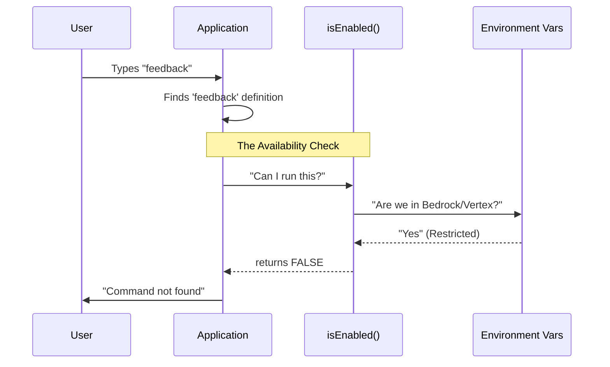

# Chapter 2: Availability Guardrails

In the previous chapter, [Command Definition](01_command_definition.md), we defined the identity of our `feedback` command—giving it a name and a description. We put the item on the menu.

However, just because an item is on the menu doesn't mean it's always available to order. Sometimes, for security or policy reasons, we need to hide the command entirely.

This brings us to **Availability Guardrails**.

## Motivation: The "Bouncer" Analogy

Imagine a nightclub. The club exists, and it has a name. But at the front door, there is a **Bouncer**. The bouncer checks IDs and enforces rules before letting anyone in.

**The Use Case:**
We have Enterprise clients (using platforms like Bedrock or Vertex) who require strict data privacy. They do not want their employees sending "feedback" data to external servers.

If a user in a restricted environment types `feedback`, the application shouldn't just error out; it should act as if the command **doesn't even exist**.

We need a way to tell the application: *"Only enable this command if the environment is safe."*

## Key Concepts

To solve this, we use a specific property called `isEnabled` within our command definition. Here is how it works:

1.  **The Check:** Before the app lists commands or executes one, it runs a "check" function.
2.  **The Conditions:** This function looks at the "User's ID" (Environment Variables) and "House Rules" (Policies).
3.  **The Verdict:** It returns `true` (Open) or `false` (Closed).

## Implementation: How to Build the Guardrail

We add the `isEnabled` property to our command object. This function must return a Boolean (`true`/`false`).

### 1. The Basic Structure

The logic is simple: "Enable this command ONLY IF specific blocking conditions are NOT met."

```typescript
const feedback = {
  name: 'feedback',
  
  // The Bouncer Function
  isEnabled: () => {
    // We start by assuming the command might be blocked
    // The ! symbol means "NOT". 
    // We want the result to be "NOT Blocked".
    return !checksIfBlocked() 
  },
  
  // ... other properties
}
```

### 2. Checking Enterprise Environments

We need to check if the user is running in a restricted enterprise environment (like AWS Bedrock or Google Vertex). If they are, feedback is disabled.

```typescript
// Inside isEnabled:
const isEnterprise = 
  isEnvTruthy(process.env.CLAUDE_CODE_USE_BEDROCK) ||
  isEnvTruthy(process.env.CLAUDE_CODE_USE_VERTEX) ||
  isEnvTruthy(process.env.CLAUDE_CODE_USE_FOUNDRY);
```

**Explanation:**
*   `process.env`: Accesses the environment variables of the computer running the code.
*   `||` (OR): If *any* of these are true, `isEnterprise` becomes true.

### 3. Checking Explicit Kill Switches

Sometimes an administrator wants to manually turn off the feature using a specific flag.

```typescript
// Inside isEnabled:
const isManuallyDisabled = 
  isEnvTruthy(process.env.DISABLE_FEEDBACK_COMMAND) ||
  isEnvTruthy(process.env.DISABLE_BUG_COMMAND);
```

**Explanation:**
*   If the user has set `DISABLE_FEEDBACK_COMMAND=true` in their terminal, this variable becomes true.

### 4. Checking Company Policy

Finally, we might have a centralized policy engine that manages permissions.

```typescript
// Inside isEnabled:
const isPolicyDenied = !isPolicyAllowed('allow_product_feedback');
```

**Explanation:**
*   We ask the policy service: "Is product feedback allowed?"
*   If the answer is "No", then `isPolicyDenied` is true.

## Visualizing the Logic

Before we look at the final code, let's visualize the "Bouncer" process flow.



In this diagram, because the Environment said "Yes" (we are in a restricted area), the Guard returned `false`. The App then pretends the command doesn't exist.

## Code Deep Dive

Now, let's look at the actual implementation in `index.ts`. It combines all the checks into one concise block.

### The Implementation Logic

The code uses a logical **NOT** (`!`) operator wrapping a long list of **OR** (`||`) conditions.

*   **Logic:** "Return `true` (Enable) if... NOT (Bedrock OR Vertex OR DisabledFlag OR PolicyDenied...)"
*   If *any* item inside the parentheses is true, the command is disabled.

```typescript
// File: index.ts

isEnabled: () =>
  !(
    // 1. Enterprise Environments
    isEnvTruthy(process.env.CLAUDE_CODE_USE_BEDROCK) ||
    isEnvTruthy(process.env.CLAUDE_CODE_USE_VERTEX) ||
    isEnvTruthy(process.env.CLAUDE_CODE_USE_FOUNDRY) ||

    // 2. Manual Disable Flags
    isEnvTruthy(process.env.DISABLE_FEEDBACK_COMMAND) ||
    isEnvTruthy(process.env.DISABLE_BUG_COMMAND) ||

    // 3. Privacy and User Checks
    isEssentialTrafficOnly() ||
    process.env.USER_TYPE === 'ant' ||

    // 4. Policy Check
    !isPolicyAllowed('allow_product_feedback')
  ),
```

**Step-by-Step Walkthrough:**

1.  **`!` (The Gatekeeper):** The very first character is `!`. It inverts the result.
2.  **`isEnvTruthy(...)`**: This helper function checks if a variable exists and is set to "true".
3.  **`isEssentialTrafficOnly()`**: A privacy check. If the user only allows essential data traffic, feedback (non-essential) is blocked.
4.  **`!isPolicyAllowed(...)`**: Notice the `!` here too. If the policy says "Allowed", this becomes `false`. If the policy says "Not Allowed", this becomes `true` (which triggers the disable block).

### Why do we do this?

By centralizing these checks in the `isEnabled` property, the rest of our application doesn't need to worry about permissions. The code for the actual feedback form is never even touched if this returns `false`.

## Summary

In this chapter, we learned about **Availability Guardrails**. We implemented a "Bouncer" function called `isEnabled` that:

1.  Checks the environment (Bedrock, Vertex).
2.  Checks manual flags.
3.  Checks policies.
4.  Determines if the `feedback` command should be accessible to the user.

Now that we have defined the command and ensured it only runs in the right environments, we need to load the actual code to make it work. But wait—we don't want to load that heavy code unless we have to!

In the next chapter, we will learn how to load the command's logic on demand.

[Next Chapter: Dynamic Command Loading](03_dynamic_command_loading.md)

---

Generated by [Code IQ](https://github.com/adityasoni99/Code-IQ)