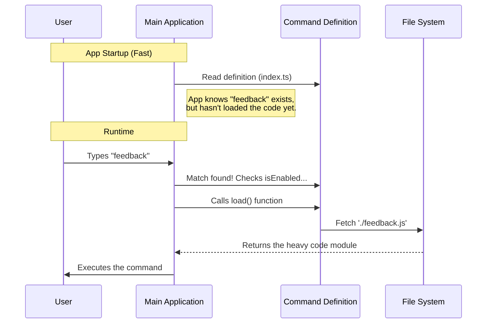

# Chapter 3: Dynamic Command Loading

In the previous chapter, [Availability Guardrails](02_availability_guardrails.md), we set up a "bouncer" to decide if the `feedback` command is allowed to run. We ensured that restricted environments don't even see the command.

Now, we face a performance challenge. Even if the command is allowed, do we really want to load all the code for it immediately when the application starts?

This brings us to **Dynamic Command Loading**.

## Motivation: The "Tool Shed" Analogy

Imagine a handyman arriving at a house. He has a massive truck filled with 500 different heavy power tools—saws, drills, jackhammers, and welders.

**The Problem:**
If the handyman tries to stuff **all 500 tools** into his pockets before ringing the doorbell, two things happen:
1.  He moves incredibly slowly (Application Startup is slow).
2.  He gets tired holding tools he doesn't need (Wasted Memory).

**The Solution:**
The handyman walks to the door with empty pockets. When the homeowner says, "I need to fix a shelf," *then* he goes to the truck, grabs the drill, and comes back.

**The Use Case:**
The `feedback` command uses a complex User Interface library (React). It is "heavy." If a user just wants to list their files, they shouldn't have to wait for the Feedback UI code to load. We want to keep that code in the "shed" until the user actually types `feedback`.

## Key Concepts

To achieve this "fetch-on-demand" behavior, we use a JavaScript feature called **Dynamic Imports**.

### Static vs. Dynamic Imports

Usually, at the top of a file, you see **Static Imports**. These happen immediately when the program starts.

```typescript
// Static Import: Loads immediately. 
// "Carrying the tool in your pocket."
import { heavyTool } from './heavyTool.js'; 
```

However, we can also import files inside a function. This is a **Dynamic Import**.

```typescript
// Dynamic Import: Loads only when this function runs.
// "Leaving the tool in the shed."
const loadTool = () => import('./heavyTool.js');
```

## The Implementation

We implement this in our command definition file (`index.ts`) using the `load` property.

### 1. The Load Function

Inside our `feedback` object, we define a property called `load`. This is a function that returns the result of an `import()` call.

```typescript
const feedback = {
  // ... name, aliases, description ...

  // The "Fetch from Shed" instruction
  load: () => import('./feedback.js'),
}
```

**Explanation:**
*   `() => ...`: This is a function. It doesn't run automatically; it waits to be called.
*   `import('./feedback.js')`: This tells the system to go find the file named `feedback.js` and load it into memory.

### 2. Why `./feedback.js`?

You might notice we are importing a file we haven't looked at yet.
*   `index.ts`: The definition (The Menu Entry). Lightweight.
*   `feedback.js`: The actual logic and UI (The Meal). Heavy.

We separate the definition from the implementation so the definition is cheap to read.

## Visualizing the Logic

Let's look at what happens "Under the Hood" when the application is running.



**Walkthrough:**
1.  **Startup:** The App reads `index.ts`. This is very fast because it's just a small text object.
2.  **Waiting:** The App sits idle. The heavy code for the feedback form is sitting on the hard drive, not taking up RAM.
3.  **Action:** The user types `feedback`.
4.  **Loading:** The App triggers the `load()` function.
5.  **Execution:** The system reads the heavy file, compiles it, and runs it.

## Code Deep Dive

Let's look at the final piece of our `index.ts` file.

```typescript
// File: index.ts

// ... previous properties (name, isEnabled) ...

  // This is the implementation of Dynamic Loading
  load: () => import('./feedback.js'),

} satisfies Command

export default feedback
```

**Explanation:**
*   **Performance:** By using `load`, we ensure that if the user *never* types "feedback", we *never* pay the cost of loading that code.
*   **`satisfies Command`**: This ensures our object matches the expected structure. If we forgot the `load` function, TypeScript would warn us here because a command isn't useful if it can't be loaded!

## Summary

In this chapter, we learned about **Dynamic Command Loading**.

We solved the problem of slow application startup by:
1.  Using the **Tool Shed Analogy** (don't carry what you don't need).
2.  Using **Dynamic Imports** (`import()`) instead of static imports.
3.  Defining a `load` function that is only called when the user explicitly requests the command.

Now we have the Definition (`index.ts`) and we know how to load the Implementation (`feedback.js`). But what exactly is inside that heavy file we just loaded? How does the application know where to start running code inside that new file?

In the next chapter, we will open up `feedback.js` and look at the entry point of our feature.

[Next Chapter: LocalJSX Execution Entry Point](04_localjsx_execution_entry_point.md)

---

Generated by [Code IQ](https://github.com/adityasoni99/Code-IQ)