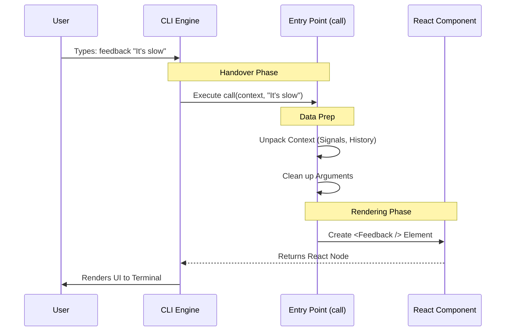

# Chapter 4: LocalJSX Execution Entry Point

In the previous chapter, [Dynamic Command Loading](03_dynamic_command_loading.md), we learned how to efficiently load the code for our command only when it is needed. We left the "Tool Shed" with our heavy tools in hand.

Now, we are ready to work. But there is a problem: The Command Line Interface (CLI) speaks "Text," but our User Interface speaks "React." We need a translator.

This brings us to the **LocalJSX Execution Entry Point**.

## Motivation: The "Controller" Analogy

Imagine a busy kitchen.
1.  **The Waiter (CLI Engine):** Takes the order from the customer. "One burger, no onions."
2.  **The Chef (React UI):** Knows how to cook the burger.
3.  **The Ticket System (The Entry Point):** This is the bridge.

The Waiter cannot just yell at the Chef. They must write a structured ticket. They need to say:
*   *Who* ordered it? (Context)
*   *What* exactly did they say? (Arguments)
*   *When* should we stop cooking if the customer leaves? (Abort Signal)

**The Use Case:**
When a user types `feedback "My screen is broken"`, the system loads our file. It looks for a specific function—usually named `call`—to hand over this data. This function acts as the **Controller**. It unpacks the messy text inputs and prepares them for the tidy React components.

## Key Concepts

To understand the Entry Point, we need to understand the three things the main application hands to us.

### 1. The `call` Function
This is the standard entry point. The application assumes every "LocalJSX" command exports a function named `call`. If you don't have this, the command won't start.

### 2. The Context (`context`)
This is the "Environment" or the "Backpack" of data. It contains:
*   **AbortController:** A "Stop Button" wire. If the user presses `Ctrl+C`, this signal tells our UI to stop immediately.
*   **Messages:** The history of the conversation so far.

### 3. The Arguments (`args`)
This is the raw text the user typed *after* the command name.
*   Command: `feedback "My screen is broken"`
*   Args: `"My screen is broken"`

## Visualizing the Flow

Let's see how data flows from the user's keyboard into our React component.



## Code Deep Dive

Let's look at `feedback.tsx`. We will break the `call` function down into very small steps.

### Step 1: The Function Signature

The `call` function must follow a specific shape (or "Type signature").

```typescript
// We import types to ensure we match the rules
import type { LocalJSXCommandContext, LocalJSXCommandOnDone } from '../../commands.js';
import * as React from 'react';

// The main entry point
export async function call(
  onDone: LocalJSXCommandOnDone,
  context: LocalJSXCommandContext,
  args?: string
): Promise<React.ReactNode> {
```

**Explanation:**
*   `export async function call`: We export this so the main app can find it. It is `async` because setting up a command might take a moment.
*   `onDone`: A callback function. We call this when the user submits the form to say "We are finished!"
*   `context`: Contains the background info (history, signals).
*   `args`: The string text the user typed.

### Step 2: Processing Arguments

The user might type `feedback` (empty) or `feedback "bug report"` (with args). We need to handle both.

```typescript
  // Inside the call function...

  // If args is undefined, default to an empty string ''
  const initialDescription = args || '';
```

**Explanation:**
*   We create a variable `initialDescription`.
*   If the user provided text, we use it to pre-fill the feedback form.
*   If they didn't, we just start with an empty form.

### Step 3: Bridging to React

Now we perform the magic trick: converting data into a User Interface.

```typescript
  // We call a helper function to create the JSX
  return renderFeedbackComponent(
    onDone,
    context.abortController.signal, // The "Stop" wire
    context.messages,               // Chat history
    initialDescription              // User input
  );
}
```

**Explanation:**
*   We extract `signal` from the context. This allows the feedback form to know if it should cancel operations.
*   We pass the `messages` so the form knows what happened previously in the conversation.
*   We return the result. The CLI Engine takes this result and figures out how to draw it.

### Step 4: The Rendering Helper

You might wonder, "What is `renderFeedbackComponent`?" It is a simple wrapper around our React Component.

```typescript
// A standalone function to create the Component
export function renderFeedbackComponent(
  onDone: any, 
  abortSignal: AbortSignal, 
  messages: any[], 
  initialDescription: string
): React.ReactNode {

  // This looks like HTML, but it's JSX (React Code)
  return <Feedback 
    abortSignal={abortSignal} 
    messages={messages} 
    initialDescription={initialDescription} 
    onDone={onDone} 
  />;
}
```

**Explanation:**
*   `<Feedback ... />`: This is where we instantiate our actual UI.
*   We map the raw arguments from the `call` function into "Props" (properties) for the component.

## Summary

In this chapter, we learned about the **LocalJSX Execution Entry Point**.

1.  We discovered that the **`call` function** acts as the controller.
2.  It bridges the gap between the raw **CLI text inputs** and the **React UI**.
3.  It unpacks the **Context** (like abort signals and message history) to ensure the UI is fully aware of its environment.

At this point, our `call` function has returned a `React.ReactNode`. But wait—terminals understand text, not React Nodes! A standard terminal cannot just "show" a React component.

We need one final piece of machinery to translate those React pixels into terminal text characters.

[Next Chapter: React-Terminal Rendering Adapter](05_react_terminal_rendering_adapter.md)

---

Generated by [Code IQ](https://github.com/adityasoni99/Code-IQ)