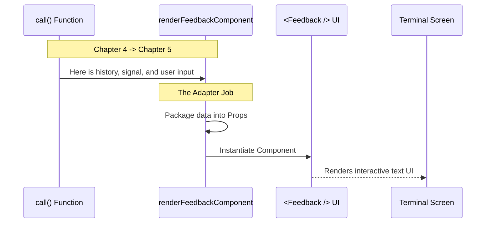

# Chapter 5: React-Terminal Rendering Adapter

Welcome to the final chapter of our series!

In the previous chapter, [LocalJSX Execution Entry Point](04_localjsx_execution_entry_point.md), we built the controller (`call` function). We learned how to unpack the user's request and prepare the necessary data.

However, we ended with a cliffhanger. Our code returned a "React Node," but our user is staring at a black text-based terminal window. Terminals don't natively understand React. They understand text.

We need a bridge. This brings us to the **React-Terminal Rendering Adapter**.

## Motivation: The "Travel Adapter" Analogy

Imagine you travel from the US to Europe. You have your hair dryer (The React Component), but the wall socket (The Terminal) has a completely different shape. You cannot plug it in directly.

You need a **Travel Adapter**.

**The Use Case:**
We want to show a rich, interactive form where the user can use arrow keys to select options and type a description.
*   **The Problem:** React is built for Web Browsers (DOM). The Terminal is a text stream.
*   **The Solution:** We create a specific function, `renderFeedbackComponent`, acting as the adapter. It takes standard data types (strings, arrays) and "plugs them in" to the `<Feedback />` component in a way the terminal renderer can understand.

## Key Concepts

To bridge this gap, our adapter performs three specific tasks:

1.  **Prop Transformation:** It converts raw data (like the chat history array) into specific "Props" (properties) that the React component expects.
2.  **Signal Wiring:** It connects the "Abort Signal" (the wire that lets the user press `Ctrl+C` to quit) to the UI.
3.  **Callback Binding:** It connects the `onDone` function. When the user hits "Enter" to submit the form, the UI needs a way to tell the main app, "I'm finished, here is the result."

## Visualizing the Flow

Here is how the data flows from the logic layer into the visual layer.



## Code Deep Dive

Let's look at `feedback.tsx` again. This time, we focus on the helper function `renderFeedbackComponent`.

### 1. The Adapter Function Signature

This function is a standalone helper. It doesn't know about "commands" or "CLI engines." It only knows about data and React.

```typescript
// feedback.tsx

// A pure function that returns a React Node
export function renderFeedbackComponent(
  onDone: (result?: string) => void, // What to do when finished
  abortSignal: AbortSignal,          // The "Stop" button wire
  messages: Message[],               // The chat history
  initialDescription: string = ''    // User's pre-typed text
): React.ReactNode {
```

**Explanation:**
*   **`onDone`**: This is the most important connection. It's a function. We pass it *down* into the UI so the UI can call it later.
*   **`abortSignal`**: React components in a terminal need to know if they should stop rendering immediately (e.g., if the user cancels).
*   **`messages`**: We pass the full conversation history so the feedback form can contextually understand what went wrong.

### 2. The Connection (The Return Statement)

The function's only job is to return the specific React Component with the correct attributes.

```typescript
  // We return the JSX "Tag"
  return <Feedback 
    abortSignal={abortSignal} 
    messages={messages} 
    initialDescription={initialDescription} 
    onDone={onDone} 
    // We can also pass background tasks if needed
    backgroundTasks={{}} 
  />;
}
```

**Explanation:**
*   **`<Feedback />`**: This is the visual component (imported from another file). It contains the logic for drawing boxes, text inputs, and handling keystrokes.
*   **`prop={value}`**: We are mapping the arguments from the function directly to the props of the component. This is the "plugging in" phase of our analogy.

### 3. Why separate this function?

You might ask: *Why not just write `<Feedback ... />` directly inside the `call` function from Chapter 4?*

The answer is **Testability**.

By creating `renderFeedbackComponent` as a separate, exported function, we can test the UI without needing to spin up the entire Command Line Engine.
*   We can write a test that calls `renderFeedbackComponent` with fake data.
*   We can check if it renders correctly.
*   We don't need a real user to type `feedback` in a real terminal to verify the code works.

## Summary

In this final chapter, we explored the **React-Terminal Rendering Adapter**.

1.  We learned that the `call` function (Controller) delegates the visual work to `renderFeedbackComponent`.
2.  We saw how this adapter takes raw data (signals, history, text) and injects them into the `<Feedback />` React component.
3.  We understood that this separation makes our code modular and easier to test.

### Tutorial Conclusion

Congratulations! You have walked through the entire lifecycle of a command in the **Feedback** project.

Let's recap our journey:
1.  **[Command Definition](01_command_definition.md)**: We put the item on the menu (`index.ts`).
2.  **[Availability Guardrails](02_availability_guardrails.md)**: We set up the bouncer to ensure only the right users see it (`isEnabled`).
3.  **[Dynamic Command Loading](03_dynamic_command_loading.md)**: We optimized performance by keeping the heavy tools in the shed until needed (`load`).
4.  **[LocalJSX Execution Entry Point](04_localjsx_execution_entry_point.md)**: We built the controller to handle the user's request (`call`).
5.  **React-Terminal Rendering Adapter**: We finally painted the UI onto the screen.

You now understand the architecture behind building rich, interactive CLI features!

---

Generated by [Code IQ](https://github.com/adityasoni99/Code-IQ)