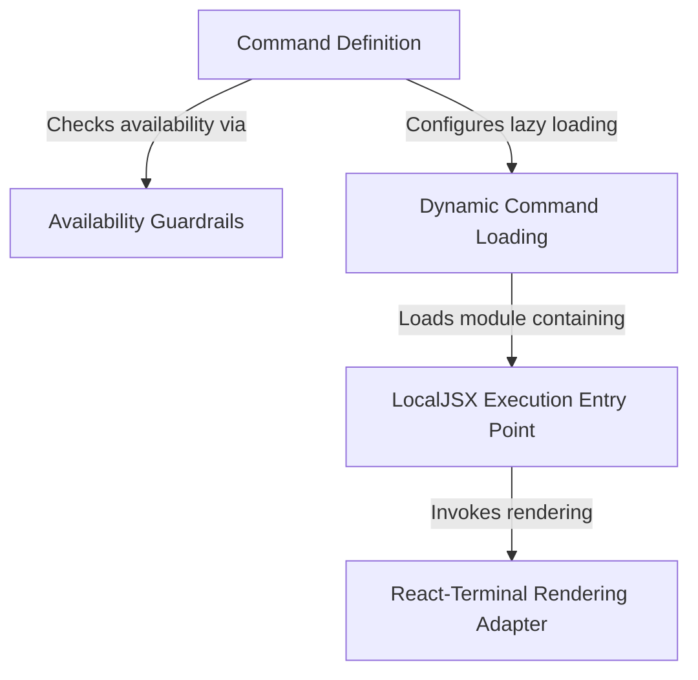

# Tutorial: feedback

This project implements a **feedback** command for a command-line interface, allowing users to submit bug reports or general comments. It features *smart guardrails* to ensure the command is only enabled in specific, allowed environments (checking policies and user types). To keep the application fast, it uses **dynamic loading** to fetch the complex React-based user interface only when the command is actually run, rather than at startup.

## Chapters

1. [Command Definition](01_command_definition.md)
2. [Availability Guardrails](02_availability_guardrails.md)
3. [Dynamic Command Loading](03_dynamic_command_loading.md)
4. [LocalJSX Execution Entry Point](04_localjsx_execution_entry_point.md)
5. [React-Terminal Rendering Adapter](05_react_terminal_rendering_adapter.md)

---

Generated by [Code IQ](https://github.com/adityasoni99/Code-IQ)