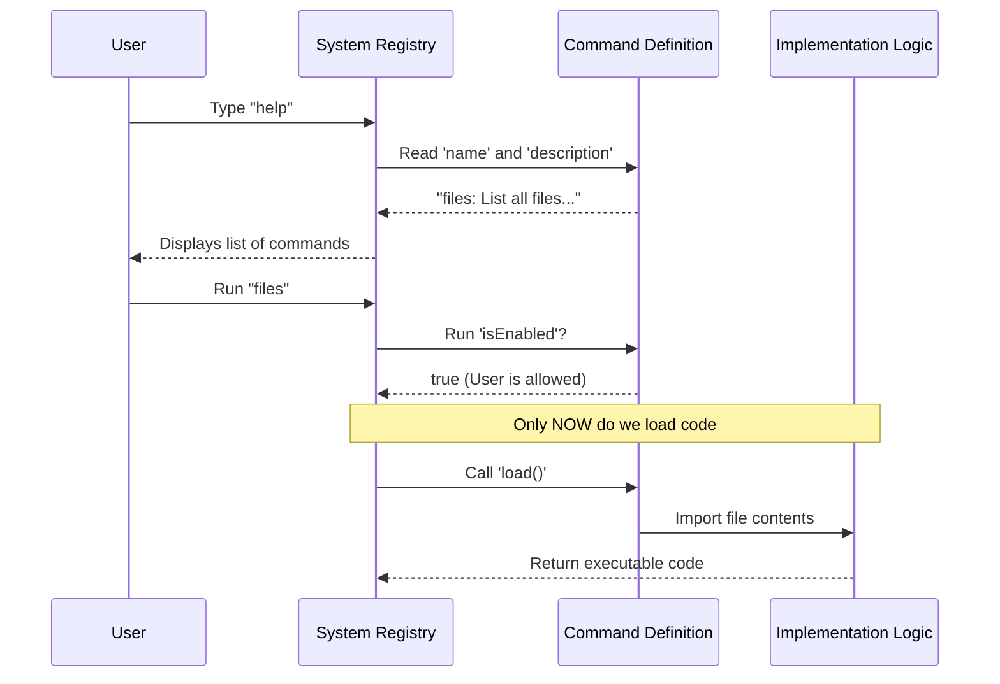

# Chapter 1: Command Registration Interface

Welcome to the `files` project! In this first chapter, we are going to look at how we introduce a new feature to our system without breaking everything or slowing it down.

## The Problem: The "Heavy Backpack"
Imagine you are building a tool that has 50 different features. If you put all the code for all 50 features into one giant file, your program would take forever to start. It’s like trying to go hiking carrying 50 different outfits in your backpack when you only plan to wear one.

We need a way to tell the system **what** commands exist without actually loading the heavy code that makes them work.

## The Solution: The Menu Analogy
Think of this abstraction like a **Restaurant Menu**.

1.  **The Menu (Registration):** Describes the dish (Name: "Steak", Description: "Grilled beef"). It tells you if it's available (Lunch vs. Dinner).
2.  **The Kitchen (Implementation):** This is where the cooking happens. The kitchen is messy and busy.

The **Command Registration Interface** is the menu. It is a lightweight definition that sits between the user and the heavy code in the kitchen.

## Key Concepts

### 1. Metadata (Data about Data)
Instead of writing code right away, we write a definition object. This object holds "metadata"—information *about* the command.

### 2. Availability
Just because a command exists doesn't mean you can use it right now. Maybe a command only works if you are logged in as an Admin. The registration interface handles this "gatekeeping."

---

## Using the Interface
Let's look at how we define the `files` command. We create a simple object in `index.ts`.

### Step 1: Identity
First, we define who the command is. This is what the user sees when they ask for "Help".

```typescript
const files = {
  type: 'local',           // Grouping category
  name: 'files',           // The command keyword
  description: 'List all files currently in context', 
  // ... more properties later
};
```
**Explanation:**
*   `name`: This is what the user types to run the command.
*   `description`: This appears in the help menu so the user knows what it does.

### Step 2: The Logic Gate
Next, we define *when* this command is allowed to run.

```typescript
const files = {
  // ... previous properties
  isEnabled: () => process.env.USER_TYPE === 'ant',
  supportsNonInteractive: true,
  // ... more properties later
};
```
**Explanation:**
*   `isEnabled`: This is a function that returns `true` or `false`. In this example, the command only shows up if the user is an "ant". This relates to [Execution Context & State](02_execution_context___state.md), which we will cover next.
*   `supportsNonInteractive`: Can this run automatically without a human typing?

### Step 3: Lazy Loading (The Secret Sauce)
Finally, we tell the system where to find the *actual* heavy code, but we don't load it yet.

```typescript
import type { Command } from '../../commands.js'

const files = {
  // ... previous properties
  load: () => import('./files.js'),
} satisfies Command

export default files;
```
**Explanation:**
*   `load`: This uses a dynamic `import`. It points to `./files.js`, which contains the actual logic. The system will only run this line if the user actually chooses this command.
*   `satisfies Command`: This ensures our object follows the rules of the interface.

---

## Under the Hood: How it Works

What happens when you start the application? The system does not read your logic code. It only reads this registration file.

### Sequence Diagram
Here is the flow of how the system interacts with the Command Registration Interface before any command is actually executed.



### Internal Implementation Walkthrough

When the system starts, it scans for these lightweight registration objects. It treats them like a manifesto.

1.  **Discovery:** The system finds the `index.ts` file.
2.  **Validation:** It checks `satisfies Command`. Does it have a name? A description?
3.  **Filtering:** It runs `isEnabled()`. If it returns `false`, the command is hidden from the user entirely.
4.  **Deferral:** It notices the `load` function but **does not execute it**. This keeps the application fast.

The actual code inside `./files.js` will be discussed in [Command Implementation Logic](04_command_implementation_logic.md), and the magic behind the import happens in the [Lazy Loading Mechanism](05_lazy_loading_mechanism.md) chapter.

## Summary

In this chapter, we learned:
1.  **Separation of Concerns:** We separate the *definition* of a command from its *execution*.
2.  **Performance:** We avoid loading heavy code until we absolutely need it.
3.  **Control:** We use flags like `isEnabled` to control availability dynamically.

We have defined the menu, but we haven't cooked the meal yet. To cook the meal, the command needs to know "where" it is operating.

[Next Chapter: Execution Context & State](02_execution_context___state.md)

---

Generated by [Code IQ](https://github.com/adityasoni99/Code-IQ)