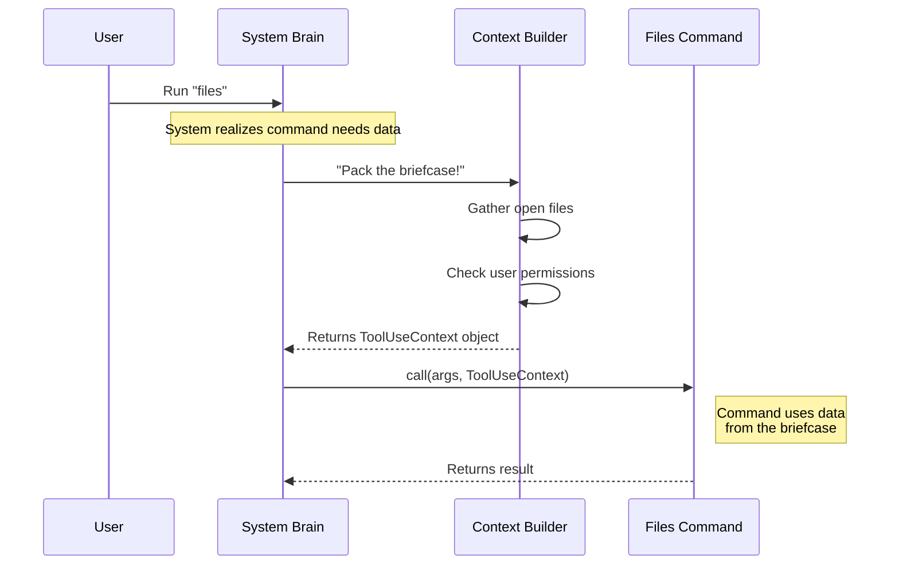

# Chapter 2: Execution Context & State

Welcome back! In [Chapter 1: Command Registration Interface](01_command_registration_interface.md), we created the "Menu" for our restaurant. We told the system that a `files` command exists.

Now, we need to send the cook into the kitchen to actually make the dish. But wait—does the cook know *which* ingredients are available right now?

## The Problem: The "Lost Contractor"

Imagine you hire a contractor to fix a window.
1.  **The Bad Way:** The contractor arrives empty-handed. They have to run around your house searching for a hammer, then run to the store to buy nails, then ask you where the window is. This is slow and chaotic (this is like using "Global Variables" in code).
2.  **The Good Way:** You hand the contractor a **toolbelt** and a **clipboard** with specific instructions when they walk in the door. They have everything they need immediately.

## The Solution: The Context Briefcase

In our system, we don't let commands search globally for data. Instead, when we run a command, we hand it a specific object called **`ToolUseContext`**.

Think of `ToolUseContext` as a **Briefcase**. It contains a snapshot of everything the command needs to know about the current moment, specifically:
*   **State:** What files are currently open?
*   **Environment:** Who is the user?
*   **History:** What happened previously?

## Key Concepts

### 1. The Snapshot
The context is a "snapshot" in time. It represents the state of the world *at the exact moment* the user pressed Enter.

### 2. The `readFileState`
Inside our briefcase, there is a specific folder called `readFileState`. This acts like a cache. It remembers every file the AI has looked at recently. Our `files` command needs this to know what to list.

---

## Using the Context

Let's look at the `files.ts` implementation. We need to accept this briefcase as an argument.

### Step 1: Receiving the Briefcase
In [Chapter 4](04_command_implementation_logic.md), we will write the full logic, but for now, look at the function signature (the input).

```typescript
import type { ToolUseContext } from '../../Tool.js'

// The 'call' function is the entry point
export async function call(
  _args: string,           // User input (not used here)
  context: ToolUseContext, // <--- THE BRIEFCASE
) {
  // Logic goes here...
}
```
**Explanation:**
*   `context`: This is automatically injected by the system. You don't create it; you just receive it.

### Step 2: Opening the Folder
Now that we have the briefcase, let's look inside to find the list of files.

```typescript
import { cacheKeys } from '../../utils/fileStateCache.js'

export async function call(_args: string, context: ToolUseContext) {
  // Check if the specific "folder" exists in the briefcase
  if (!context.readFileState) {
    return { type: 'text', value: 'No files found.' }
  }
  
  // Extract the list of filenames
  const files = cacheKeys(context.readFileState)
  // ... continue logic
}
```
**Explanation:**
*   `context.readFileState`: We access the property directly.
*   `cacheKeys(...)`: This helper turns the raw state data into a simple list of file paths.

---

## Under the Hood: How it Works

You might be wondering: *Who packs the briefcase?*

The system has a central "Brain" that tracks everything. When a user runs a command, the Brain pauses, gathers all current data, packs it into the `ToolUseContext`, and hands it to the command.

### Sequence Diagram



### Internal Implementation Walkthrough

While you don't need to write this part (the system handles it), it helps to understand what is happening behind the scenes.

Imagine a simplified System Runner:

```typescript
// This is pseudo-code of what the System does
const currentSessionState = {
  openFiles: { 'index.ts': '...', 'style.css': '...' },
  currentUser: 'ant'
};

async function executeCommand(commandName) {
  // 1. Pack the briefcase (Context)
  const context = {
    readFileState: currentSessionState.openFiles,
    // ... other tools
  };

  // 2. Load the command (Lazy Loading - see Chapter 5)
  const command = await import(`./commands/${commandName}.js`);

  // 3. Hand over the briefcase
  return command.call(null, context);
}
```

**Explanation:**
1.  The system holds the "Truth" (`currentSessionState`).
2.  It creates a `context` object specifically for this one command execution.
3.  It calls your function, passing that object.

## Summary

In this chapter, we learned:
1.  **Context over Globals:** We don't look for data globally; we wait to be handed a `ToolUseContext`.
2.  **The Briefcase Analogy:** The context contains tools and data (like `readFileState`) necessary for the job.
3.  **Statelessness:** Our command logic is clean. It takes an input (context) and produces an output.

Now that we have the context and have processed the data, we need to return an answer to the user. We can't just return a raw string; we need a structured format.

[Next Chapter: Standardized Result Objects](03_standardized_result_objects.md)

---

Generated by [Code IQ](https://github.com/adityasoni99/Code-IQ)