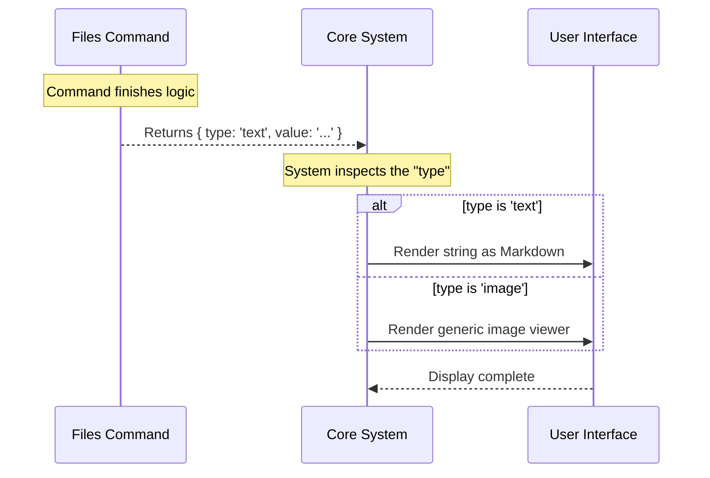

# Chapter 3: Standardized Result Objects

Welcome to Chapter 3!

In the previous chapter, [Execution Context & State](02_execution_context___state.md), we learned how the system hands our command a "briefcase" full of tools and data (the Context). We have the ingredients to cook our meal.

Now, we need to decide how to serve the meal. We can't just throw food on the table; we need a plate. In our system, that plate is the **Standardized Result Object**.

## The Problem: The "Messy Delivery"

Imagine you are running a logistics company.
1.  **The Chaos:** One factory sends you a loose pile of electronics. Another sends bananas in a sack. A third sends a car with no packaging. Your trucks and cranes don't know how to handle all these different shapes.
2.  **The Fix:** You require every factory to use a **Standard Shipping Container**. It doesn't matter what is inside (bananas or cars); the container always has the same corners for the crane to hook onto.

In programming, if one command returns a plain text string, another returns a number, and a third returns a complex JSON object, the core system will crash trying to figure out how to display them.

## The Solution: `LocalCommandResult`

We enforce a strict contract called `LocalCommandResult`. No matter what your command does, it **must** return an object that looks like this:

```javascript
{
  type: 'text',           // The label on the box
  value: 'Hello World'    // The contents of the box
}
```

This is our "Shipping Container." The system sees this object and immediately knows: "Ah, this is text. I know how to print text to the user."

## Key Concepts

### 1. The Structure
Every result object has at least two properties:
*   **`type`**: This tells the system how to interpret the data (e.g., `'text'`, `'image'`, `'error'`).
*   **`value`**: This is the actual data you generated.

### 2. Type Safety
We use TypeScript to enforce this. If you try to return just a string like `"Success!"`, the code won't compile. You *must* wrap it in the container.

---

## Using the Interface

Let's look at how we apply this to our `files` command. We want to list the files, but we need to wrap that list in our standardized object.

### Step 1: Importing the Contract
First, we tell TypeScript that we promise to use the shipping container format.

```typescript
// Import the type definition
import type { LocalCommandResult } from '../../types/command.js'

// We promise that this function returns a LocalCommandResult
export async function call(
  _args: string, 
  context: ToolUseContext
): Promise<LocalCommandResult> { 
  // ... logic
}
```
**Explanation:**
*   `Promise<LocalCommandResult>`: This is our pledge. We guarantee that when this function finishes, it will hand back a valid result object.

### Step 2: Packing the Box
Inside our function, once we have calculated our data (the list of files), we wrap it up.

```typescript
// Assume we calculated this string earlier
const message = "Files in context: index.ts, style.css"

// Return the object
return { 
  type: 'text', 
  value: message 
}
```
**Explanation:**
*   `type: 'text'`: We explicitly say this is text.
*   `value`: We put our calculated string here.

### Step 3: Handling Empty States
What if there are no files? We still use the same container!

```typescript
// If no files are found
return { 
  type: 'text', 
  value: 'No files in context' 
}
```
**Explanation:**
*   Consistency is key. Even an "empty" result is wrapped in a valid object so the system handles it gracefully.

---

## Under the Hood: How it Works

Why do we do this? It allows the core system (the "Brain") to be dumb about the specific command but smart about the output.

When the system receives your object, it acts like a crane operator checking the manifest.

### Sequence Diagram



### Internal Implementation Walkthrough

Here is a simplified look at the code that *calls* your command. It acts as a switchboard.

```typescript
// simplified_runner.ts

async function runCommand(name, args, context) {
  // 1. Run your command (we loaded this in Chapter 1)
  const result = await command.call(args, context);

  // 2. Handle the Shipping Container
  switch (result.type) {
    case 'text':
      console.log("Output:", result.value);
      break;
      
    case 'error':
      console.error("Command Failed:", result.value);
      break;
      
    // The system can easily be extended for new types!
  }
}
```

**Explanation:**
1.  The runner awaits your result.
2.  It checks `result.type`.
3.  Because `files` returns `'text'`, it enters the first case and prints the value.
4.  If we ever wanted to add a `graph` type, we wouldn't need to change the `files` command; we would just add a case here.

## Summary

In this chapter, we learned:
1.  **Consistency:** We never return raw data; we always return a structured object.
2.  **The Contract:** We use `LocalCommandResult` to promise the system a `type` and a `value`.
3.  **Flexibility:** This structure allows the system to handle text, errors, or future data types without breaking.

We have now covered the **Registration** (Chapter 1), the **Input** (Chapter 2), and the **Output** (Chapter 3). We have defined the boundaries of our puzzle piece.

Now, it is finally time to fill in the middle. Let's write the actual code that finds the files!

[Next Chapter: Command Implementation Logic](04_command_implementation_logic.md)

---

Generated by [Code IQ](https://github.com/adityasoni99/Code-IQ)