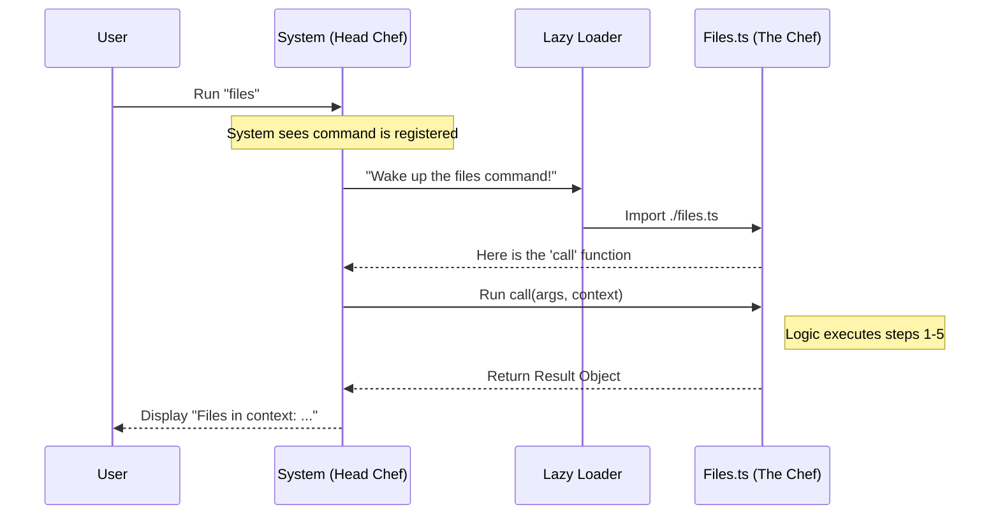

# Chapter 4: Command Implementation Logic

Welcome back! 

In [Chapter 1: Command Registration Interface](01_command_registration_interface.md), we printed the **Menu** (registered the command).
In [Chapter 2: Execution Context & State](02_execution_context___state.md), we prepared the **Ingredients** (the Context).
In [Chapter 3: Standardized Result Objects](03_standardized_result_objects.md), we prepared the **Dinner Plates** (the Result Object).

Now, it is finally time to cook! This chapter covers the **Command Implementation Logic**—the actual code that does the work.

## The Problem: The "Empty Kitchen"

Imagine a restaurant that has a beautiful menu and fancy plates, but no chefs. You order a steak, the waiter goes to the kitchen, and... nothing happens.

We have defined *that* the `files` command exists, but we haven't defined *how* it finds the files. We need a specific place to put the logic so that it runs only when requested.

## The Solution: The "Chef" (Implementation)

The **Command Implementation Logic** is the Chef. 
1.  **Separation:** The Chef stays in the kitchen (a separate file). They don't worry about greeting customers (Registration).
2.  **Action:** The Chef takes the ingredients (Context), follows a recipe (Logic), and puts the food on the plate (Result).

In our project, this logic lives in a dedicated file (e.g., `files.ts`) and is contained within a single function called `call`.

---

## The Recipe: The `call` Function

Every command implementation must export a specific function named `call`. This is the entry point—the moment the Chef starts cooking.

It always follows this pattern:

```typescript
export async function call(args, context) {
  // 1. Check Ingredients (Context)
  // 2. Cook the Meal (Process Logic)
  // 3. Plate the Food (Return Result)
}
```

Let's build the `files` command logic step-by-step.

### Step 1: The Function Header
First, we define the function. We need to import the types we learned about in previous chapters to make sure we are following the rules.

```typescript
import type { ToolUseContext } from '../../Tool.js'
import type { LocalCommandResult } from '../../types/command.js'

// We accept arguments and context, and promise to return a Result
export async function call(
  _args: string,
  context: ToolUseContext,
): Promise<LocalCommandResult> {
  // Logic will go here...
}
```
**Explanation:**
*   `_args`: This holds text the user might type (e.g., `files --all`). We use an underscore `_` because the `files` command ignores arguments; it just lists everything.
*   `context`: This is the briefcase from [Chapter 2: Execution Context & State](02_execution_context___state.md).

### Step 2: Gathering Ingredients
We need to see what files are currently in our "working memory." We look inside the `context`.

```typescript
import { cacheKeys } from '../../utils/fileStateCache.js'

// inside call()...
const files = context.readFileState 
  ? cacheKeys(context.readFileState) 
  : []
```
**Explanation:**
*   `context.readFileState`: This is where the system stores open files.
*   `cacheKeys(...)`: A helper tool that turns the complex state object into a simple list of filenames.
*   If `readFileState` is empty (undefined), we just start with an empty list `[]`.

### Step 3: Handling Empty Plates
What if there are no files? We shouldn't serve a blank plate without saying anything.

```typescript
// inside call()...
if (files.length === 0) {
  return { 
    type: 'text', 
    value: 'No files in context' 
  }
}
```
**Explanation:**
*   We check if the list is empty.
*   If it is, we immediately return a message wrapped in our [Standardized Result Object](03_standardized_result_objects.md). The Chef's job is done here.

### Step 4: The Cooking (Processing)
If we *do* have files, we want to make the list look nice. We often want to show paths relative to where the user is currently working, so the output isn't cluttered.

```typescript
import { relative } from 'path'
import { getCwd } from '../../utils/cwd.js'

// inside call()...
// Map over every file and make the path shorter (relative)
const fileList = files
  .map(file => relative(getCwd(), file))
  .join('\n')
```
**Explanation:**
*   `getCwd()`: Get Current Working Directory.
*   `relative(...)`: Calculates the shortest path to the file from where you are standing.
*   `join('\n')`: Stacks the filenames on top of each other (new lines) to make a list.

### Step 5: Plating (The Return)
Finally, we wrap our delicious list in the standardized object and send it out to the dining room.

```typescript
// inside call()...
return { 
  type: 'text', 
  value: `Files in context:\n${fileList}` 
}
```
**Explanation:**
*   We set the `type` to `'text'`.
*   We put our formatted string into `value`. The system will now display this to the user.

---

## Under the Hood: The Execution Flow

How does the system connect the "Menu" (Chapter 1) to this "Chef" (Chapter 4)?

It uses a process where the system acts as the Head Chef, directing traffic.

### Sequence Diagram



### Internal Implementation Details

When you write the code above, you are writing a **Module**. The system treats your file as a self-contained unit.

1.  **Isolation:** The variables inside `files.ts` (like `fileList`) are private to this file. They don't leak out and mess up other commands.
2.  **Statelessness:** Notice that we don't save anything *permanently* inside this file. Every time `call` runs, it calculates the list fresh from the `context`. This ensures the data is always up-to-date.

The magic that allows the System to say "Wake up the files command!" without having loaded the code previously is called **Lazy Loading**.

## Summary

In this chapter, we learned:
1.  **The `call` Function:** The standard entry point for all logic.
2.  **Process Flow:** We take input (Context), process it (map/join), and return output (Result Object).
3.  **Isolation:** Our logic focuses *only* on the task at hand (listing files), relying on the Context for data and the Result Object for display.

We have built the Menu, the Ingredients, the Plate, and now the Meal itself. But there is one final piece of magic. How do we ensure that this "Chef" stays asleep until the exact moment they are needed, keeping our application fast?

[Next Chapter: Lazy Loading Mechanism](05_lazy_loading_mechanism.md)

---

Generated by [Code IQ](https://github.com/adityasoni99/Code-IQ)