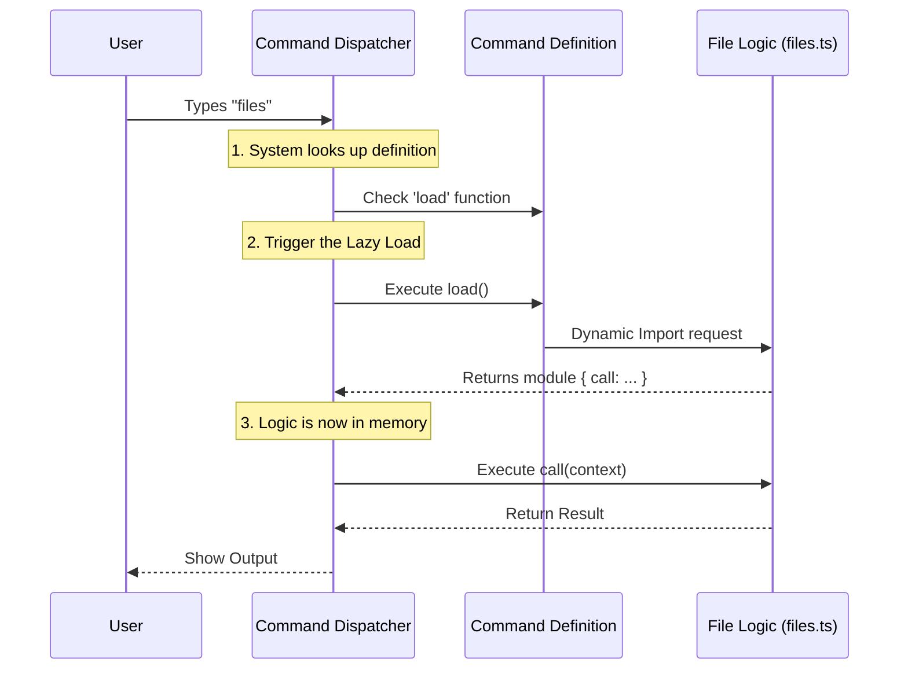

# Chapter 5: Lazy Loading Mechanism

Welcome to the final chapter of the `files` project tutorial!

Let's quickly recap our journey:
1.  [Command Registration Interface](01_command_registration_interface.md): We created the **Menu** (the definition).
2.  [Execution Context & State](02_execution_context___state.md): We prepared the **Ingredients** (the context).
3.  [Standardized Result Objects](03_standardized_result_objects.md): We chose the **Plates** (the result format).
4.  [Command Implementation Logic](04_command_implementation_logic.md): We hired the **Chef** (the logic code).

Now, imagine we have 100 different chefs for 100 different dishes. If all 100 chefs try to squeeze into the kitchen the moment we open the restaurant, nobody can move! The restaurant (your application) becomes slow and clunky.

This chapter introduces the **Lazy Loading Mechanism**, which keeps our kitchen empty and fast until an order is actually placed.

## The Problem: The "Traffic Jam"

In traditional programming, you often see a long list of imports at the top of a file:

```typescript
// The "Eager" way (Bad for performance)
import { call as fileCall } from './files.js'
import { call as networkCall } from './network.js'
import { call as databaseCall } from './database.js'
// ... imagine 50 more lines here
```

When you start the application, the computer has to read, load, and compile **all** of these files immediately, even if the user only wants to check the time. This is called "Eager Loading," and it makes applications slow to start and heavy on memory.

## The Solution: Just-in-Time (Lazy Loading)

We use a technique similar to **"Just-in-Time" manufacturing**.

Think of a Car Factory.
*   **The Old Way:** Storing 10,000 tires on the assembly floor "just in case." It takes up huge space.
*   **The Lazy Way:** The factory orders the tires to arrive *exactly* when the car frame reaches the wheel station.

In our code, we tell the system: *"Here is the address of the code file, but don't go get it until the user actually types the command."*

## Key Concepts

### 1. Static vs. Dynamic Imports
*   **Static Import:** `import ... from ...` at the top of a file. happens immediately.
*   **Dynamic Import:** `import(...)` used inside a function. It returns a **Promise**. It happens only when that line of code is executed.

### 2. The `load` Property
In [Chapter 1](01_command_registration_interface.md), we saw the `load` property in our registration object. This is our specific trigger.

---

## Implementing Lazy Loading

Let's look at `index.ts` again. We are defining the command, but notice we are **not** importing the logic at the top.

### The Definition File

```typescript
import type { Command } from '../../commands.js'

// Notice: No import of './files.js' here!

const files = {
  type: 'local',
  name: 'files',
  description: 'List all files currently in context',
  // ... checks and flags
  
  // THE MAGIC HAPPENS HERE:
  load: () => import('./files.js'),
} satisfies Command

export default files
```

**Explanation:**
*   `load`: This is a function.
*   `() => ...`: This function is **not run** when the file is read. It sits there, waiting.
*   `import('./files.js')`: This command fetches the code from the other file. It creates a bridge to the logic we wrote in [Chapter 4](04_command_implementation_logic.md).

### What happens in memory?

1.  **App Start:** The system reads `index.ts`. It takes up almost zero memory because it's just text descriptions.
2.  **User types "files":** The system executes the `load()` function.
3.  **Loading:** Node.js goes to the disk, reads `files.js`, compiles it, and loads it into memory.
4.  **Execution:** The command runs.

---

## Under the Hood: How it Works

The system has a "Runner" that orchestrates this. It acts like a dispatcher.

### Sequence Diagram

Here is the flow of a user triggering a Lazy Loaded command.



### Internal Implementation Walkthrough

Let's write a simplified version of the system code that actually calls your command. This helps you understand why we defined `load` the way we did.

#### Step 1: finding the Command
The system has a list of registered commands (the menus).

```typescript
// simplified_runner.ts
async function runUserCommand(inputName: string, context: any) {
  // 1. Find the registration object (from Chapter 1)
  const commandDef = registry.find(cmd => cmd.name === inputName)
  
  if (!commandDef) return "Command not found"
  
  // ... continued below
}
```

#### Step 2: Triggering the Load
This is where the dynamic import is triggered. We use `await` because reading a file from disk takes a few milliseconds.

```typescript
  // ... continued
  
  // 2. Load the implementation (The Lazy Load)
  // We call the function we defined in index.ts
  const module = await commandDef.load()
  
  // 'module' now holds the contents of 'files.ts'
  // specifically, it holds the 'call' function
```

#### Step 3: Executing the Logic
Now that we have the module, we can run the `call` function we wrote in [Chapter 4](04_command_implementation_logic.md).

```typescript
  // ... continued

  // 3. execute the logic
  const result = await module.call(null, context)
  
  return result
}
```

## Why this matters for you

As a developer adding a new feature to `files`:
1.  **Safety:** You can write heavy, complex code in your implementation file without worrying about slowing down the rest of the app.
2.  **Isolation:** If your `files.ts` has a syntax error, the app will still start successfully. The error will only crash if someone tries to run that specific command.
3.  **Scalability:** We can add 1,000 commands, and the application startup time will stay exactly the same.

## Summary

In this final chapter, we learned:

1.  **Deferred Execution:** We don't load code until we need it.
2.  **Dynamic Imports:** We use `() => import(...)` to create a bridge between the definition and the logic.
3.  **Performance:** This architecture allows our tool to remain lightweight and fast, regardless of how many features we add.

### Conclusion

You have now completed the entire architecture tutorial for the `files` project!

*   You defined a command in the **Registration Interface**.
*   You learned how data is passed via **Execution Context**.
*   You ensured consistency with **Standardized Results**.
*   You wrote the actual code in **Command Implementation**.
*   And you optimized it all with **Lazy Loading**.

You are now ready to build your own commands and extend the system. Happy coding!

---

Generated by [Code IQ](https://github.com/adityasoni99/Code-IQ)