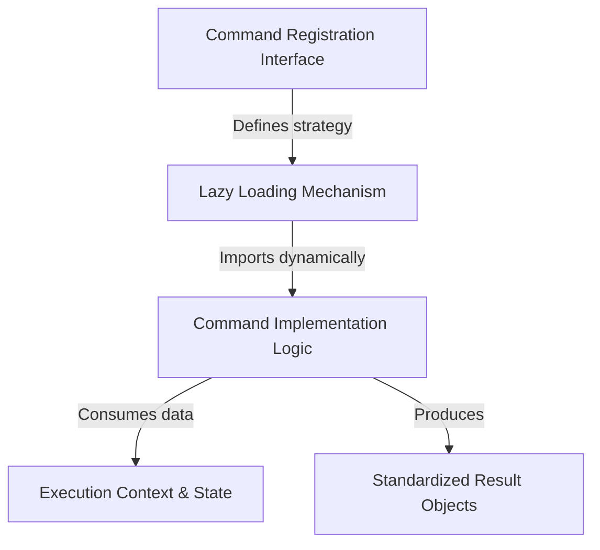

# Tutorial: files

This project builds a modular **command system** where tools (like a file lister) are defined via a lightweight *registration interface*. It uses a **lazy loading** strategy to fetch the heavy *implementation logic* only when needed, ensuring the command executes within a specific context and returns data in a consistent, **standardized format**.

## Chapters

1. [Command Registration Interface](01_command_registration_interface.md)
2. [Execution Context & State](02_execution_context___state.md)
3. [Standardized Result Objects](03_standardized_result_objects.md)
4. [Command Implementation Logic](04_command_implementation_logic.md)
5. [Lazy Loading Mechanism](05_lazy_loading_mechanism.md)

---

Generated by [Code IQ](https://github.com/adityasoni99/Code-IQ)