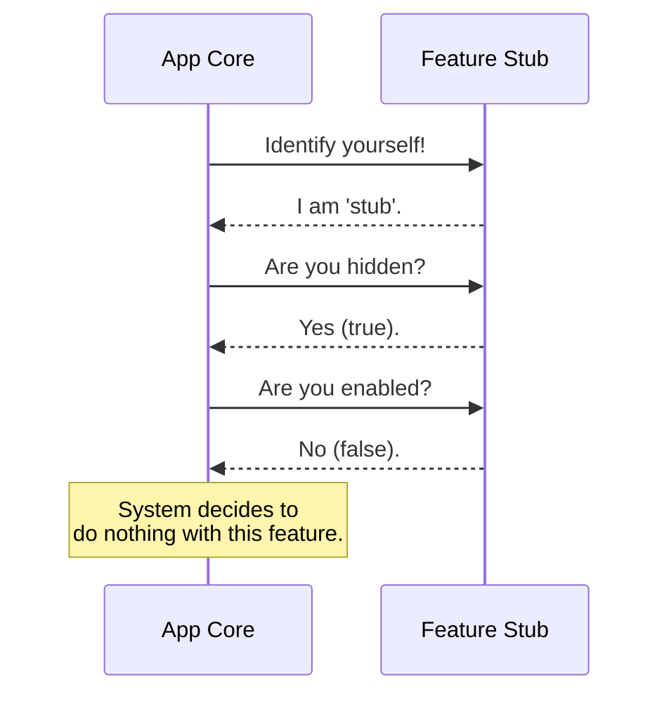

# Chapter 1: Feature Configuration Stub

Welcome to the `good-claude` project! In this first chapter, we are going to look at the most fundamental building block of our system: the **Feature Configuration Stub**.

## Why do we need this?

Imagine you are managing a large shopping mall. You have an empty space where a new store is going to open. You can't just leave a hole in the wall; you need to put up a temporary facade.

You place a "Coming Soon" sign over the window and lock the door.
1.  **Identity:** It has a reserved space (Unit 101).
2.  **Hidden:** People can't see the messy construction inside.
3.  **Disabled:** Customers cannot enter the store yet.

In programming, when we create a new feature (like a "Dark Mode" button or a "User Profile" page), we often need to reserve a spot for it in the code without actually letting users interact with it yet. We need a default, safe state.

This is exactly what the **Feature Configuration Stub** does. It acts as that "Coming Soon" placeholder, ensuring your application doesn't crash just because a feature isn't finished yet.

## Key Concepts

To create this "placeholder," we need three specific pieces of information. Let's break them down:

1.  **Name (`name`)**: This is the ID tag. The system needs to know what to call this feature internally.
2.  **Visibility (`isHidden`)**: This acts like an invisibility cloak. If this is `true`, the button or menu item for this feature won't show up in the User Interface (UI).
3.  **Activity (`isEnabled`)**: This is the master power switch. If this logic says "false," the feature effectively does not exist. Even if a hacker tried to find it, the logic inside won't run.

## How to use it

Let's look at the default configuration used in `good-claude`. This is the code that represents a completely inactive, hidden feature.

### The Code

Here is the content of our basic definition.

```javascript
// --- File: index.js ---

export default {
  isEnabled: () => false, // Always returns 'no'
  isHidden: true,         // Cover it up
  name: 'stub'            // Generic name
};
```

**What is happening here?**
*   We create a simple object.
*   We tell the system: "My name is 'stub', please hide me, and I am currently turned off."

## Under the Hood: The Concept

When the `good-claude` application starts up, it looks at every feature to decide what to show on the screen. It interviews each component.

Since our Stub is the default, here is the conversation that happens between the System and the Stub:



Because the Stub answers "Yes" to being hidden and "No" to being enabled, the System safely ignores it. This prevents errors like "undefined is not a function" or blank white screens.

## Under the Hood: The Implementation

Let's look closer at the file `index.js`. This file serves as the **Base Class** or **Default Implementation** for features in our project.

If you create a new feature but forget to define how it behaves, `good-claude` will automatically use these settings as a safety net.

```javascript
// Function acts as a "Guard"
isEnabled: () => false,
```

Here, `isEnabled` is not just a simple value (like `false`); it is a **function** (`() => false`).

**Why a function?**
Currently, it simply returns `false`. However, by making it a function, we allow for future complexity. Later on, you might want a feature to be enabled *only* if the user is an Admin. Using a function allows us to add that logic later without changing the structure of the Stub.

```javascript
// Visual flag
isHidden: true, 
name: 'stub'
```

These are static properties. `isHidden` ensures the UI renderer skips this item, and `name` gives us a safe string to log in our debug console so we know this is just a placeholder.

## Conclusion

You have learned about the **Feature Configuration Stub**. It is the default, safe state for any component in `good-claude`. It provides:
1.  A **Identity** (`name`).
2.  A **UI State** (`isHidden`).
3.  A **Logic State** (`isEnabled`).

By using this stub, we ensure that unfinished features stay hidden and disabled, acting just like a "Coming Soon" storefront in a mall.

Since this is the first building block of the system, understanding this "default state" is crucial before we start building active, visible features!

---

Generated by [Code IQ](https://github.com/adityasoni99/Code-IQ)