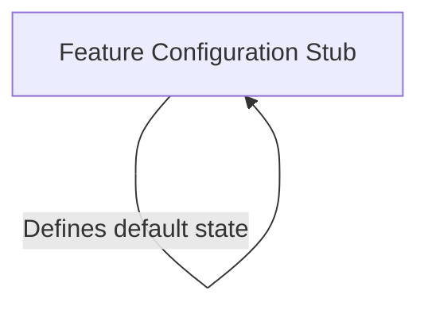

# Tutorial: good-claude

This project appears to be a **modular framework** (likely an extension named *Good Claude*) designed to manage various functional components. It utilizes a **Feature Configuration Stub** to establish a standard interface for these components, ensuring they act as **placeholders** (hidden and disabled) by default until they are fully implemented and activated.

## Chapters

1. [Feature Configuration Stub](01_feature_configuration_stub.md)

---

Generated by [Code IQ](https://github.com/adityasoni99/Code-IQ)