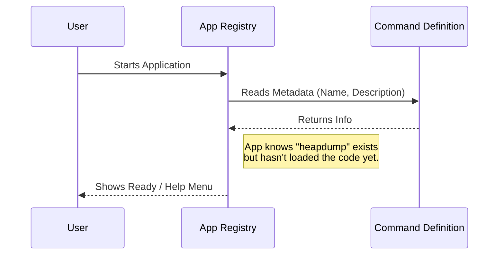

# Chapter 1: Command Definition

Welcome to the first chapter of the **heapdump** project tutorial! In this series, we will build a robust system for managing system commands.

## The Motivation: The Restaurant Menu

Imagine you are building a Command Line Interface (CLI) that has 50 different tools (database backups, memory dumps, user management, etc.).

If you load the code for **all 50 tools** every time the user types a single command, your application will be very slow to start. It would be like a restaurant chef cooking every single dish on the menu before a customer has even sat down!

**The Solution:**
Instead of loading the heavy code immediately, we create a **Command Definition**. This is like the **Menu Entry** in a restaurant. It tells the system:
1.  What the command is called.
2.  What it does (description).
3.  How it behaves (is it hidden? is it interactive?).
4.  Where to find the "recipe" (code) when someone actually orders it.

By using Command Definitions, our main application acts like a lightweight menu, keeping things fast and organized.

### Central Use Case
We want to introduce a feature called `heapdump` (which saves a snapshot of memory). We need to register this feature so the application knows it exists, but without running any heavy logic yet.

---

## Concept 1: The Identity

The most basic part of a Command Definition is its identity. This is how the user finds and selects the command.

To define our `heapdump` command, we start with a simple JavaScript object.

```typescript
const heapDump = {
  type: 'local',
  name: 'heapdump',
  description: 'Dump the JS heap to ~/Desktop',
}
```

**What happened here?**
*   `name`: This is what the user types in the terminal (e.g., `myapp heapdump`).
*   `description`: This text appears when the user runs `myapp --help`.
*   `type`: Categorizes the command (e.g., it runs locally on this machine).

---

## Concept 2: Behavioral Flags

Sometimes, you need to control how a command behaves before it even runs. We use **boolean flags** for this.

Let's add some configuration to our object:

```typescript
// ... existing properties
  isHidden: true,
  supportsNonInteractive: true,
// ...
```

**Explanation:**
*   `isHidden: true`: This command is a "secret menu" item. It won't show up in the main list, but it still works if you know the name.
*   `supportsNonInteractive: true`: This tells the system, "It's safe to run this command in a script without a human pressing keys."

---

## Concept 3: The Loading Contract

This is the most crucial part. We need to tell the system where the actual code lives, but we don't want to import it yet.

```typescript
// ... existing properties
  load: () => import('./heapdump.js'),
} satisfies Command
```

**Explanation:**
*   `load`: This is a function that returns a Promise. It points to the file where the heavy lifting happens. This leads us into the concept of [Lazy Module Loading](02_lazy_module_loading.md), which we will cover in the next chapter.
*   `satisfies Command`: This is a TypeScript feature. It ensures our object follows the strict rules of a "Command." If we forget a required property, TypeScript will yell at us!

---

## Internal Implementation: Under the Hood

How does the main application use this definition?

When you start the application, it acts like a "Registry." It collects these definitions to build its internal routing map. It reads the definition file but **stops** before loading the actual implementation file.

### Visualizing the Process

Here is what happens when the application starts up:



1.  The **User** starts the app.
2.  The **App Registry** looks at our `index.ts` file.
3.  It sees the **Command Definition** and notes down "Okay, there is a command called `heapdump`."
4.  It presents the menu to the user.

---

## Deep Dive: The Code

Let's look at the actual file `index.ts` used in the project. This file serves as the entry point for our feature.

### File: `index.ts`

```typescript
import type { Command } from '../../commands.js'

const heapDump = {
  type: 'local',
  name: 'heapdump',
  description: 'Dump the JS heap to ~/Desktop',
  isHidden: true,
  // ... continued below
```

First, we import the `Command` type. This is the contract or "template" that all commands must follow. We define the basic metadata strings and the `isHidden` flag.

```typescript
  // ... continued
  supportsNonInteractive: true,
  load: () => import('./heapdump.js'),
} satisfies Command

export default heapDump
```

Here we finish the object.
1.  We enable `supportsNonInteractive`.
2.  We define the `load` function. Notice we are using `import()`. This is dynamic; it doesn't execute `./heapdump.js` until this specific function is called.
3.  `export default heapDump`: We export this definition so the main application can find it.

## Conclusion

In this chapter, we learned about **Command Definition**. We created a lightweight "manifest" that describes our feature (`heapdump`) to the system without weighing it down with implementation logic.

We defined:
1.  **Identity:** Name and Description.
2.  **Configuration:** Hidden status and interactivity support.
3.  **The Path:** A pointer to where the code lives.

In the next chapter, we will explore what happens when that `load` function is actually triggered.

[Next Chapter: Lazy Module Loading](02_lazy_module_loading.md)

---

Generated by [Code IQ](https://github.com/adityasoni99/Code-IQ)