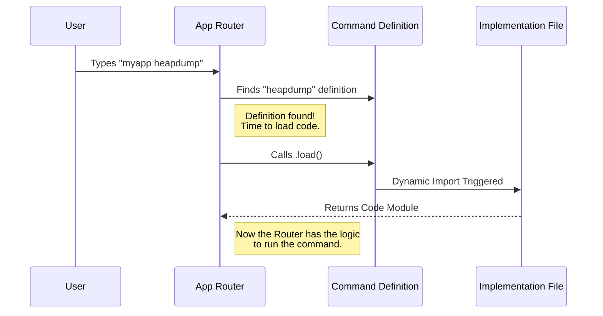

# Chapter 2: Lazy Module Loading

Welcome to Chapter 2! In the previous chapter, [Command Definition](01_command_definition.md), we created a menu entry for our `heapdump` command. We told the system *what* the command is, but we didn't actually load the heavy code required to run it.

In this chapter, we will learn **how** to load that code efficiently using a concept called **Lazy Module Loading**.

---

## The Motivation: The Library Archive

Imagine a massive library with thousands of books.
*   **Eager Loading (The bad way):** When you walk into the library, the librarian piles **every single book** the library owns onto the front desk, "just in case" you ask for one. The desk collapses, and you can't find anything.
*   **Lazy Loading (The good way):** The front desk is clean. The books are kept in the archive. The librarian only goes to the back to fetch a specific book **after** you ask for it.

### Central Use Case
Our `heapdump` tool is like a very heavy encyclopedia. It requires complex logic to snapshot the computer's memory.
If a user just wants to check the version of our CLI (`myapp --version`), we shouldn't waste time or computer memory loading the heavy `heapdump` code. We should only load it when the user explicitly types `myapp heapdump`.

---

## Concept 1: Static vs. Dynamic Imports

In JavaScript and TypeScript, there are two ways to bring code from one file to another.

### 1. Static Import (Eager)
This is what you usually see at the top of a file. It runs immediately when the application starts.

```typescript
// The "Eager" way
import { runHeapDump } from './heapdump.js'

// The code above runs INSTANTLY when the app starts.
// This slows down startup time.
```

### 2. Dynamic Import (Lazy)
This is a function that imports the code only when it is called.

```typescript
// The "Lazy" way
const loadMyCode = () => import('./heapdump.js')

// The file is NOT read yet.
// It is only read when we call loadMyCode().
```

For our project, we exclusively use **Dynamic Imports** for commands.

---

## Concept 2: The Promise

When you ask the librarian to fetch a book from the archive, it isn't instantaneous. You have to wait a few seconds.

In code, this "waiting" is represented by a **Promise**.
When we call `import()`, it returns a Promise that eventually resolves to the code module.

---

## Solving the Use Case

Let's revisit the `index.ts` file we looked at in Chapter 1. We solve the performance problem by defining a `load` function that uses a dynamic import.

### The Implementation

```typescript
// From index.ts
const heapDump = {
  // ... other properties ...
  load: () => import('./heapdump.js'),
}
```

**What is happening here?**
1.  We define a function `() => ...`.
2.  Inside that function, we call `import('./heapdump.js')`.
3.  We assign this function to the `load` property.

By doing this, the file `./heapdump.js` is ignored during startup. It sits quietly on the disk until the application decides it is time to execute the command.

---

## Internal Implementation: Under the Hood

How does the application actually use this? Let's look at the flow when a user actually types the command.

### Visualizing the Process

The application acts as a "Router." It matches the user's text input to a command definition, and then triggers the load.



### Deep Dive: The Router Logic

While we don't need to write the Router logic ourselves (it's part of the framework), understanding it helps us write better commands.

Here is a simplified version of what the Router does when it receives the command:

```typescript
// Simplified Router Logic
async function handleCommand(commandDef: Command) {
  console.log("User selected: " + commandDef.name)

  // 1. Trigger the lazy load
  const module = await commandDef.load()

  // 2. The module is now loaded!
  console.log("Code loaded from file.")
}
```

**Explanation:**
*   `async/await`: Because loading a file takes time (remember the **Promise**?), the Router `await`s the result.
*   `const module`: This variable now holds the contents of `./heapdump.js`.

### The File Being Loaded

The file we are loading (`heapdump.js` or `heapdump.ts`) acts as the "Service Layer." We will discuss exactly what goes inside this file in the next chapter. For now, just know that **Lazy Module Loading** is the bridge that connects the *Definition* to the *Execution*.

## Conclusion

In this chapter, we learned about **Lazy Module Loading**.

1.  **Performance:** We avoid loading heavy code until it is strictly necessary.
2.  **Dynamic Imports:** We use the `() => import(...)` syntax to create a loading function.
3.  **Asynchronous Nature:** Loading creates a "Promise" that the system waits for.

Now that we have successfully loaded the module, what do we do with it? The system needs a standard way to run the code we just fetched.

[Next Chapter: Command Execution Handler](03_command_execution_handler.md)

---

Generated by [Code IQ](https://github.com/adityasoni99/Code-IQ)