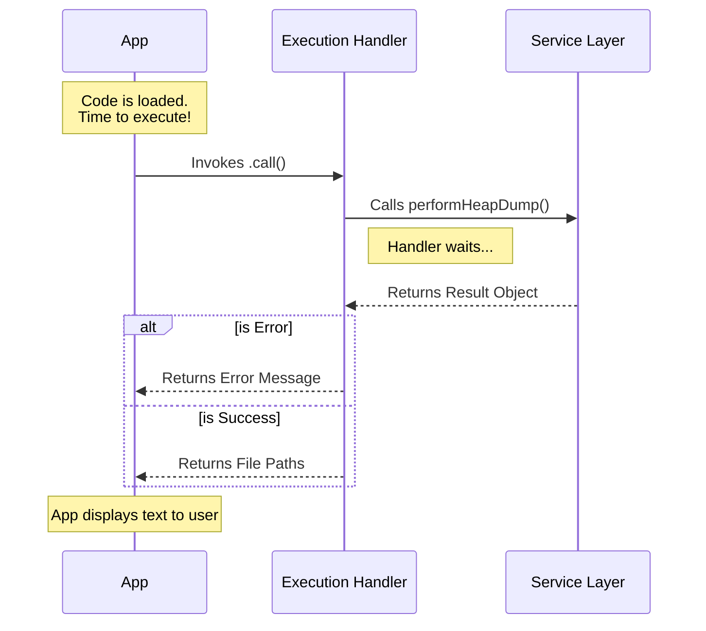

# Chapter 3: Command Execution Handler

Welcome to Chapter 3!

In the previous chapter, [Lazy Module Loading](02_lazy_module_loading.md), we learned how to efficiently fetch the code file only when it is needed. We compared this to a librarian fetching a book from the archive.

Now that we have the "book" (the code file) open in front of us, we need to read it! In this chapter, we will build the **Command Execution Handler**.

---

## The Motivation: The Restaurant Kitchen

Let's go back to our restaurant analogy.
*   **Chapter 1 (Command Definition):** The Menu. It lists the dish.
*   **Chapter 2 (Lazy Loading):** The Waiter fetching the ingredients.
*   **Chapter 3 (Execution Handler):** **The Head Chef.**

When the ingredients arrive, the Head Chef doesn't necessarily chop every carrot personally. Instead, the Head Chef **coordinates** the process. They:
1.  Receive the order.
2.  Tell the line cooks to start working (Delegate the hard work).
3.  Wait for the result.
4.  Decide if the plate looks good (Success) or if it's burnt (Error).
5.  Send the result out to the customer.

### Central Use Case
We want to run the `heapdump` logic. However, saving a snapshot of memory is risky—it might fail (e.g., if the disk is full).
Our **Execution Handler** needs to try to run the task, catch any errors if they happen, and format the final message for the user.

---

## Concept 1: The Standard Entry Point

The main application needs a consistent way to tell your code to "Start!"
Just like every car has an ignition slot for a key, every command module in our system must export a specific function named `call`.

```typescript
// The system looks specifically for a function named "call"
export async function call() {
  // Logic goes here
}
```

If we named it `start()` or `run()`, the system wouldn't find it. We must stick to the standard named `call`.

---

## Concept 2: The Coordinator (Not the Worker)

The Execution Handler is a manager. It shouldn't contain 500 lines of complex math or low-level system operations. Instead, it calls other helper functions (the "Service Layer") to do the heavy lifting.

This keeps our code clean. The Handler focuses on **flow control**: "Do this, then check that."

---

## Solving the Use Case

Let's build the `heapdump.ts` file. We will break it down into small steps.

### Step 1: Import the Helper
First, we import the actual worker function. We haven't built this yet (we will in the next chapter), but we know we need it.

```typescript
// heapdump.ts
// Import the "worker" logic (Service Layer)
import { performHeapDump } from '../../utils/heapDumpService.js'
```

### Step 2: Define the Handler
We define our asynchronous `call` function. It needs to return a Promise because creating a heap dump takes time.

```typescript
// Define the standard entry point
export async function call(): Promise<{ type: 'text'; value: string }> {
  // We invoke the heavy logic here and wait for it
  const result = await performHeapDump()
  
  // ... continued below
```

**Explanation:**
*   `async`: Allows us to pause and wait for the dump to finish.
*   `await performHeapDump()`: This is the Head Chef telling the line cook to make the food. We wait here until the work is done.

### Step 3: Handle Errors
What if the disk is full? The `result` variable tells us if it succeeded or failed.

```typescript
  // Check if the worker reported a failure
  if (!result.success) {
    return {
      type: 'text',
      // We format a nice error message for the user
      value: `Failed to create heap dump: ${result.error}`,
    }
  }
```

**Explanation:**
*   We act as a gatekeeper. If something went wrong (`!result.success`), we return an error message immediately. We don't crash the app; we just report the problem.

### Step 4: Handle Success
If we pass the error check, it means everything went well! We return the success message.

```typescript
  // If we get here, it worked!
  return {
    type: 'text',
    // Combine the file paths into a single string
    value: `${result.heapPath}\n${result.diagPath}`,
  }
}
```

**Explanation:**
*   We format the output to show the user where their files are saved (`heapPath` and `diagPath`).

---

## Internal Implementation: Under the Hood

How does the system invoke this handler?

When the `load()` function (from Chapter 2) finishes, the system gets the module object. It simply assumes there is a `.call()` property on it and executes it.

### Visualizing the Process



### Deep Dive: The Return Type

You might have noticed the return object looks specific:
```typescript
{ type: 'text', value: '...' }
```

This is part of a **Standardized Output Protocol**. The Handler doesn't `console.log` directly to the screen. Instead, it returns a data object describing *what* should be shown. This allows the main application to decide if the text should be printed plain, colored green, or sent to a log file. We will cover this fully in [Standardized Output Protocol](05_standardized_output_protocol.md).

## Conclusion

In this chapter, we built the **Command Execution Handler**.

We learned:
1.  **The `call` function:** The standard entry point for all commands.
2.  **Coordination:** The handler coordinates the work but delegates the heavy lifting to a service.
3.  **Flow Control:** The handler checks for errors and decides what message to return to the user.

But wait—we keep calling `performHeapDump()`, but we haven't written it yet! That is the actual "heavy lifting" logic.

In the next chapter, we will roll up our sleeves and write the code that actually touches the system memory.

[Next Chapter: Service Layer Delegation](04_service_layer_delegation.md)

---

Generated by [Code IQ](https://github.com/adityasoni99/Code-IQ)