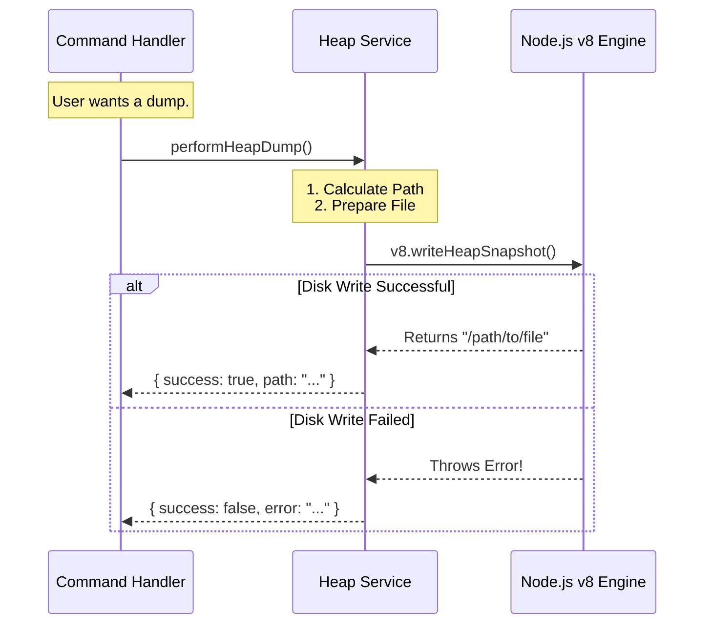

# Chapter 4: Service Layer Delegation

Welcome to Chapter 4!

In the previous chapter, [Command Execution Handler](03_command_execution_handler.md), we built the "Manager" of our command. The Handler received the order and coordinated the process, but it didn't actually do the heavy lifting itself.

In this chapter, we will build the **Service Layer**. This is the "Technician" that performs the complex, low-level work of actually saving the memory snapshot.

---

## The Motivation: The Architect and the Plumber

Imagine you are an Architect designing a house.
*   **The Architect (Handler):** Creates the blueprints, talks to the client, and makes sure the project stays on track.
*   **The Plumber (Service):** Actually cuts the pipes and installs the sink.

If the Architect tries to install the pipes themselves while holding the blueprints, things get messy!

**The Problem:**
Writing a heap dump involves talking to the Node.js engine internals (`v8`), managing file paths, and handling operating system errors. If we put all this messy code inside our Handler, our Handler becomes hard to read and hard to test.

**The Solution:**
We practice **Service Layer Delegation**. We move the messy, low-level logic into a separate file (a Service). The Handler simply delegates the task: "Hey Service, please save the heap now."

### Central Use Case
We need to use the Node.js built-in `v8` module to write a snapshot of the current memory to the disk. This operation might fail (e.g., if the disk is full), so we need to handle that gracefully and return the file path if it succeeds.

---

## Concept 1: Separation of Concerns

This is a fancy programming term that means "Keep different things in different places."

1.  **The Command Layer (Handler):** Cares about the User. It handles inputs and formats outputs.
2.  **The Service Layer (Implementation):** Cares about the System. It handles disk writes, database connections, and calculations.

By separating them, you can change *how* the heap dump is written (System) without changing *how* the command is called (User).

---

## Concept 2: The Service Interface

Our Service needs to be a "black box." The Handler shouldn't care *how* it works, only *what* it returns.

We will define a strict return format so the Handler knows exactly what to expect:

```typescript
// The contract between Handler and Service
interface ServiceResult {
  success: boolean;
  heapPath?: string; // Only exists if success is true
  error?: unknown;   // Only exists if success is false
}
```

---

## Solving the Use Case

Let's write `src/utils/heapDumpService.ts`. We will break this complex task into small, manageable code blocks.

### Step 1: Importing Dependencies
We need the built-in `v8` library (the engine that runs JavaScript) and `path` to manage file locations.

```typescript
// src/utils/heapDumpService.ts
import v8 from 'v8'
import path from 'path'

// We will export a single function to do the work
export async function performHeapDump() {
  // Logic starts here...
```

**Explanation:**
*   `v8`: This is a built-in Node.js module. It gives us direct access to the memory engine.
*   `path`: Helps us create file paths that work on both Windows and Mac/Linux.

### Step 2: Preparing the Environment
We need to determine where to save the file.

```typescript
  // ... inside performHeapDump
  try {
    // 1. Create a unique filename based on the current time
    const timestamp = Date.now()
    const filename = `heapdump-${timestamp}.heapsnapshot`
    
    // 2. Resolve the full path (e.g., /Users/me/project/...)
    const fullPath = path.resolve(process.cwd(), filename)
```

**Explanation:**
*   `try { ... }`: We start a "safety block." If anything crashes inside here, we catch it instead of killing the program.
*   `Date.now()`: Ensures every dump has a unique name so we don't overwrite old ones.

### Step 3: Executing the Low-Level Operation
Now for the critical line of code. We ask the engine to save the memory.

```typescript
    // 3. The low-level magic!
    // This writes the file to disk synchronously
    const writtenPath = v8.writeHeapSnapshot(fullPath)

    // 4. Return success!
    return { success: true, heapPath: writtenPath }
```

**Explanation:**
*   `v8.writeHeapSnapshot`: This creates the file. It returns the path where it saved the file.
*   We return an object with `success: true`. This matches the interface the Handler expects.

### Step 4: Handling Errors
What if the disk is full? The code above would crash. We need to catch that crash.

```typescript
  } catch (err) {
    // If anything went wrong above, we end up here.
    console.error('Service Error:', err)

    // Return failure instead of crashing
    return { success: false, error: err }
  }
}
```

**Explanation:**
*   `catch (err)`: We capture the error object.
*   We return `success: false`. The Handler will see this and know to display an error message to the user.

---

## Internal Implementation: Under the Hood

How does the data flow from the Handler to the System and back?

### Visualizing the Delegation



### Deep Dive: Why `v8`?

You might wonder why we use `import v8 from 'v8'`.

Node.js is built on top of the **V8 JavaScript Engine** (the same one used in Google Chrome). The `v8` module exposes internal functions that are usually hidden.
*   `writeHeapSnapshot` pauses your application for a split second.
*   It serializes (converts) every object in memory into a JSON-like format.
*   It streams this data to a file.

By wrapping this dangerous, low-level operation in our **Service Layer**, we ensure that if V8 changes in the future, we only have to update this one file (`heapDumpService.ts`), not our Command Handler.

---

## Conclusion

In this chapter, we implemented **Service Layer Delegation**.

We learned:
1.  **Separation:** The Handler manages the *request*, but the Service performs the *action*.
2.  **Safety:** We wrapped low-level system calls (writing to disk) in a `try/catch` block within the service.
3.  **Stability:** The Service returns a safe result object (`success: boolean`) instead of throwing errors up to the user.

Now we have a complete chain:
1.  **Definition** (Menu)
2.  **Lazy Loading** (Fetching ingredients)
3.  **Handler** (The Manager)
4.  **Service** (The Technician)

The Service has returned the file path to the Handler. The Handler has formatted a string. But... how do we actually display that string to the user? Do we just `console.log` it? What if we want to print it in JSON format for a machine to read?

In the final chapter, we will learn how to send our response back to the user properly.

[Next Chapter: Standardized Output Protocol](05_standardized_output_protocol.md)

---

Generated by [Code IQ](https://github.com/adityasoni99/Code-IQ)