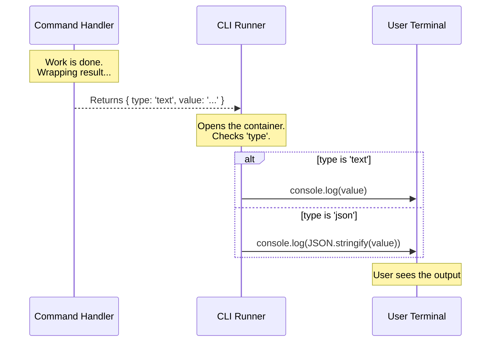

# Chapter 5: Standardized Output Protocol

Welcome to Chapter 5!

In the previous chapter, [Service Layer Delegation](04_service_layer_delegation.md), we built the "Technician" (the Service) that actually writes the file to the disk. It hands the result back to the "Manager" (the Handler).

Now, the Manager holds the result. But how do we give it to the user? Do we just `console.log` it? What if we want the text to be red if it fails? What if we want to save the output to a log file instead of the screen?

In this chapter, we will learn about the **Standardized Output Protocol**.

---

## The Motivation: The Shipping Container

Imagine a massive cargo ship.
*   **The Problem:** If one customer sends loose bananas, another sends a car, and a third sends loose socks, the crane operator has a nightmare trying to load the ship.
*   **The Solution:** **Standardized Shipping Containers.** It doesn't matter what is *inside* (bananas, cars, socks). The outside is always a metal box of the exact same size. The crane operator only needs to know how to move the box.

### Central Use Case
Our `heapdump` command has finished running. It has a file path to show the user.
Instead of printing it directly to the screen, we want to package it in a "container" so the main application (the CLI Runner) can decide how to handle it. This makes our command reusable and keeps the display logic consistent across the entire app.

---

## Concept 1: The Container Shape

The "Standardized Output Protocol" is just a fancy way of saying: "All commands must return a JavaScript object that looks like this:"

```typescript
// The "Container" format
type CommandResult = {
  type: 'text' | 'json' | 'table'; // What kind of data is inside?
  value: any;                      // The actual data
}
```

By using this format, the main application never has to guess what it received.

---

## Concept 2: Separating Data from Display

When you write `console.log("Hello")`, you are mixing **Data** ("Hello") with **Display** (Printing to screen).

In our system, we want to separate them.
1.  **Command:** "Here is the text result." (Data)
2.  **App Runner:** "Okay, I will print this to the terminal using the color green." (Display)

---

## Solving the Use Case

Let's look at how our `heapdump` command uses this protocol. We are looking at the final return statements in `heapdump.ts`.

### Example 1: returning Success

When everything goes right, we don't print the path. We wrap it in an object.

```typescript
// Inside heapdump.ts (The Handler)

return {
  type: 'text', // Label the box
  // The content of the box
  value: `Heap dump created at: ${result.heapPath}`,
}
```

**Explanation:**
*   `type: 'text'`: We tell the system, "I am sending you a plain string."
*   `value`: This is the actual message we want the user to eventually see.

### Example 2: Returning Failure

Even if the command fails, we still return a valid container! We don't crash the app; we just send a container filled with an error message.

```typescript
// Inside heapdump.ts (The Handler)

if (!result.success) {
  return {
    type: 'text', 
    // The error message acts as the value
    value: `Error: Failed to create dump. ${result.error}`,
  }
}
```

**Explanation:**
*   Consistency is key. Whether success or failure, the shape of the object (`{ type, value }`) is identical. The main app doesn't need special logic to handle the return value.

---

## Internal Implementation: Under the Hood

What happens to this object after our command returns it?

The main application (the CLI Runner) receives this object and acts as the "Crane Operator." It inspects the `type` and decides how to display the `value`.

### Visualizing the Process



### Deep Dive: The Runner Code

Let's look at a simplified version of the code in the main application that processes your result. This code runs *after* your command finishes.

```typescript
// Simplified CLI Runner
async function runCommand() {
  // 1. Run your command (Chapter 3)
  const result = await command.call()

  // 2. Open the container (The Protocol)
  if (result.type === 'text') {
    // Standard text? Just print it.
    console.log(result.value)
  } 
  // ... checks for other types
}
```

**Explanation:**
*   Because we used the protocol, the Runner allows us to change how we output things easily.
*   If we wanted to make all text **bold**, we would only change this one file (`CLI Runner`), and every single command in our system would update instantly.

---

## Conclusion

In this chapter, we learned about the **Standardized Output Protocol**.

We learned:
1.  **Consistency:** Wrapping results in a standard object (`{ type, value }`) makes the system predictable.
2.  **Separation:** We separated the *Result* (the command's job) from the *Display* (the runner's job).
3.  **The Container Analogy:** Just like a shipping container, the standard format allows the system to handle any kind of data easily.

### Series Wrap-Up

Congratulations! You have completed the **heapdump** project tutorial.

You have built a fully functional system architecture:
1.  **[Command Definition](01_command_definition.md):** You created the menu entry.
2.  **[Lazy Module Loading](02_lazy_module_loading.md):** You optimized performance by loading code only when needed.
3.  **[Command Execution Handler](03_command_execution_handler.md):** You built the manager to coordinate the task.
4.  **[Service Layer Delegation](04_service_layer_delegation.md):** You built the technician to safely handle system operations.
5.  **Standardized Output Protocol:** You ensured the result was delivered cleanly to the user.

You now possess the foundational knowledge to build scalable, high-performance CLI tools. Happy coding!

---

Generated by [Code IQ](https://github.com/adityasoni99/Code-IQ)