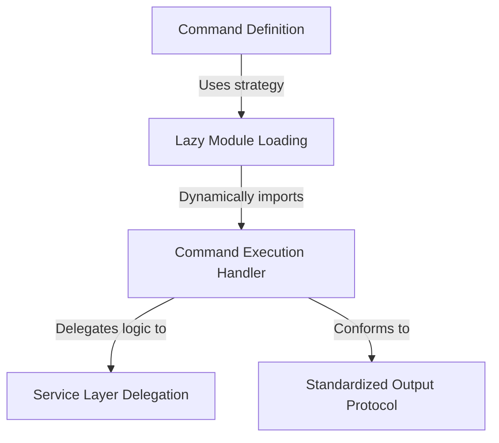

# Tutorial: heapdump

This project implements a specific **CLI command** aimed at debugging memory issues by creating a *heap dump* (a snapshot of memory) on the user's Desktop. It utilizes a **lazy loading** architecture to ensure the heavy logic is only imported when the command is actually run, and it follows a strict protocol to ensure the results are returned in a **standardized text format**.

## Chapters

1. [Command Definition](01_command_definition.md)
2. [Lazy Module Loading](02_lazy_module_loading.md)
3. [Command Execution Handler](03_command_execution_handler.md)
4. [Service Layer Delegation](04_service_layer_delegation.md)
5. [Standardized Output Protocol](05_standardized_output_protocol.md)

---

Generated by [Code IQ](https://github.com/adityasoni99/Code-IQ)