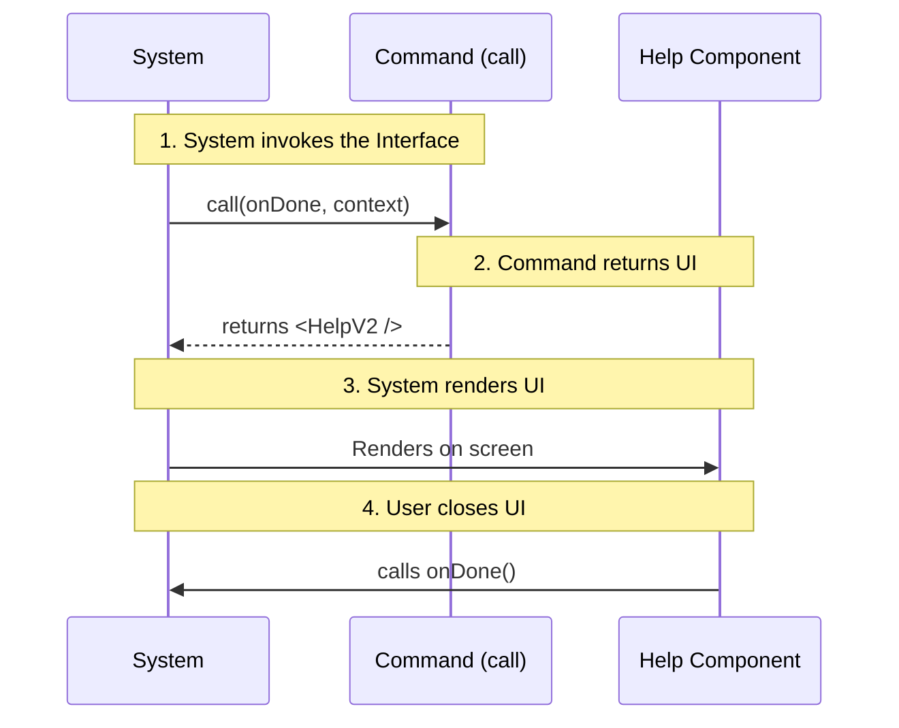

# Chapter 1: Standardized Command Interface

Welcome to the first chapter of the **Help** project tutorial!

In this chapter, we are going to explore the foundation of how commands work in our system. Before we write any complex logic or beautiful user interfaces, we need to answer a simple question: **How does the system know how to run your code?**

## The Problem: The Chaos of No Rules

Imagine you are building a computer. You want people to be able to plug in a mouse, a keyboard, or a webcam.

If the mouse manufacturer designs a triangle plug, the keyboard manufacturer designs a square plug, and the webcam uses a star-shaped plug, your computer would need a thousand different holes to support them all. That is chaos.

## The Solution: The "USB" Port

To fix this, we created a standard: **The USB Port**. The computer provides a specific shape. If a device matches that shape, it plugs in and works immediately. The computer doesn't need to know *how* the mouse works inside; it just knows how to connect to it.

In our project, the **Standardized Command Interface** is that USB port.

Every command (like "Help", "Settings", or "Search") must look exactly the same on the outside. This allows the system to launch any command without knowing what it actually does.

## The Use Case: Launching the "Help" Command

Let's look at how we build the `help` command. We want to tell the system:

> "When the user asks for help, run this specific function."

To do this, we export a function named `call` that follows a strict set of rules (a type called `LocalJSXCommandCall`).

### Step 1: Defining the "Shape"

First, we need to import the definition of what a command looks like. This is our "USB specification."

```typescript
// help.tsx
import * as React from 'react';
// We import the specific type signature
import type { LocalJSXCommandCall } from '../../types/command.js';
import { HelpV2 } from '../../components/HelpV2/HelpV2.js';
```

**Explanation:**
We are importing `LocalJSXCommandCall`. This is a TypeScript type that enforces the rules. It ensures our function accepts the right inputs and returns the right output.

### Step 2: The Command Signature

Here is the most important part. We define our `call` function. Notice how it takes specific arguments.

```typescript
// The 'call' function MUST match LocalJSXCommandCall
export const call: LocalJSXCommandCall = async (
  onDone, // Argument 1: A function to call when we are finished
  context // Argument 2: A box containing tools and data
) => {
  // ... logic goes here
};
```

**Explanation:**
*   **`onDone`**: This is a callback function. When your command is finished (e.g., the user closes the Help window), you call this to tell the system "I'm done!"
*   **`context`**: This object contains useful things the system gives you. In the code below, we extract `commands` from `options` inside this context.

### Step 3: Returning the UI

Finally, the command must return something the system can render. In our case, it returns a React component (JSX).

```typescript
export const call: LocalJSXCommandCall = async (onDone, { options: { commands } }) => {
  // We pass 'commands' data to the UI
  // We pass 'onDone' so the UI can close itself
  return <HelpV2 commands={commands} onClose={onDone} />;
};
```

**Explanation:**
We simply return the `<HelpV2 />` component. We act as a bridge. We take the `commands` list provided by the system and pass it to the UI. We also pass `onDone` to the `onClose` prop, so when the user clicks "X" in the UI, the system knows the command is over.

## Under the Hood: How the System Calls You

It helps to understand what is happening on the other side of the wall. How does the system actually use this `call` function?

### The Flow

1.  The System decides it needs to run "Help".
2.  It finds the file and looks for the exported `call` function.
3.  It prepares the `onDone` callback and the `context` data.
4.  It runs your function and waits for the Result (the UI).



### The System's View (Simplified)

Here is a simplified example of what the system code looks like when it runs your command. You don't write this, but it helps to see it!

```typescript
// This is hypothetical code inside the System Core
async function executeCommand(commandFile) {
  // 1. Prepare the "I am done" signal
  const handleDone = () => console.log("Command finished!");

  // 2. Prepare the context (tools the command might need)
  const context = { options: { commands: ['cmd1', 'cmd2'] } };

  // 3. PLUG IT IN! Invoke the standardized function
  const uiElement = await commandFile.call(handleDone, context);
  
  // 4. Show the result
  renderOnScreen(uiElement);
}
```

**Explanation:**
Because your `help.tsx` followed the rules (the `LocalJSXCommandCall` signature), the system could confidently pass `handleDone` and `context` into `commandFile.call`, knowing exactly what would happen.

## Summary

In this chapter, we learned:
1.  **Standardization** is like a USB port; it allows the system to run any command without knowing its internal logic.
2.  **`LocalJSXCommandCall`** is the specific shape of that port.
3.  The command receives **`onDone`** (to signal completion) and **`context`** (data from the system).
4.  The command returns a **UI Component** for the system to render.

But wait—how did the system find the `help.tsx` file in the first place? How did it know that this file corresponds to the command name "help"?

To answer that, we need to look at how commands are registered.

[Next Chapter: Command Metadata Registry](02_command_metadata_registry.md)

---

Generated by [Code IQ](https://github.com/adityasoni99/Code-IQ)