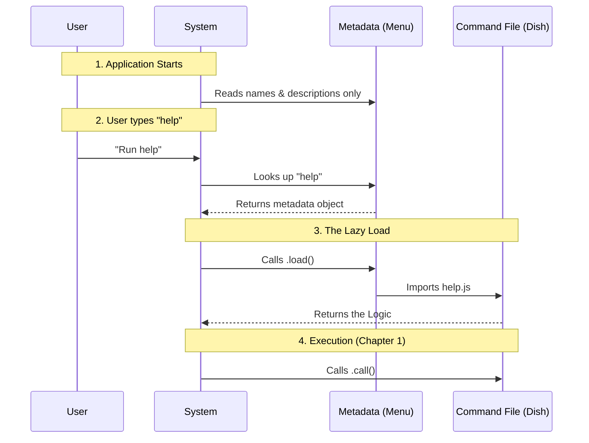

# Chapter 2: Command Metadata Registry

Welcome to the second chapter!

In the previous [Standardized Command Interface](01_standardized_command_interface.md) chapter, we learned how to write the actual logic (the code) that runs when a command is executed. We compared it to designing a standard "USB plug" so the system can connect to it.

But now we have a new problem. Imagine you have 100 different USB devices in a drawer. How do you know which one is the webcam and which one is the mouse without plugging them all in one by one? You need a label.

In this chapter, we will build that label. We call it the **Command Metadata Registry**.

## The Problem: The Heavy Backpack

Imagine you are going on a hike. You have a heavy tent, a sleeping bag, and a cooking stove.

If you carry *everything* on your back from the moment you leave your house, you will be exhausted before you even reach the trail. Ideally, you want to keep those heavy items in your car (storage) and only pick them up when you actually decide to camp.

In software, **Code is Heavy**.
If our application loads the code for every single command (Help, Settings, Profile, Search) the moment the app starts, the app will be slow. We want to list the commands available, but we don't want to carry their weight until the user actually asks for them.

## The Solution: The "Restaurant Menu"

This is exactly how a restaurant works.
1.  **The Menu (Metadata):** It lists the names ("Burger") and descriptions ("Juicy beef with cheese"). It is light and easy to hold.
2.  **The Dish (The Code):** This is the heavy plate of food. It is created in the kitchen *only after* you order it.

The **Command Metadata Registry** is our menu. It tells the system *about* the command without loading the command itself.

## The Use Case: Defining "Help"

We want the system to know that a command named "help" exists. We want to tell the system:

> "I have a command called 'help'. It shows available commands. If the user asks for it, here is where you can find the code."

Let's write the definition file (`index.ts`) for our Help feature.

### Step 1: Naming the Dish

First, we define the basic identity of the command. This is what the user sees on the "Menu."

```typescript
// index.ts
import type { Command } from '../../commands.js'

const helpMetadata = {
  type: 'local-jsx',
  name: 'help',
  description: 'Show help and available commands',
  // ... more to come
};
```

**Explanation:**
*   **`type`**: Tells the system what kind of plug to use (remember the USB analogy from Chapter 1).
*   **`name`**: The keyword the user types to run this.
*   **`description`**: A human-readable hint about what this does.

### Step 2: The "Kitchen Order" Slip

This is the magic part. Instead of putting the code here, we put a *function* that knows how to find the code.

```typescript
// index.ts continued...
const help = {
  // ... previous properties ...
  
  // The strategy to load the code
  load: () => import('./help.js'),
  
} satisfies Command;

export default help;
```

**Explanation:**
*   **`import('./help.js')`**: This is a special instruction. It says, "Don't read `help.js` right now. Wait until this function is called."
*   **`satisfies Command`**: This is TypeScript simply checking that our menu entry has all the required fields (name, description, load).

### The Complete File

Here is how the file looks when put together. It is very short and lightweight!

```typescript
// index.ts
import type { Command } from '../../commands.js'

const help = {
  type: 'local-jsx',
  name: 'help',
  description: 'Show help and available commands',
  load: () => import('./help.js'),
} satisfies Command

export default help
```

**Explanation:**
This file acts as the registration. The main application reads this file instantly. It knows "Help" exists, but it hasn't spent any energy loading the actual logic inside `help.js` yet.

## Under the Hood: The Order Process

How does the system use this registry? Let's trace the flow from the moment the application starts to when the command runs.

### The Flow

1.  **App Start:** The system reads the **Registry** (the Menu). It sees "help" is an option.
2.  **User Action:** The user types `help`.
3.  **Lookup:** The system checks the registry. "Do I have an item named help? Yes."
4.  **Loading:** The system executes the `load()` function. This finally goes to the disk and reads the heavy code (the Dish).
5.  **Execution:** The system runs the code it just loaded.



### The System's View (Simplified)

Here is a simplified look at how the main system code might process this registry.

```typescript
// Hypothetical System Core
const registry = [ helpCommand, settingsCommand ]; // List of metadata

function onUserInput(inputName) {
  // 1. Find the menu item
  const found = registry.find(cmd => cmd.name === inputName);

  if (found) {
    console.log(`Found command: ${found.description}`);
    
    // 2. Load the heavy code NOW (not before)
    found.load().then(module => {
      // 3. Run it (Standard Interface from Ch 1)
      module.call(); 
    });
  }
}
```

**Explanation:**
The system iterates through the lightweight `registry` list. It compares names. Only when a match (`found`) is discovered does it trigger `.load()`. This keeps the application snappy.

## Summary

In this chapter, we solved the problem of "Heavy Loading" by creating a **Command Metadata Registry**.

1.  We separated the **Definition** (Menu) from the **Implementation** (Dish).
2.  We defined the `name` and `description` so the system can list the command.
3.  We provided a `load` function that points to the code without reading it immediately.

This `load` function uses a technique called **Lazy Loading**. While we touched on it here, it is a powerful concept that deserves its own focus. How exactly does the browser or Node.js handle splitting these files apart?

[Next Chapter: Lazy Code Splitting](03_lazy_code_splitting.md)

---

Generated by [Code IQ](https://github.com/adityasoni99/Code-IQ)