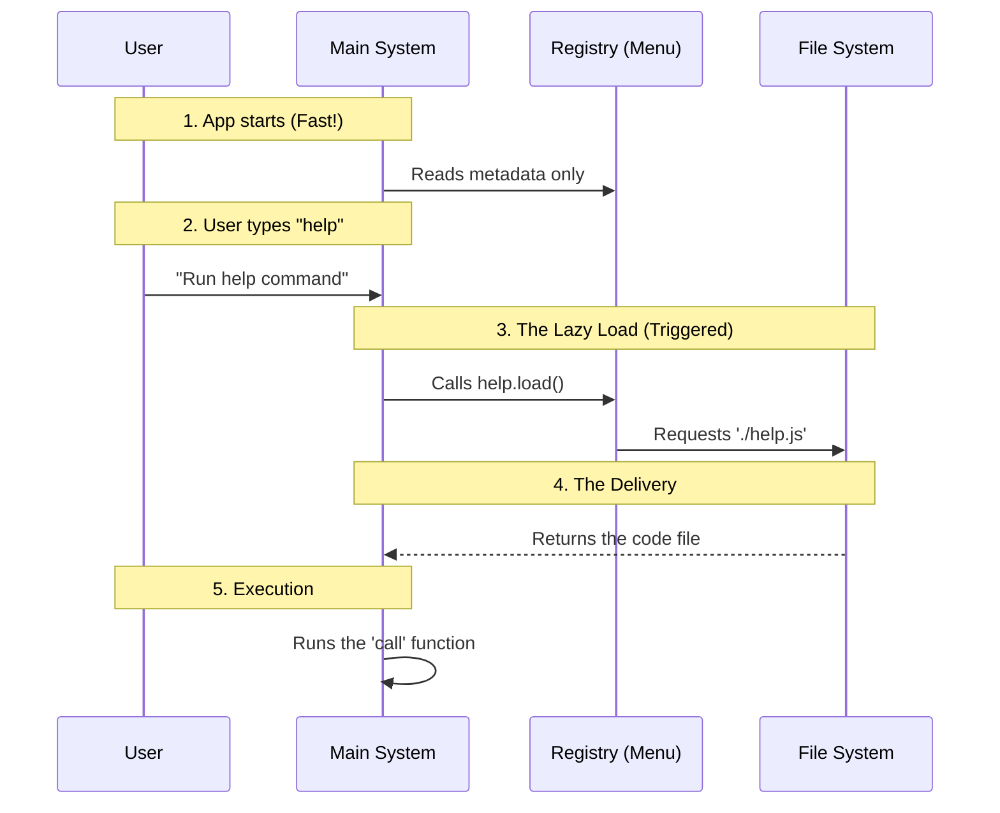

# Chapter 3: Lazy Code Splitting

Welcome to Chapter 3!

In the previous [Command Metadata Registry](02_command_metadata_registry.md) chapter, we created a "Menu" (the Registry) to list our commands without needing the actual "Dish" (the code). We briefly touched on a function called `load`.

Now, we are going to explore the magic behind that function. This concept is called **Lazy Code Splitting**.

## The Problem: The Overcrowded Desk

Imagine a public library.

If the librarian tried to keep **every single book in the library** on the front desk just in case someone asked for one, two things would happen:
1.  The desk would collapse (The computer runs out of memory).
2.  Opening the library in the morning would take hours because the librarian has to carry all the books to the desk first (Slow startup time).

## The Solution: The Storage Room

Ideally, the librarian keeps the desk empty.
1.  **The Request:** You walk up and ask for "Harry Potter".
2.  **The Retrieval:** The librarian walks to the back storage room.
3.  **The Delivery:** They return with *only* that specific book.

In programming, this is **Lazy Code Splitting**. We leave the code files on the hard drive (the storage room) and only read them into memory (the desk) when the user specifically asks for that command.

## The Use Case: Loading "Help" on Demand

Our goal is to ensure that the heavy logic for the `help` command is **not** loaded when the application starts. It should only load when the user types `help`.

### The Magic Function: Dynamic Import

In standard JavaScript/TypeScript, we usually see imports at the top of the file:

```typescript
// Standard Import (Eager)
// This happens immediately when the app starts!
import { call } from './help.js'; 
```

This is "Eager Loading." It puts the book on the desk immediately. To fix this, we use a special function called **Dynamic Import**.

Here is how we implemented it in our registry file:

```typescript
// index.ts
const help = {
  name: 'help',
  // ... other metadata
  
  // The Lazy Load Instruction
  load: () => import('./help.js'),
}
```

**Explanation:**
*   **`() => ...`**: This is an arrow function. It wraps the instruction. The code inside does not run until someone calls this function.
*   **`import('./help.js')`**: This function tells the language: "Go find this file and load it now."

Because we wrapped the import inside a function, the file is ignored until the exact moment we pull the trigger.

## Under the Hood: The "Promise" of Code

When you call `import('./help.js')`, the computer doesn't give you the code instantly. Reading a file takes time (even if it's just milliseconds).

Instead, the computer gives you a **Promise**.
Think of a Promise like a generic restaurant buzzer.
1.  You order food (Call `load()`).
2.  They give you a buzzer (The `Promise`).
3.  You wait.
4.  The buzzer goes off (The Promise "resolves").
5.  You get your food (The `module` containing your code).

### The Sequence

Let's look at the timeline of events when a user interacts with our system.



## Implementing the Logic

How do we write the code that uses this pattern? We act as the "System" here. We need to handle the Promise (the buzzer).

### Step 1: Triggering the Load

When the system finds the command the user wants, it calls the function we defined.

```typescript
// Hypothetical System Code
async function runCommand(commandMetadata) {
  console.log("Loading code...");

  // 1. Call the load function
  // We use 'await' to pause until the file is ready
  const commandModule = await commandMetadata.load();

  return commandModule;
}
```

**Explanation:**
*   **`await`**: This keyword pauses the function. It says, "Don't move to the next line until the file is fully loaded."
*   **`commandModule`**: This variable now holds the contents of `help.tsx` (specifically the `call` function we wrote in Chapter 1).

### Step 2: Executing the Command

Once we have the module, it looks exactly like a normal object. We can use the interface we learned in [Standardized Command Interface](01_standardized_command_interface.md).

```typescript
// ... continuing from above
  
  // 2. The file is loaded. Let's run it!
  // We extract the 'call' function we defined in Chapter 1
  const { call } = commandModule;

  // 3. Execute with context (Standard Interface)
  await call(onDone, context);
}
```

**Explanation:**
We treat the loaded code just like any other object. We extract `call` and run it. The system doesn't care that this code just arrived from the hard drive 5 milliseconds ago; it runs it all the same.

## Why is this "Beginner Friendly"?

You might ask, "Why bother with this complexity?"

If you are building a tiny app with 2 commands, you don't need this.
But imagine you are building a massive system like VS Code or Excel. They have thousands of commands.
*   **Without Lazy Splitting:** The app would take 5 minutes to open.
*   **With Lazy Splitting:** The app opens in 1 second. It only loads the "Spell Checker" when you actually start typing.

In our `help` project, we adopt this habit early. It keeps our main application file small and clean.

## Summary

In this chapter, we learned:
1.  **Lazy Code Splitting** keeps our application startup fast by leaving code in "storage" until needed.
2.  **`import()`** (Dynamic Import) is the function that fetches code on demand.
3.  **Promises** are the mechanism the system uses to wait for that file to load.

Now that we have successfully loaded our `help` command code, we need to decide what to show the user. In the first chapter, we returned a `<HelpV2 />` tag. But what is that? How do we build user interfaces in a terminal?

To answer that, we need to explore how we construct the visuals.

[Next Chapter: Declarative UI Composition](04_declarative_ui_composition.md)

---

Generated by [Code IQ](https://github.com/adityasoni99/Code-IQ)