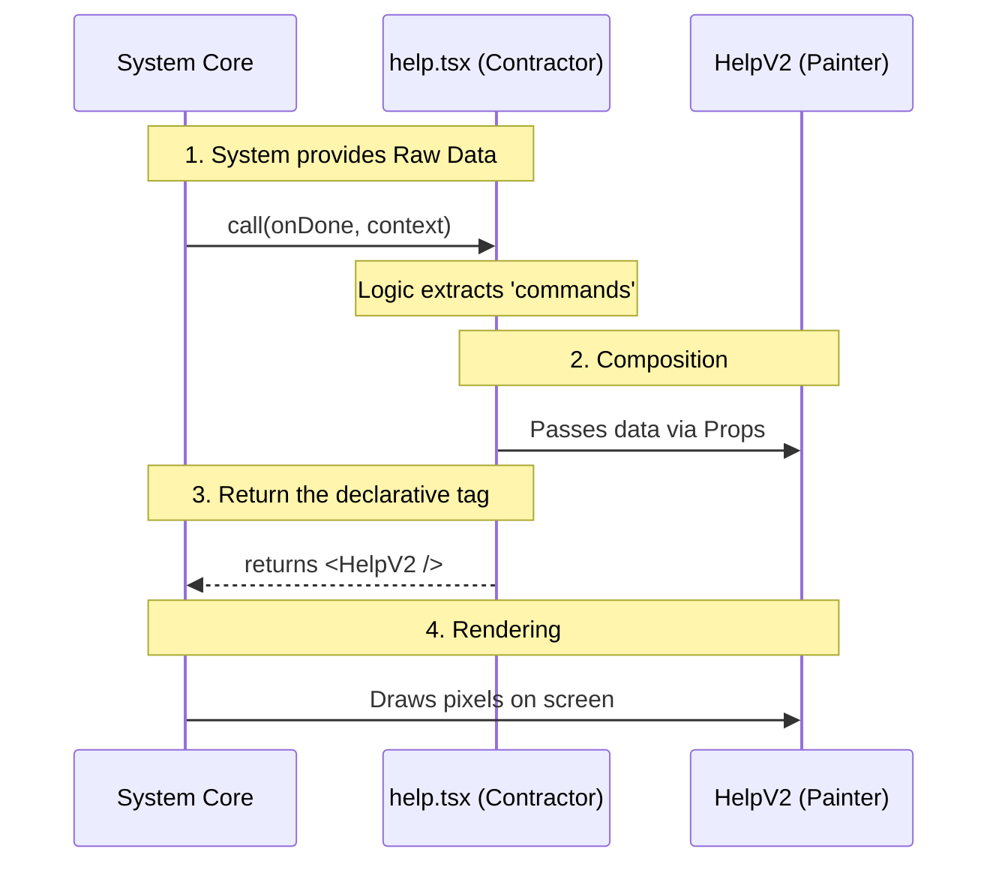

# Chapter 4: Declarative UI Composition

Welcome to Chapter 4!

In the previous [Lazy Code Splitting](03_lazy_code_splitting.md) chapter, we learned how to efficiently load our code only when needed.

Now that the system has loaded our `help.tsx` file, we face a design challenge: **How do we organize the code inside it?**

Do we write one giant function that calculates data, handles key presses, and draws pixels to the screen all at once? No. That would be a mess. Instead, we use a technique called **Declarative UI Composition**.

## The Problem: The "Do-It-All" Handyman

Imagine you want to build a house. You hire one person. They pour the concrete, wire the electricity, paint the walls, and install the windows.

If the painting looks bad, you have to distract the person while they are pouring concrete to fix it. If the electricity fails, the painting stops. This is **Coupled Logic**. It is hard to manage because one person is doing too many different types of jobs.

## The Solution: The Contractor and The Specialist

A better way to build a house is:
1.  **The General Contractor:** They receive the blueprints (Data). They don't pick up a paintbrush. They simply hire a specialist.
2.  **The Painter:** They are an expert at visuals. They don't care about the blueprints or the budget; they just paint what the contractor tells them to.

In our project:
*   **The Contractor** is the `call` function in `help.tsx`. It manages the data.
*   **The Painter** is the `HelpV2` component. It handles the visuals.

## The Use Case: Passing the "Commands" List

Our goal is to display a list of available commands (like "Settings", "Profile", "Search") to the user.

1.  The `call` function receives this list from the system.
2.  The `call` function passes this list to `HelpV2`.
3.  `HelpV2` draws it on the screen.

Let's look at how we compose this relationship.

### Step 1: The Contractor (Logic)

First, let's look at our `help.tsx` file again. Its job is to prepare the data.

```typescript
// help.tsx
export const call: LocalJSXCommandCall = async (
  onDone, 
  { options: { commands } } // We extract the data here
) => {
  // Logic layer: We have the data ('commands')
  // We are ready to hire the painter.
  
  // ... return the UI
};
```

**Explanation:**
The `call` function acts as the **Logic Layer**. It extracts `commands` (the list of tools) and `onDone` (the signal to finish). It does not know *how* to draw a list. It just holds the data.

### Step 2: The Painter (Visuals)

We import a specialized component called `HelpV2`. This component is defined elsewhere (in a purely visual file).

```typescript
// help.tsx
import { HelpV2 } from '../../components/HelpV2/HelpV2.js';

// ... inside the call function ...
return <HelpV2 commands={commands} onClose={onDone} />;
```

**Explanation:**
This single line is the essence of **Declarative Composition**.
*   We are **not** saying: "Draw a rectangle at x=10, write text 'Help'..."
*   We **are** saying: "I declare that I want a `<HelpV2 />` component here."

We pass the "work order" via **props**:
1.  `commands={commands}`: Here is the data to paint.
2.  `onClose={onDone}`: Here is the button to press when the user quits.

### Why "Declarative"?

**Imperative (The Old Way):**
> "Go to the kitchen. Open the drawer. Get a spoon. Scoop ice cream. Put it in a bowl."

**Declarative (The React Way):**
> "I want a bowl of ice cream."

By returning `<HelpV2 />`, we are focusing on the *result*, not the step-by-step drawing instructions.

## Under the Hood: The Handoff

How does the data flow from the system, through our logic, to the visual component?

### The Flow

1.  **System** calls the Command (`help.tsx`).
2.  **Command** unwraps the data (`context`).
3.  **Command** creates the Element (`<HelpV2 />`) with that data attached.
4.  **System** takes that Element and renders it.



### Deep Dive: The Props Connection

Let's look closer at the connection point in `help.tsx`. This is where the Logic layer shakes hands with the UI layer.

```typescript
// help.tsx
export const call: LocalJSXCommandCall = async (onDone, context) => {
  
  // 1. Get the data
  const commandList = context.options.commands;

  // 2. Delegate to the UI Component
  return (
    <HelpV2 
      commands={commandList} 
      onClose={onDone} 
    />
  );
};
```

**Explanation:**
*   **Separation of Concerns:** If we want to change how the help menu *looks* (e.g., change the color from blue to red), we edit `HelpV2`. We don't touch this file.
*   **Data Passing:** If we want to change *what data* shows up (e.g., filter out hidden commands), we edit this file. We don't touch `HelpV2`.

This makes our code much safer and easier to update.

## Summary

In this chapter, we learned about **Declarative UI Composition**:

1.  We separated **Logic** (The Contractor) from **Presentation** (The Painter).
2.  The `call` function acts as the Controller, gathering data.
3.  The `HelpV2` component acts as the View, displaying the data.
4.  We used **JSX** (`<HelpV2 />`) to declaratively describe what we want to show.

Now the UI is on the screen! But a user interface isn't a static painting; it needs to live, react to inputs, and eventually disappear. How do we know when the user has opened or closed the command?

To handle this, we need to understand the lifecycle of our command.

[Next Chapter: Lifecycle Management](05_lifecycle_management.md)

---

Generated by [Code IQ](https://github.com/adityasoni99/Code-IQ)