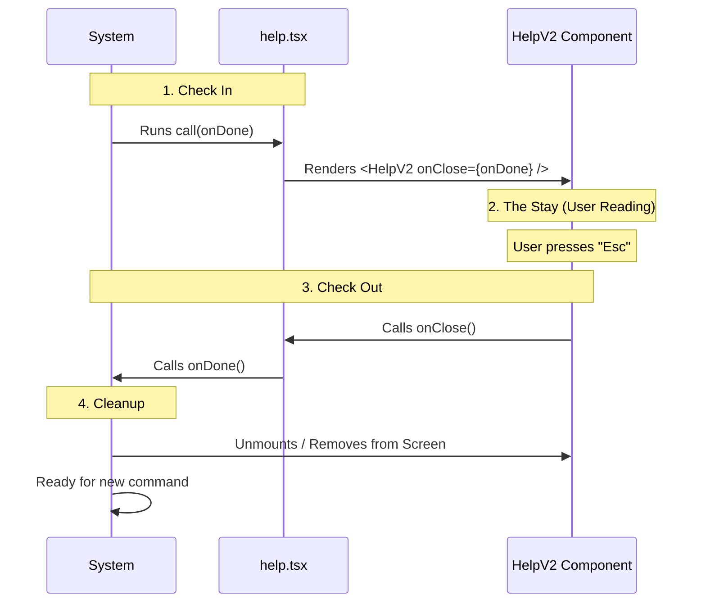

# Chapter 5: Lifecycle Management

Welcome to the final chapter of our beginner tutorial!

In the previous [Declarative UI Composition](04_declarative_ui_composition.md) chapter, we learned how to paint our user interface onto the screen. We successfully displayed the "Help" menu.

But now we have a new problem. **How do we leave?**

If you have ever been stuck in a computer program where pressing `Esc`, `q`, or `Ctrl+C` didn't work, you know the frustration. The program is "hanging." We need a way to tell the main system, "We are finished here, please return to the main menu."

This concept is called **Lifecycle Management**.

## The Problem: The Guest Who Won't Leave

Imagine a hotel.
1.  **Check In:** You arrive at the front desk and get a room key.
2.  **The Stay:** You sleep, watch TV, and use the room.
3.  **Check Out:** You return the key to the desk.

If you never return the key, the hotel thinks you are still there. The cleaners can't enter, and the front desk can't give the room to a new guest. The system is blocked.

In our software:
*   **The Stay** is the time the user spends looking at the Help screen.
*   **The Check Out** is the moment the user presses "Close".

We need a standardized way to hand back the key.

## The Solution: The `onDone` Callback

In our system, the "Key" is a function called `onDone`.

When the system runs your command, it hands you this function. It says:
> "Here is a special button. You can keep the screen as long as you want. But when you are finished, please press this button so I know I can take over again."

## The Use Case: Closing the Help Window

Let's look at `help.tsx` one last time. We need to receive the key (`onDone`) and pass it to our UI so the user can click it.

### Step 1: Receiving the Key

In Chapter 1, we saw the arguments for our function. Now let's focus specifically on the first one.

```typescript
// help.tsx
export const call: LocalJSXCommandCall = async (
  onDone, // <--- This is the "Check Out" button
  context
) => {
  // ...
};
```

**Explanation:**
The variable `onDone` is a function. We didn't write it; the system wrote it and gave it to us. We just need to hold onto it.

### Step 2: Passing the Key to the UI

The logic layer (the `call` function) doesn't have a mouse or keyboard. It can't "click" anything. It must pass the key to the component that *can* handle user input: `<HelpV2 />`.

```typescript
// help.tsx
// ... imports

export const call: LocalJSXCommandCall = async (onDone, { options }) => {
  const { commands } = options;

  // We pass 'onDone' to the 'onClose' prop
  return <HelpV2 commands={commands} onClose={onDone} />;
};
```

**Explanation:**
We act as a messenger.
1.  System gives `onDone` to `call`.
2.  `call` gives `onDone` to `HelpV2` (renaming it `onClose` because that makes more sense for a UI button).

### Step 3: Triggering the Check Out

Inside the visual component (`HelpV2`), there is likely code that listens for a keypress (like `Esc`) or a mouse click on an "X" button.

```typescript
// Inside the hypothetical HelpV2 component
function HelpV2(props) {
  // When user presses 'Esc'...
  useInput((input) => {
    if (input === 'Escape') {
      // Call the function passed down from the parent
      props.onClose(); 
    }
  });

  return <Text>Press Esc to Close</Text>;
}
```

**Explanation:**
When `props.onClose()` is called inside the UI, it triggers `onDone()` inside our logic, which signals the System. The chain is complete.

## Under the Hood: The Lifecycle Flow

What actually happens inside the system when you call `onDone()`? It triggers a cleanup process.

### The Flow

1.  **Start:** System launches command.
2.  **Wait:** System pauses and lets the user interact.
3.  **Signal:** User triggers `onDone`.
4.  **Cleanup:** System removes the UI from the screen.
5.  **Resume:** System goes back to its main loop (ready for the next command).



### The System's View (Simplified)

Here is a simplified version of how the system "waits" for you to finish.

```typescript
// Hypothetical System Core
function executeCommand() {
  return new Promise((resolve) => {
    // We create the onDone function
    const onDone = () => {
      console.log("Room is free!");
      resolve(); // This unblocks the system
    };

    // We pass it to your command
    yourCommand.call(onDone, context);
  });
}
```

**Explanation:**
The system wraps the entire execution in a **Promise**.
*   The `onDone` function effectively resolves that Promise.
*   Until you call it, the `await executeCommand()` line in the main system stays paused.
*   Once you call it, the system wakes up and clears the screen.

## Why is this "Beginner Friendly"?

You might ask: "Why can't I just kill the process?"

If you force-quit a program, you might lose data, corrupt files, or leave database connections open. By using a controlled Lifecycle (`onDone`), we ensure:
1.  **Clean Up:** We can save settings before closing.
2.  **Smooth Transition:** The screen doesn't just flash black; it returns gracefully to the previous menu.
3.  **Stability:** The main application stays running, ready for the next command.

## Summary of the Tutorial

Congratulations! You have completed the **Help Project Tutorial**.

Let's recap our journey:

1.  **[Standardized Command Interface](01_standardized_command_interface.md):** We learned that every command must have a standard "shape" (the USB plug) so the system can connect to it.
2.  **[Command Metadata Registry](02_command_metadata_registry.md):** We created a "Menu" to list commands without loading their heavy code.
3.  **[Lazy Code Splitting](03_lazy_code_splitting.md):** We used `import()` to fetch the code from storage only when requested (The Librarian).
4.  **[Declarative UI Composition](04_declarative_ui_composition.md):** We separated Logic (Contractor) from Visuals (Painter) to keep code clean.
5.  **Lifecycle Management:** We used `onDone` to politely signal when we are finished, ensuring a smooth user experience.

You now understand the core architecture of a modular, scalable command-line application. You can add new commands, build complex UIs, and manage system resources efficiently.

Happy Coding!

---

Generated by [Code IQ](https://github.com/adityasoni99/Code-IQ)