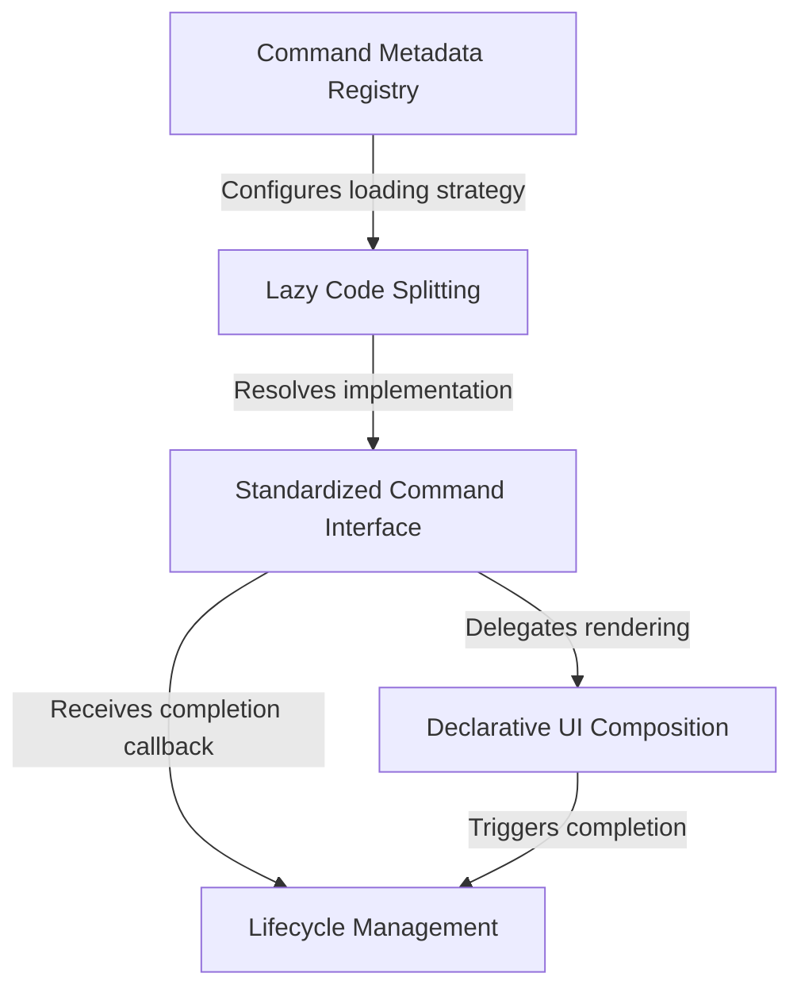

# Tutorial: help

This project implements a **help command** designed to guide users by displaying a list of available system features. It utilizes a *lazy loading strategy* to keep the application fast, ensuring the specific help logic is only fetched when needed. Once activated, the command uses **declarative UI components** to present information and manages the user's session lifecycle cleanly.

## Chapters

1. [Standardized Command Interface](01_standardized_command_interface.md)
2. [Command Metadata Registry](02_command_metadata_registry.md)
3. [Lazy Code Splitting](03_lazy_code_splitting.md)
4. [Declarative UI Composition](04_declarative_ui_composition.md)
5. [Lifecycle Management](05_lifecycle_management.md)

---

Generated by [Code IQ](https://github.com/adityasoni99/Code-IQ)