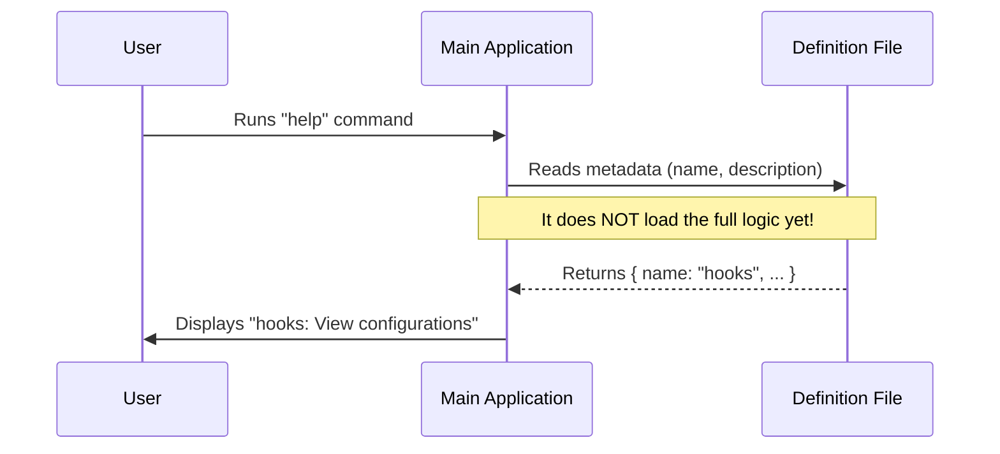

# Chapter 1: Command Registry Definition

Welcome to the **hooks** project! If you are looking to understand how to build flexible and powerful CLI (Command Line Interface) tools, you are in the right place.

We start our journey with the most fundamental concept: **The Command Registry Definition**.

### The Motivation: The Restaurant Menu
Imagine you are running a restaurant. You have a world-class chef in the kitchen who makes the best lasagna. However, if that lasagna isn't listed on the **menu**, no customer will ever order it. The chef will just stand there waiting.

In our CLI tool, the "Chef" is the code that does the actual work (the logic), and the "Menu" is the **Command Registry Definition**.

**The Problem:**
You want to create a new feature (like a "hooks" viewer), but the main application doesn't know it exists yet.

**The Solution:**
We create a small definition file. This file doesn't contain the heavy logic. It contains just enough metadata—like the name and description—to tell the main application: *"Hey, I exist! If someone asks for 'hooks', call me."*

### Implementing the Definition

Let's look at how we define a command. This is the entry point for our `hooks` feature.

We define a simple object that satisfies the `Command` structure.

**Input:** `index.ts`
```typescript
import type { Command } from '../../commands.js'

const hooks = {
  type: 'local-jsx',
  name: 'hooks',
  description: 'View hook configurations for tool events',
  immediate: true,
  // We'll look at 'load' in the next section
  load: () => import('./hooks.js'),
} satisfies Command

export default hooks
```

**Explanation:**
This small block of code is our "Menu Item."
1.  **`name`**: This is what the user types in the terminal (e.g., `my-tool hooks`).
2.  **`description`**: This shows up in the help text so the user knows what the command does.
3.  **`type`**: This tells the system *how* to run the command. Here, it is `'local-jsx'`, which acts as our user interface layer (more on this in [Local JSX Execution](03_local_jsx_execution.md)).

### The Power of "Lazy" Loading

You might notice the `load` property in the code above. This is a crucial part of keeping our application fast.

```typescript
// Inside our hooks object
load: () => import('./hooks.js'),
```

**Why do we do this?**
Back to our restaurant analogy: The menu describes the lasagna, but the chef doesn't start baking it until you actually order it.

If we loaded all the code for every single command when the application starts, the CLI would be very slow. By using `() => import(...)`, we promise to load the heavy code (the actual recipe) **only** when the user specifically asks for it. This concept is explored further in [Dynamic Command Loading](02_dynamic_command_loading.md).

### Under the Hood: How it Works

So, what happens when you start the application? How does it read this definition?

The main application acts like a Manager. When it starts up, it scans the directory for these definition files to build its internal registry.

Here is the flow of events:



1.  **Discovery:** The App finds `index.ts`.
2.  **Registration:** It reads the `name` and `description` and adds them to its internal list.
3.  **Waiting:** The App sits and waits. It knows `hooks` exists, but it hasn't touched the actual code logic yet.

### Deep Dive: Internal Implementation

Let's look at how the system types verify this definition. This ensures we don't make spelling mistakes in our menu.

**Input:** Validation logic (Simplified)
```typescript
// The system checks if your object matches the rules
interface Command {
  name: string;
  description: string;
  load: () => Promise<any>;
}

// If we miss 'name', TypeScript screams at us!
const hooks = {
    // ... properties
} satisfies Command 
```

**What happens here?**
The `satisfies Command` keyword is our safety net. It ensures that every "Menu Item" has at least a name and a way to load the main dish. If you forget the description, the code won't compile.

This standardization allows the **Application State Context** to manage all commands uniformly, regardless of what they actually do (see [Application State Context](05_application_state_context.md)).

### Summary

In this chapter, we learned that a **Command Registry Definition** is like a menu item.
1.  It defines **Metadata** (Name, Description).
2.  It points to the **Implementation** via a lazy `load` function.
3.  It keeps the application fast by not loading heavy code until necessary.

At this point, the application knows our command exists, but it doesn't know how to run the code inside `import('./hooks.js')` yet.

In the next chapter, we will learn exactly how the application takes this definition and wakes up the code when the user types the command.

[Next: Dynamic Command Loading](02_dynamic_command_loading.md)

---

Generated by [Code IQ](https://github.com/adityasoni99/Code-IQ)