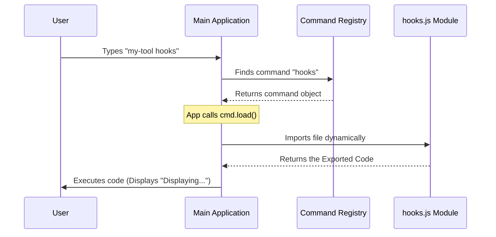

# Chapter 2: Dynamic Command Loading

Welcome back! In the previous chapter, [Command Registry Definition](01_command_registry_definition.md), we created the "Menu" for our restaurant. We told the application that a command named `hooks` exists, but we didn't actually bake the lasagna yet.

Now, we are going to learn how to deliver that order to the kitchen. This concept is called **Dynamic Command Loading**.

### The Motivation: The Clean Workshop
Imagine you own a car repair workshop. You fix all kinds of cars: Toyotas, Fords, Ferraris.

**The Problem:**
If you kept *every* spare part for *every* car model in your main lobby, you wouldn't be able to walk! It would be cluttered, heavy, and slow to navigate.

**The Solution:**
You keep the lobby empty and clean. You have a direct phone line to a huge warehouse.
1. A customer drives in with a Ferrari.
2. **Only then** do you call the warehouse.
3. The warehouse sends *specifically* the Ferrari engine parts.
4. You fix the car.

In programming, this is called **"Lazy Loading"**. We don't load the heavy code for the `hooks` command until the user actually types `hooks` in their terminal. This keeps our CLI tool starting up lightning fast.

### The "Phone Call" Mechanism

In our `index.ts` from the previous chapter, we wrote a specific line of code that acts as our "phone line" to the warehouse.

**Input:** `index.ts` (Review)
```typescript
const hooks = {
  name: 'hooks',
  // ... other metadata
  
  // This is the dynamic loader!
  load: () => import('./hooks.js'),
} satisfies Command
```

**Explanation:**
*   **`import(...)`**: This is a special JavaScript function. Unlike the standard `import X from Y` at the top of a file (which happens immediately), `import()` acts like a function call.
*   **`() => ...`**: We wrap it in an arrow function so it doesn't run yet. It waits until we call it.

### Creating the Spare Part (The Heavy Logic)

Now, let's create the file that sits in the warehouse. This is the file that gets loaded when the phone rings.

We will create a file named `hooks.tsx` (or `.js`). This contains the actual code that runs.

**Input:** `hooks.tsx`
```typescript
import React from 'react';
import { Text } from 'ink';

// This is the heavy component we avoided loading earlier
export default function HooksCommand() {
  return (
    <Text>
      Displaying all hook configurations...
    </Text>
  );
}
```

**Explanation:**
1.  **`export default`**: This is crucial. When the dynamic importer grabs this file, it looks for the `default` export to know what to run.
2.  **The Logic**: Right now, it just returns text. In the future, this file could contain thousands of lines of code, heavy libraries, or complex calculations. Because of Dynamic Loading, none of that weight affects the app's startup time.

### Under the Hood: What happens when you type `hooks`?

How does the main application go from seeing the menu to serving the dish? Let's walk through the process step-by-step.

1.  **User Action:** You type `my-tool hooks` in the terminal.
2.  **Lookup:** The App checks the Registry (from Chapter 1) and finds the entry for `hooks`.
3.  **Trigger:** The App sees that you want to run it. It executes the `load()` function we defined.
4.  **Fetching:** Node.js goes to the file system, reads `hooks.js`, and compiles it.
5.  **Execution:** The App takes the result and runs it.

Here is a diagram of the flow:



### Internal Implementation Code

Let's look at a simplified version of the code inside the Main Application that handles this magic.

**Input:** `cli-runner.ts` (Simplified)
```typescript
// Assume we found the 'command' object from the registry
async function runCommand(command: Command) {
  
  console.log("Loading module...");
  
  // 1. CALL THE WAREHOUSE
  // We await because reading the file takes a few milliseconds
  const module = await command.load();

  // 2. USE THE PART
  // We access the 'default' export we defined earlier
  const LogicComponent = module.default;

  // 3. START THE ENGINE
  // render() handles the UI (See Chapter 3)
  render(LogicComponent);
}
```

**Explanation:**
1.  **`async / await`**: Dynamic loading is asynchronous (it takes time). We must `await` the result of `command.load()`.
2.  **`module.default`**: When you import a file dynamically, you get an object containing all exports. Since we used `export default` in our `hooks.tsx`, we access it here.
3.  **Separation of Concerns**: The Runner doesn't know *what* is inside the module until it loads it. It just knows how to load it.

### Integration with Other Systems

This dynamic loading pattern is the bridge between two other major concepts in our system:

*   **Tool Ecosystem Integration**: External plugins can be loaded this way too! The core application doesn't need to bundle every plugin; it just needs to know where to find them. (See [Tool Ecosystem Integration](04_tool_ecosystem_integration.md)).
*   **Application State Context**: Even though the code is loaded late, it still needs access to the user's data. The system injects this data immediately after loading. (See [Application State Context](05_application_state_context.md)).

### Summary

In this chapter, we implemented a "Just-In-Time" delivery system for our code.
1.  We used `() => import(...)` to delay loading.
2.  We created the implementation file (`hooks.tsx`).
3.  We learned how the runner `awaits` the file loading before execution.

Now that we have successfully loaded our file, we are looking at a block of code that looks like HTML (`<Text>...</Text>`). How does a command line tool understand that?

In the next chapter, we will explore the technology that allows us to write UI components for the terminal.

[Next: Local JSX Execution](03_local_jsx_execution.md)

---

Generated by [Code IQ](https://github.com/adityasoni99/Code-IQ)