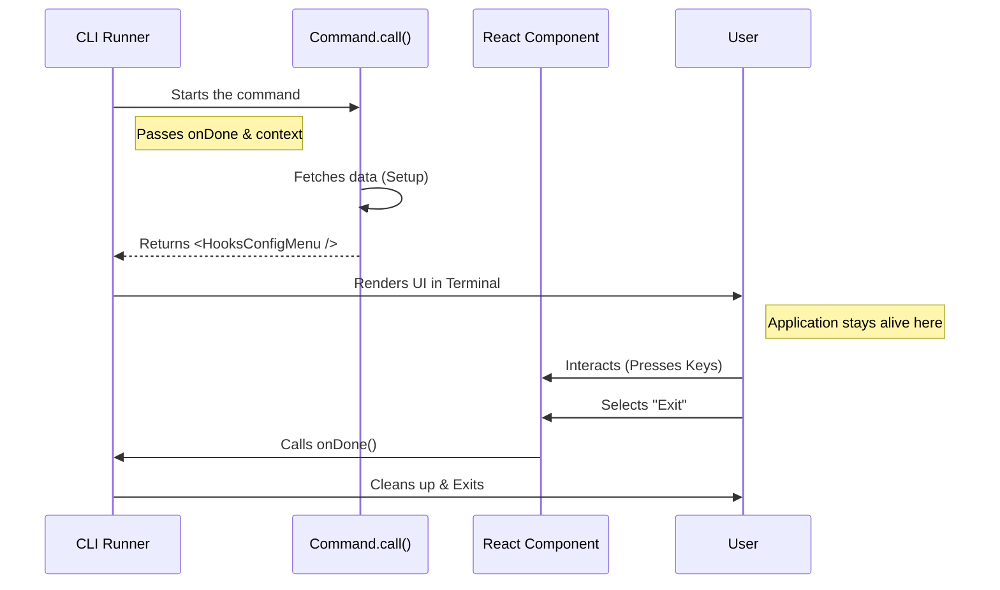

# Chapter 3: Local JSX Execution

Welcome back! 

In the previous chapter, [Dynamic Command Loading](02_dynamic_command_loading.md), we learned how to "lazy load" our code. We retrieved the heavy logic from the warehouse only when the user asked for it.

Now, we have the code in our hands. But what do we do with it? 

If this were a standard command line tool, we might just `console.log` some text and quit. But we are building something interactive. We want menus, colors, and key-press handling. To do this, we use **Local JSX Execution**.

### The Motivation: The Interactive Pop-up Store

Imagine you want to open a **Pop-up Store**. You can't just throw merchandise on the sidewalk; you need a process.

1.  **Setup:** You unlock the space, arrange the shelves, and bring in the inventory.
2.  **Open for Business:** You open the doors. Customers interact, browse, and buy things. This happens over time.
3.  **Closing:** When the day is done, you lock up and leave the space exactly as you found it.

In our CLI framework, **Local JSX Execution** is the manager of this Pop-up Store. It handles the lifecycle of an interactive command.

**The Problem:**
Standard scripts run top-to-bottom and finish instantly.
**The Solution:**
We need a way to keep the application "alive" while the user interacts with the interface, and a clean way to exit when they are done.

### The Core Concept: The `call` Function

Every command in our system that shows a UI must export a specific function named `call`. This function is the manager.

Let's look at the signature of this function.

**Input:** `hooks.tsx` (Concept)
```typescript
import type { LocalJSXCommandCall } from '../../types/command.js';

// The function signature
export const call: LocalJSXCommandCall = async (onDone, context) => {
  
  // 1. Setup Phase
  // 2. Render Phase
  
};
```

**Explanation:**
The framework passes us two critical tools:
1.  **`onDone`**: This is the "Close Store" button. When we call this function, the interactive mode ends, and the terminal returns to normal.
2.  **`context`**: This is our toolbox. It allows us to access the application's global data (see [Application State Context](05_application_state_context.md)).

### Step 1: The Setup Phase

Before we show anything to the user, we need to gather data. In our `hooks` command, we want to show a list of tools.

**Input:** `hooks.tsx` (Logic)
```typescript
// inside the 'call' function...

// Get the global application state
const appState = context.getAppState();

// Get the specific permissions we need
const permissionContext = appState.toolPermissionContext;

// Extract a list of tool names (e.g., ['linter', 'tester'])
const toolNames = getTools(permissionContext).map(tool => tool.name);
```

**Explanation:**
We are preparing the inventory for our store. We ask the `context` for the current state of the app, and we filter out the list of tools we need to display.

### Step 2: The Render Phase (Opening the Doors)

This is where the magic happens. Instead of returning text or a number, we return **JSX**.

If you have used React for the web, this looks familiar. We are using a library called **Ink** to render React components as text in the terminal.

**Input:** `hooks.tsx` (Rendering)
```typescript
import React from 'react';
import { HooksConfigMenu } from './HooksConfigMenu.js';

// inside the 'call' function...

return (
  <HooksConfigMenu 
    toolNames={toolNames} 
    onExit={onDone} 
  />
);
```

**Explanation:**
1.  **`<HooksConfigMenu />`**: This is our visual component (the shelves and counters).
2.  **`toolNames={...}`**: We pass the data we fetched in the Setup Phase.
3.  **`onExit={onDone}`**: This is crucial! We pass the "Close Store" button *into* the component. The component will press this button when the user hits `Esc` or selects "Exit".

### Under the Hood: The Lifecycle

How does the framework handle a function that returns HTML-like tags? Let's visualize the flow.



### Deep Dive: Internal Implementation

The CLI Runner does some heavy lifting to make this seamless. It doesn't just print the JSX; it "mounts" it, effectively taking over the terminal window.

Here is a simplified look at how the framework executes your `call` function.

**Input:** `cli-runner.ts` (Simplified Internal Logic)
```typescript
import { render } from 'ink';

async function executeLocalJsx(command, context) {
    // A promise that resolves only when the command says it's done
    let finishedResolver;
    const finishedPromise = new Promise(r => finishedResolver = r);

    // Run the user's setup logic
    const uiComponent = await command.call(finishedResolver, context);

    // Tell Ink to take over the terminal screen
    const { unmount } = render(uiComponent);

    // PAUSE here until the user clicks "Exit" (calling onDone)
    await finishedPromise;

    // Clean up the terminal screen
    unmount();
}
```

**Explanation:**
1.  **`finishedPromise`**: The framework creates a "pause button". It waits indefinitely at `await finishedPromise`.
2.  **`render(uiComponent)`**: The **Ink** library draws your UI component to the screen and starts listening for keyboard events.
3.  **`unmount()`**: When `finishedResolver` (which is your `onDone`) is finally called, the framework clears the screen and returns the user to their standard shell.

### Connecting to the Ecosystem

This `Local JSX` architecture is powerful because it allows plugins to bring their own UIs.

*   The **Logic** comes from [Tool Ecosystem Integration](04_tool_ecosystem_integration.md).
*   The **Data** comes from [Application State Context](05_application_state_context.md).
*   The **UI** is rendered right here using Local JSX.

### Summary

In this chapter, we learned:
1.  **Local JSX Execution** allows us to build interactive TUIs (Terminal User Interfaces).
2.  The **`call`** function acts as the store manager: setting up data and opening the UI.
3.  **`onDone`** is the mechanism to cleanly exit the application loop.
4.  We pass data from the global context into visual React components.

Now that we know how to render the UI for our tools, we need to understand where these tools actually come from. How does the system know which tools are available to populate our menu?

Next, we will explore the **Tool Ecosystem Integration**.

[Next: Tool Ecosystem Integration](04_tool_ecosystem_integration.md)

---

Generated by [Code IQ](https://github.com/adityasoni99/Code-IQ)